# 🛡️ Detection Engineering Framework

---

## 📖 About this Framework

### 📚 Pre-Git Version History

| **Version** | **📅 Date** | **📊 Status** | **🔄 Changes** |
|-------------|-------------|---------------|----------------|
| 0.1 | 13/04/2021 | Draft | First Draft |
| 1.0 | 14/04/2021 | Release | First Release |
| 1.1 | 25/04/2021 | Revision | Minor amendments |
| 1.2 | 15/06/2021 | Revision | Minor amendments |
| 1.3 | 24/08/2021 | Draft | Overhaul amendments |
| 1.4 | 07/09/2021 | Released | Minor amendments |
| 1.5 | 14/04/2022 | Released | Minor amendments |
| **2.0** | **06/06/2023** | **Revision** | **Major amendments** |

### 👥 Review History

| **👤 Reviewer** | **📋 Version** | **📅 Date** |
|-----------------|----------------|-------------|
| Kunal Hatode | 1.0 | 13/04/2021 |
| Kunal Hatode | 1.5 | 13/04/2022 |
| Kunal Hatode | 2.0 | 06/06/2023 |

---

## 🎯 Introduction

### 📄 Preface

In today's ever-evolving digital landscape, organizations face a multitude of sophisticated and persistent cyber threats that can compromise their sensitive data, disrupt operations, and damage their reputation. To effectively combat these threats, a robust **Use Case and Detection Engineering Framework** is essential.

This comprehensive guide aims to provide security professionals, incident responders, and IT teams with a holistic understanding of the key principles, strategies, and best practices involved in building and maintaining an effective security monitoring and incident response program.

**🏗️ Framework Phases:**

- **📋 Planning Phase**: Establishing foundation and objectives
- **⚙️ Development Phase**: Building technical detection capabilities  
- **🚀 Delivery Phase**: Implementation and activation
- **🔧 Improvement Phase**: Continuous enhancement and optimization

Throughout the guide, key roles and stakeholders are identified, providing a clear understanding of the responsibilities and contributions of various teams involved in security monitoring and incident response. This holistic approach ensures effective collaboration and efficient handling of security incidents.

> ⚠️ **Important Note**: This guide is a comprehensive framework, encompassing a wide range of concepts, methodologies, and best practices. It serves as a valuable resource for organizations seeking to establish or enhance their security monitoring and incident response capabilities.

By following the principles and recommendations outlined in this guide, organizations can build a resilient and proactive security posture, mitigating risks and responding effectively to emerging threats.

### 👥 Audience

This document is intended for:

| **👤 Role** | **🎯 Focus Area** |
|-------------|-------------------|
| **🔒 Security Managers** | Strategic oversight and governance |
| **📊 SOC Managers** | Operational management and coordination |
| **👨‍💻 SOC Analysts** | Day-to-day monitoring and analysis |
| **⚙️ Detection Engineers** | Technical development and implementation |
| **🛡️ Security Professionals** | Overall security operations |

We hope that this guide will serve as a valuable reference and practical companion for security professionals, incident responders, and IT teams as they navigate the challenging landscape of security monitoring and incident response.

### 🔍 Scope

This deliverable is a **Use Case Framework** to address the detection of cyber threats & attack tactics techniques and procedures appropriate to the SOC. The objective of building a Use Case Framework is to better protect the organization's valuable assets by designing and developing detection use cases using a holistic approach that connects **Risk**, **Threat** & **compliance requirements**.

```mermaid
graph LR
    A[🎯 Risk] --> D[🛡️ Detection Framework]
    B[⚠️ Threat] --> D
    C[📜 Compliance] --> D
    D --> E[🔍 Detection Use Cases]
    
    style A fill:#693e00,stroke:#fff,stroke-width:2px,color:#fff
    style B fill:#640d04,stroke:#fff,stroke-width:2px,color:#fff
    style C fill:#3c1e70,stroke:#fff,stroke-width:2px,color:#fff
    style D fill:#161b22,stroke:#fff,stroke-width:3px,color:#fff
    style E fill:#f0f6fc,stroke:#fff,stroke-width:2px,color:#000
```

> ⚠️ **Disclaimer**: Following the guidelines and recommendations in this document does not guarantee a secure environment, or that all security incidents will be prevented. Absolute security is impossible to achieve on any open network. However, security risks can be reduced by establishing a good security policy together with sound administration practices; monitoring and responding to security incidents; testing and evaluating security; and improving, securing and managing security weaknesses on an on-going basis. Cisco does not recommend deploying security technologies without associated security policies.

---

## 🏗️ Detection Engineering Framework

### 🔍 Overview

In the context of cybersecurity, a **use case** describes a potential security threat or incident and defines the steps, actions, or behaviors that indicate the presence of that threat. It helps in identifying, monitoring, and detecting security incidents or suspicious activities within an organization's network or systems.

**Detection engineering**, on the other hand, refers to the process of designing and developing effective methods and techniques to identify and respond to security threats and incidents. It involves creating and implementing:

- 🔍 **Detection rules**
- 🧠 **Logic patterns**
- 🔎 **Search strings**
- 📝 **Detection signatures**

These enable security monitoring systems to identify and generate alerts for suspicious activities or potential security breaches. Detection engineering also encompasses the development of **response playbooks**, which provide predefined steps and actions to be taken in response to specific security events or incidents.

The **use case and detection engineering framework** combines these two concepts to create a structured approach for developing, managing, and improving security monitoring capabilities. This framework emphasizes the importance of proactive identification, monitoring, and response to security threats.

### ❓ Why adopt a Use Case & Detection Engineering Framework?

Essentially, use cases describe manifestations of threats from a high level (the modus operandi of the cyber criminals) to the lowest level (concrete security events in the infrastructure such as exploits, failed logins, etc.). Use cases also describe follow-up actions (incident response) and are tied with business drivers to show how security monitoring reduces risk in the organization.

```mermaid
graph TD
    A[🎯 High Level Threats] --> B[🔍 Mid Level Indicators]
    B --> C[📊 Low Level Events]
    C --> D[🚨 Incident Response]
    D --> E[💼 Business Value]
    
    style A fill:#F44336,stroke:#fff,stroke-width:2px,color:#fff
    style B fill:#FF9800,stroke:#fff,stroke-width:2px,color:#fff
    style C fill:#4CAF50,stroke:#fff,stroke-width:2px,color:#fff
    style D fill:#2196F3,stroke:#fff,stroke-width:2px,color:#fff
    style E fill:#9C27B0,stroke:#fff,stroke-width:2px,color:#fff
```

Within the complexity of the security architecture, framework can provide structure and overview. Such frameworks enable control over the development of the use cases and provide insight into identify how well an organization can defend against cyber threats.

**🎯 The use case framework should allow the SOC:**

- ✅ To ensure stakeholder objectives are met uniformly
- ✅ To capture gaps and challenges early on during the creation of use cases
- ✅ To have a holistic "frame of reference" where detection use cases can be categorized into
- ✅ To engineer detection capabilities in a consistent & methodological manner
- ✅ To quickly see where use cases are lacking and need more attention
- ✅ To facilitate a phased approach of expanding new use cases based on a large variety of inputs and priorities in the form of Use Case Roadmap

### ⚡ Principles of the Framework

```mermaid
graph TB
    A[💼 Business-Driven] --> B[🛡️Framework]
    C[⚠️ Risk-Aligned] --> B
    D[📜 Compliance-Focused] --> B
    E[🔄 Systematic] --> B
    F[📊 Visibility-Enabling] --> B
    G[🎯 Anti-Ad-hoc] --> B
    H[🔄 Efficiency-Driven] --> B
    I[📋 State-Aware] --> B
    
    style A fill:#2196F3,stroke:#fff,stroke-width:2px,color:#fff
    style B fill:#9C27B0,stroke:#fff,stroke-width:3px,color:#fff
    style C fill:#F44336,stroke:#fff,stroke-width:2px,color:#fff
    style D fill:#FF9800,stroke:#fff,stroke-width:2px,color:#fff
    style E fill:#4CAF50,stroke:#fff,stroke-width:2px,color:#fff
    style F fill:#00BCD4,stroke:#fff,stroke-width:2px,color:#fff
    style G fill:#795548,stroke:#fff,stroke-width:2px,color:#fff
    style H fill:#607D8B,stroke:#fff,stroke-width:2px,color:#fff
    style I fill:#3F51B5,stroke:#fff,stroke-width:2px,color:#fff
```

The key principles driving this framework:

- 🎯 **Business-Driven**: The creation of use cases should be driven by the organisation's business requirements
- ⚖️ **Risk-Aligned**: The use cases must align with the business's risk appetite over any form of asset  
- 📜 **Compliance-Focused**: The use case framework should provide structured control over the compliance requirements of the organisation
- 🔄 **Systematic**: The creation of use cases must follow a systematic process to eliminate or reduce errors
- 📊 **Visibility-Enabling**: The use case framework should create a foundation for the ability to assess the state of visibility and detection capability
- 🎯 **Anti-Ad-hoc**: The use case framework must reduce the ad hoc detection of threats for the organisation
- 🔄 **Efficiency-Driven**: The use case framework should eliminate redundant & duplicate methods of managing use cases
- 📋 **State-Aware**: The management of the use cases must articulate the state of the use cases at any given point of time

### 🧩 What does the Framework consist of?

The framework includes:

| **🧩 Component** | **📝 Description** |
|------------------|-------------------|
| **🎯 Fundamentals** | How business risk, threats and compliance requirements drive the framework |
| **🔄 Lifecycle** | Practical Use Case & Detection Engineering lifecycle management process |
| **⚙️ Development Guide** | Practical guide to develop correlation and detection rules in SIEM |
| **📚 Catalog Guide** | Suggested guide to maintain use cases and SIEM Rules in catalogue format |
| **📋 Templates** | Series of templates, processes and conventions that support the framework |

### ⚠️ Challenges of Creating & Managing Use Cases

```mermaid
graph TB
    A[⚠️ Use Case Challenges] --> B[📦 Split Coverage]
    A --> C[🏷️ No Naming Conventions]
    A --> D[🎯 Attack-Centric Bias]
    A --> E[🤖 SOAR Integration Issues]
    A --> F[🏢 Vendor Lock-in]
    
    style A fill:#F44336,stroke:#fff,stroke-width:2px,color:#fff
    style B fill:#FF5722,stroke:#fff,stroke-width:2px,color:#fff
    style C fill:#FF9800,stroke:#fff,stroke-width:2px,color:#fff
    style D fill:#FFC107,stroke:#000,stroke-width:2px,color:#000
    style E fill:#FFEB3B,stroke:#000,stroke-width:2px,color:#000
    style F fill:#CDDC39,stroke:#000,stroke-width:2px,color:#000
```

**🔍 Key Challenges Identified:**

1. **📦 Split Coverage**: Most out-of-the-box use cases are split up from each other based on their rule content package which can be put (after some analysis of the detection logic) under the same "use case" as they have the same detection scope.

2. **🏷️ Naming Issues**: Most SIEM out-of-the-box (and later custom added rules) do not have an overarching naming convention over all rules.

3. **🎯 Detection Bias**: Most use case approaches have an Attack-centric or quantitative detection bias. Most SIEM Vendors have attempted to organize use cases in a Use Case Framework that primarily focuses on a single limited threat model (kill chain or ATT&CK Framework) this misses critical categories like Self-monitoring, localized anomaly detection (that is not attack centric) and distinctions between quantitative threat modelling and qualitative threat modelling.

4. **🤖 SOAR Integration**: Use Cases are hard to align with a SOAR playbooks platform without a framework. Most vendors fail to accommodate the emergence of SOAR technologies that are trying to connect automated or semi-automated playbooks to SIEM use cases.

5. **🏢 Vendor Complexity**: SIEM Vendor Taxonomy overly complex or not generalizable. Many SIEM vendors have attempted to standardize detection through taxonomy of detection categories, but these categories are generally limited only to the SIEM vendor itself and hard to generalize to other detection technologies of other vendors like IDS, IPS, UBA and others.

---

## 🎯 Drivers for Use Cases

Before going any further, it is important to provide a definition of use cases. This is necessary, because of the fact that the term is used to describe a variety of elements in different publications.

> 📝 **Definition**: "A use case is a security monitoring scenario that is aimed at the detection of manifestations of a cyber threat"

A use case has a **strategical**, **tactical** and **operational** component. This definition emphasizes the fact that the focus of the framework is on the **'detect'** and **'respond'** phase of the NIST cybersecurity framework.

```mermaid
graph LR
    A[🎯 Strategic] --> D[🛡️ Use Case]
    B[⚔️ Tactical] --> D
    C[⚙️ Operational] --> D
    D --> E[🔍 Detect]
    D --> F[🚨 Respond]
    
    style A fill:#3F51B5,stroke:#fff,stroke-width:2px,color:#fff
    style B fill:#9C27B0,stroke:#fff,stroke-width:2px,color:#fff
    style C fill:#FF9800,stroke:#fff,stroke-width:2px,color:#fff
    style D fill:#2196F3,stroke:#fff,stroke-width:3px,color:#fff
    style E fill:#4CAF50,stroke:#fff,stroke-width:2px,color:#fff
    style F fill:#F44336,stroke:#fff,stroke-width:2px,color:#fff
```

Naturally, the events and incidents that flow from the security monitoring architecture can be used to improve protection mechanisms or further refine the threat identification. While threats are a core driver for security monitoring, they are not the only driver. Other aspects of the organizational environment must be considered as well such as **risk** and **compliance** obligations.

Developing the right use cases or detection rules, and having an effective development and implementation process, is more than half the battle in reducing response time to a potential attack and minimizing its impact.

**🎯 Use cases must be customized for each organization**, reflecting:

- 🏢 Organization's current unique requirements and risk, threat and compliance profile
- 🌍 Current threat landscape, based on the organization's industry vertical  
- 💾 Types of assets owned
- 🌐 Organization's operating regions, applications and services used

### 🔄 Risk, Threats and Compliance Overview

```mermaid
graph TB
    A[⚠️ Risks] --> D[🛡️ Security Monitoring]
    B[🎯 Threats] --> D
    C[📜 Compliance] --> D
    
    A --> A1[💰 Financial Loss]
    A --> A2[🏢 Reputation Damage]
    A --> A3[⚙️ Operational Disruption]
    
    B --> B1[🌐 External Actors]
    B --> B2[👤 Internal Actors]
    B --> B3[🦠 Malware]
    
    C --> C1[🌍 International Standards]
    C --> C2[🏛️ National Regulations]
    C --> C3[🏭 Industry Requirements]
    
    style D fill:#9C27B0,stroke:#fff,stroke-width:3px,color:#fff
    style A fill:#F44336,stroke:#fff,stroke-width:2px,color:#fff
    style B fill:#FF9800,stroke:#fff,stroke-width:2px,color:#fff
    style C fill:#2196F3,stroke:#fff,stroke-width:2px,color:#fff
    style A1 fill:#E91E63,stroke:#fff,stroke-width:2px,color:#fff
    style A2 fill:#E91E63,stroke:#fff,stroke-width:2px,color:#fff
    style A3 fill:#E91E63,stroke:#fff,stroke-width:2px,color:#fff
    style B1 fill:#FF5722,stroke:#fff,stroke-width:2px,color:#fff
    style B2 fill:#FF5722,stroke:#fff,stroke-width:2px,color:#fff
    style B3 fill:#FF5722,stroke:#fff,stroke-width:2px,color:#fff
    style C1 fill:#3F51B5,stroke:#fff,stroke-width:2px,color:#fff
    style C2 fill:#3F51B5,stroke:#fff,stroke-width:2px,color:#fff
    style C3 fill:#3F51B5,stroke:#fff,stroke-width:2px,color:#fff
```

**⚠️ Risks**

Cybersecurity risk is the probability of exposure or loss resulting from a cyber-attack or data breach on your organization. A better, more encompassing definition is the potential loss or harm related to technical infrastructure, use of technology or reputation of an organization.

Organizations are becoming more vulnerable to cyber threats due to the increasing reliance on computers, networks, programs, social media and data globally. Data breaches, a common cyber-attack, have massive negative business impact and often arise from insufficiently protected data.

**🎯 Threats**

Any potential occurrence that may cause an undesirable or unwanted outcome for an organization or for a specific asset is a threat. Threats are any action or inaction that could cause damage, destruction, alteration, loss, or disclosure of assets or that could block access to or prevent maintenance of assets.

Cyber threats refer to the possibility of a successful cyber-attack that aims to gain unauthorized access, damage, disrupt, or steal an information technology asset, computer network, intellectual property or any other form of sensitive data.

**Known threat sources include:**
- 🏛️ Hostile nations
- 💀 Terrorist groups  
- 🕵️ Corporate spies
- 🎭 Hacktivists
- 😠 Disgruntled insiders
- 🤷 Accidental actions of authorized users

**📜 Compliance**

As the number and severity of cyber-attacks increases, industry standards organizations and governments seek to enforce cybersecurity by establishing more stringent compliance requirements. In cybersecurity, compliance means creating a program that establishes risk-based controls to protect the integrity, confidentiality, and accessibility of information stored, processed, or transferred.

Organizations subject to industry or regional cybersecurity regulations are required by law to meet compliance and take the prescribed actions following the discovery of a data breach.

### 🏢 Aligning to Business Context

Each line of business has their own risks and threats. For example, the threats of banking firm is not the same as a healthcare or Government entity. So, understanding the line of business would help well in plotting the threat actors and attack motivation.

```mermaid
graph TD
    A[🏢 Business Objectives] --> B[💻 Technology Decisions]
    B --> C[💾 IT Assets]
    C --> D[👥 People]
    C --> E[📊 Data]
    
    F[⚠️ Vulnerabilities] --> G[🎯 Threat Agents]
    G --> H[💥 Exploitation]
    
    C --> F
    D --> F
    E --> F
    
    I[🛡️ Safeguards] --> J[🔒 Risk Mitigation]
    J --> C
    J --> D
    J --> E
    
    style A fill:#2196F3,stroke:#fff,stroke-width:2px,color:#fff
    style B fill:#9C27B0,stroke:#fff,stroke-width:2px,color:#fff
    style C fill:#607D8B,stroke:#fff,stroke-width:2px,color:#fff
    style D fill:#795548,stroke:#fff,stroke-width:2px,color:#fff
    style E fill:#00BCD4,stroke:#fff,stroke-width:2px,color:#fff
    style F fill:#FF5722,stroke:#fff,stroke-width:2px,color:#fff
    style G fill:#F44336,stroke:#fff,stroke-width:2px,color:#fff
    style H fill:#E91E63,stroke:#fff,stroke-width:2px,color:#fff
    style I fill:#4CAF50,stroke:#fff,stroke-width:2px,color:#fff
    style J fill:#8BC34A,stroke:#fff,stroke-width:2px,color:#fff
```

It's important to understand what the organisation business objectives are specifically for a given period of time. As these business objectives influence and shape the technology decisions. The technology decisions in turn become the assets in the shape of IT equipment, People and Data that must be safeguarded every single day because they are bound to have vulnerabilities that possess the risk of being exploited by Threat agents.

**🔄 Cyber Elements Relationship:**
- **🎯 Threats** exploit **⚠️ vulnerabilities**, which results in **📊 exposure**
- **📊 Exposure** is **⚠️ risk**, and **⚠️ risk** is mitigated by **🛡️ safeguards**  
- **🛡️ Safeguards** protect **💾 assets** that are endangered by **🎯 threats**

```mermaid
flowchart TB
    A[🎯 Threats] -->|exploit| B[⚠️ Vulnerabilities]
    B -->|results in| C[📊 Exposure]
    C -->|is| D[⚠️ Risk]
    D -->|mitigated by| E[🛡️ Safeguards]
    E -->|protect| F[💾 Assets]
    F -->|endangered by| A

    style A fill:#b62324,stroke:#fff,stroke-width:2px,color:#fff
    style B fill:#bb8009,stroke:#fff,stroke-width:2px,color:#fff
    style C fill:#db6d28,stroke:#fff,stroke-width:2px,color:#fff
    style D fill:#db61a2,stroke:#fff,stroke-width:2px,color:#fff
    style E fill:#00BCD4,stroke:#fff,stroke-width:2px,color:#fff
    style F fill:#2ea043,stroke:#fff,stroke-width:2px,color:#fff
```

Businesses also evolve continuously. Thus, it is possible that changes to the business layer of the use case may be required. These changes may also need to be reflected in operational implementation. For example, changes in demands regarding use case output may lead to new assets being monitored or new monitoring rules being implemented.

🔠<strong>Defining Threats and Risks - Click to expand</strong>

**Defining Threats and Risks:**

To grasp the essence of threats and risks, let's start by defining each concept individually. In the realm of cybersecurity, a **threat** refers to a specific type of malicious actor, an entity, or an event that has the potential to exploit vulnerabilities and compromise the security of computer systems, networks, or data. These threats may come in the form of hackers, malware, viruses, phishing attacks, or social engineering tactics. 

On the other hand, a **risk** is the potential for loss, harm, or negative consequences resulting from the exploitation of vulnerabilities by threats. Risks encompass assessing the likelihood and potential impact of threats on an organization's information assets, including data confidentiality, integrity, and availability.

**Threats: The 'What' of Cybersecurity:**

Imagine a medieval castle fortified with high walls, towers, and guards. In the context of cybersecurity, threats can be likened to the external forces attempting to breach the castle's defenses. These forces could be hostile invaders, spies, or even traitors within the castle walls. Similarly, cybersecurity threats are the specific instances of potential harm, often associated with intentional malicious activities or accidental occurrences.

**Risks: The 'How' and 'Why' of Cybersecurity:**

While threats focus on the external forces attempting to breach our digital defenses, risks provide a broader perspective by considering the overall uncertainty and potential impact to our information assets. In our castle analogy, risks can be compared to the assessment of the castle's vulnerability, the potential impact of an invasion, and the consequences for the kingdom.

**The Interplay Between Threats and Risks:**

While threats and risks are distinct concepts, they are intertwined and mutually influence each other in the realm of cybersecurity. Threats are specific manifestations of potential harm, often originating from intentional malicious activities or accidental occurrences. Risks, on the other hand, encompass a broader range of potential threats, vulnerabilities, and their associated consequences.

---

### ⚠️ Risk Drivers

All IT systems have risk. There is no way to eliminate 100 percent of all risks. Instead, upper management and key stakeholders must decide which risks are acceptable and which are not. Determining which risks are acceptable requires detailed and complex asset and risk assessments.

```mermaid
graph LR
    A[📊 Risk Assessment] --> B[📈 Quantitative]
    A --> C[📋 Qualitative]
    B --> D[💰 Monetary Figures]
    C --> E[📝 Subjective Values]
    D --> F[🔄 Hybrid Analysis]
    E --> F
    
    style A fill:#FF9800,stroke:#fff,stroke-width:2px,color:#fff
    style B fill:#2196F3,stroke:#fff,stroke-width:2px,color:#fff
    style C fill:#9C27B0,stroke:#fff,stroke-width:2px,color:#fff
    style D fill:#00BCD4,stroke:#fff,stroke-width:2px,color:#fff
    style E fill:#E91E63,stroke:#fff,stroke-width:2px,color:#fff
    style F fill:#4CAF50,stroke:#fff,stroke-width:2px,color:#fff
```

There are **two risk assessment methodologies**:

- **📈 Quantitative**: Assigns real monetary figures to the loss of an asset
- **📋 Qualitative**: Assigns subjective and intangible values to the loss of an asset

Both methods are necessary for a complete risk analysis. Most environments employ a **hybrid** of both risk assessment methodologies in order to gain a balanced view of their security concerns.

🔠<strong>Types of Risk Drivers - Click to expand</strong>

**📊 Quantitative & Qualitative Pertinence**

The quantitative method results in concrete probability percentages. That means the end result is a report that has monetary figures for levels of risk, potential loss, cost of countermeasures, and value of safeguards. This report is usually fairly easy to understand, especially for anyone with knowledge of spreadsheets and budget reports.

Qualitative risk analysis is more scenario based than it is calculator based. Rather than assigning exact monetary figures to possible losses, you rank threats on a scale to evaluate their risks, costs, and effects. The method of combining quantitative and qualitative analysis into a final assessment of organizational risk is known as **hybrid assessment** or **hybrid analysis**.

**💼 Business Impact Analysis**

Business impact analysis (BIA) is a systematic process to determine and evaluate the potential effects of an interruption to critical business operations as a result of a disaster, accident or emergency. A BIA is an essential component of an organization's business continuance plan.

One of the basic assumptions behind BIA is that every component of the organization is reliant upon the continued functioning of every other component, but that some are more crucial than others and require a greater allocation of time, effort and funds in the wake of a disaster.

---

### 🎯 Threat Drivers

Threat drivers are the factors or conditions that contribute to the emergence, growth, or impact of threats in the cybersecurity landscape. They provide insight into the motivations, capabilities, and techniques of threat actors, helping organizations understand the potential risks they face.

```mermaid
graph TB
    A[🎯 Threat Drivers] --> B[🌐 External Actors]
    A --> C[👤 Internal Actors]  
    A --> D[⚠️ Vulnerabilities]
    A --> E[💣 Exploits]
    A --> F[🎭 Social Engineering]
    A --> G[🦠 Malware]
    A --> H[🔥 Advanced Persistent Threats]
    
    style A fill:#F44336,stroke:#fff,stroke-width:2px,color:#fff
    style B fill:#FF5722,stroke:#fff,stroke-width:2px,color:#fff
    style C fill:#E91E63,stroke:#fff,stroke-width:2px,color:#fff
    style D fill:#9C27B0,stroke:#fff,stroke-width:2px,color:#fff
    style E fill:#673AB7,stroke:#fff,stroke-width:2px,color:#fff
    style F fill:#3F51B5,stroke:#fff,stroke-width:2px,color:#fff
    style G fill:#2196F3,stroke:#fff,stroke-width:2px,color:#fff
    style H fill:#00BCD4,stroke:#fff,stroke-width:2px,color:#fff
```

**Common threat drivers include:**

| **🎯 Threat Driver** | **📝 Description** |
|----------------------|-------------------|
| **🌐 External Actors** | Individuals, groups, or organizations outside the target organization |
| **👤 Internal Actors** | Individuals within an organization who pose a security risk |
| **⚠️ Vulnerabilities** | Weaknesses or flaws in software, hardware, or system configurations |
| **💣 Exploits** | Tools, techniques, or malicious code that take advantage of vulnerabilities |
| **🎭 Social Engineering** | Psychological manipulation techniques to deceive individuals |
| **🦠 Malware** | Malicious software designed to gain unauthorized access or disrupt systems |
| **🔥 APTs** | Sophisticated, targeted attacks by well-resourced threat actors |

🔠<strong>Types of Threat Drivers - Click to expand</strong>

**🧠 Threat Intelligence**

Cyber threat intelligence is what cyber threat information becomes once it has been collected, evaluated in the context of its source and reliability, and analysed through rigorous and structured tradecraft techniques by those with substantive expertise and access to all-source information.

**🎯 Threat Modelling**

Threat modelling is a crucial component of any robust use case framework as it provides a systematic approach to identify, assess, and mitigate potential threats and risks. By incorporating threat modelling into the use case development process, organizations can enhance the security of their systems, applications, and infrastructure.

**🔍 Threat Hunting**

Threat hunting is the proactive cybersecurity practice of searching for hidden threats already in an organization's environment. Threat hunting is necessary because many adversaries engineer their attacks to bypass an organization's perimeter and defences in order to sneak in undetected.

**📚 Lessons Learned From Incident Response**

Incident response activities originating from security alerts are also input into the use case management process. This loopback mechanism ensures that monitoring is effective and efficient. After all, breaches must be detected and false-positives should be avoided as much as possible.

---

### 📜 Compliance Drivers

> 🚨 **Challenge**: Business owners find themselves completely overwhelmed with **dozens of acronyms**, **hundreds of controls**, and complex compliance obligations.

### 🎯 What is Cybersecurity Compliance?

**Cybersecurity Compliance** involves meeting various controls (usually enacted by a regulatory authority, law, or industry group) to protect the **confidentiality**, **integrity**, and **availability** of data. 

```mermaid
graph TD
    A[🏢 Organization] --> B{Compliance Requirements}
    B --> C[📜 Legal Requirements]
    B --> D[🏛️ Regulatory Bodies]
    B --> E[🏭 Industry Groups]
    
    C --> F[🔒 Data Protection]
    D --> F
    E --> F
    
    F --> G[🛡️ CIA Triad]
    G --> H[🔐 Confidentiality]
    G --> I[✅ Integrity]
    G --> J[⚡ Availability]

    style A fill:#F44336,stroke:#fff,stroke-width:2px,color:#fff
    style B fill:#FF5722,stroke:#fff,stroke-width:2px,color:#fff
    style C fill:#E91E63,stroke:#fff,stroke-width:2px,color:#fff
    style D fill:#9C27B0,stroke:#fff,stroke-width:2px,color:#fff
    style E fill:#673AB7,stroke:#fff,stroke-width:2px,color:#fff
    style F fill:#3F51B5,stroke:#fff,stroke-width:2px,color:#fff
    style G fill:#2196F3,stroke:#fff,stroke-width:2px,color:#fff
    style H fill:#00BCD4,stroke:#fff,stroke-width:2px,color:#fff
    style I fill:#00BCD4,stroke:#fff,stroke-width:2px,color:#fff
    style J fill:#00BCD4,stroke:#fff,stroke-width:2px,color:#fff
```

### 📊 Compliance Requirements Sources

Compliance requirements vary by **industry** and **sector**, but typically involve using an array of specific organizational processes and technologies to safeguard data. Controls come from a variety of sources including:

- 🏛️ **CIS** (Center for Internet Security)
- 🇺🇸 **NIST Cybersecurity Framework**
- 🌍 **ISO 27001**

> ⚠️ **Important**: Many of these standards impose rules that mandate monitoring key IT systems and security controls.

🔠<strong>Types of Compliance Drivers - Click to expand</strong>

## 📚 Types of Compliance Drivers

### 🌍 International Cybersecurity Regulations
> Compliance standards adopted by organizations due to regulations that are **not limited by national boundaries**.

**Examples:**
- 🔒 **ISO 27001** - Information Security Management
- 🇪🇺 **GDPR** - General Data Protection Regulation  
- 🎯 **Common Criteria** - IT Security Evaluation

### 🏛️ National Cybersecurity Regulations
> Compliance standards **imposed or suggested** by the government of the country.

**Examples:**
- 🇶🇦 **Qatar CSF** - Qatar Cybersecurity Framework
- 🇬🇧 **Cyber Essentials** - UK Government Scheme
- 🇩🇪 **BSI IT-Grundschutz** - German IT Security Standards

### 🏭 Operating Sector Regulations
> **Industry-specific standards** that organizations must follow to comply with obligations for business operations.

**Examples:**
- 💳 **PCI DSS** - Payment Card Industry Data Security Standard
- ⚡ **IEC 62443** - Industrial Communication Networks Security

### 🏢 Internal Information Management Policies
> **Organization-specific policies** or set of rules mandated by the internal information security department.

---
