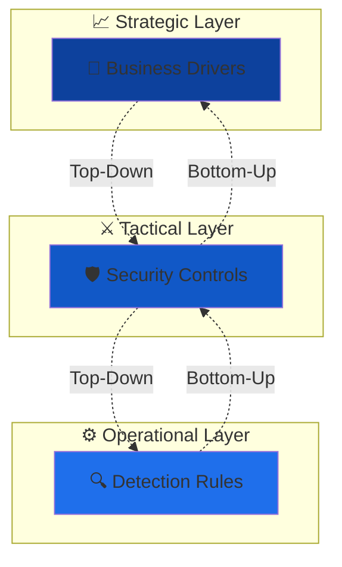

# 🔄 Use Case and Detection Engineering Lifecycle

## 🚀 Overview

> 🎯 **Problem Solved**: A Use Case Framework tackles the problem of **"deciding where to focus on and on what time in a complex cyber security environment"**.

### ⚠️ The Challenge

Most organizations tend to deal on an **ad-hoc basis** of building use cases without any reference framework or train of thought. This introduces **risks** to the organization since their SOC is not properly being guided in an effective way.

### ✅ The Solution

This Use Case framework allows for **strategic and effective decision making** in a phased manner when dealing with developing and implementing new use cases for the **Security Operations Centre (SOC)**.

## 🔗 Two-Way Traceability

> 🔄 **Key Principle**: Two-way traceability is important throughout the framework.

**Benefits:**
- 📊 **Top-Down**: Show how business drivers are implemented in operational monitoring
- 📈 **Bottom-Up**: Connect monitoring rules to specific threats and business drivers

---

## 🔄 Lifecycle Phases

### 1️⃣ Planning Phase

> 🏗️ **Foundation**: In this phase, the foundation for the use case and detection formation is laid down.

#### 🎯 Key Activities:
- 📋 Defining the **scope and objectives** of your detection program
- 🏭 Identifying the **assets and data sources** to be monitored  
- 🎯 Understanding the **specific threats and risks** you need to address
- 🏛️ Establishing the necessary **governance structure**
- 📊 Defining **key performance indicators (KPIs)** for measuring success
- 🛠️ Identifying the required **resources** (tools, technologies, and personnel)

### 2️⃣ Development Phase

> ⚒️ **Creation**: Once the planning phase is complete, you move on to the development phase.

#### 🔧 Key Activities:
- 🔍 Creating the necessary **detection rules, queries, and use cases**
- 🚨 Enabling your **SIEM system** to identify and alert on potential security incidents
- 🏗️ Deep understanding of the organization's **infrastructure, applications, and threat landscape**
- 🤝 Collaborating with other teams (network administrators and system owners)
- 📊 Gathering **relevant information** and ensuring effective detection capabilities

### 3️⃣ Delivery Phase

> 🚀 **Implementation**: The delivery phase involves implementing the detection rules and use cases into the SIEM system.

#### ⚙️ Key Activities:
- ⚙️ **Configuring** the SIEM solution to ingest and analyze relevant log data
- 📊 Processing data from various sources:
  - 🔥 Firewalls
  - 🛡️ Intrusion Detection Systems  
  - 💻 Endpoint Agents
- 🧪 **Testing and fine-tuning** detection mechanisms
- 📉 Reducing **false positives**
- 📈 Improving overall **SIEM system effectiveness**
- 🔗 **Integrating** with other security tools and systems

### 4️⃣ Improvement Phase

> 🔄 **Continuous Enhancement**: The improvement phase is an ongoing process that occurs after the initial delivery.

#### 📈 Key Activities:
- 📊 Continuously **monitoring** the performance of detection mechanisms
- 🔧 **Refining** them based on real-world feedback and incident response experiences
- 📊 **Analyzing** the effectiveness of rules and use cases
- 🔍 **Identifying gaps or weaknesses**
- 🔄 **Updating** them to address emerging threats and environmental changes
- 🧠 Staying informed about the **latest threat intelligence**
- 🔄 **Incorporating** relevant updates into the detection process

---

## 📈 Success Metrics

| Phase | 📊 Key Metrics | 🎯 Success Indicators |
|-------|----------------|----------------------|
| 🏗️ **Planning** | Scope Definition, Resource Allocation | Clear objectives, Stakeholder buy-in |
| ⚒️ **Development** | Rule Quality, Coverage | Comprehensive detection, Low false positives |
| 🚀 **Delivery** | Implementation Speed, Integration Success | Operational SIEM, Real-time monitoring |
| 🔄 **Improvement** | Detection Rate, Response Time | Reduced incidents, Faster resolution |

---

*📝 **Note**: This framework ensures strategic alignment between business objectives and operational security monitoring capabilities.*

# To be Continued...
