# 🔄Detection Engineering Lifecycle

## 🚀 Overview

> 🎯 **Problem Solved**: A Use Case Framework tackles the problem of **"deciding where to focus on and on what time in a complex cyber security environment"**.

### ⚠️ The Challenge

Most organizations tend to deal on an **ad-hoc basis** of building use cases without any reference framework or train of thought. This introduces **risks** to the organization since their SOC is not properly being guided in an effective way.

### ✅ The Solution

This Use Case framework allows for **strategic and effective decision making** in a phased manner when dealing with developing and implementing new use cases for the **Security Operations Centre (SOC)**.

## 🔗 Two-Way Traceability

> 🔄 **Key Principle**: Two-way traceability is important throughout the framework.

```mermaid
graph TB
    subgraph "📈 Strategic Layer"
        A[🎯 Business Drivers]
    end
    
    subgraph "⚔️ Tactical Layer"
        B[🛡️ Security Controls]
    end
    
    subgraph "⚙️ Operational Layer"
        C[🔍 Detection Rules]
    end
    
    A -.->|Top-Down| B
    B -.->|Top-Down| C
    C -.->|Bottom-Up| B
    B -.->|Bottom-Up| A
    
    style A fill:#0d419d
    style B fill:#1158c7
    style C fill:#1f6feb
```

**Benefits:**
- 📊 **Top-Down**: Show how business drivers are implemented in operational monitoring
- 📈 **Bottom-Up**: Connect monitoring rules to specific threats and business drivers

---

## 🔄 Lifecycle Phases

### 1️⃣ Planning Phase

> 🏗️ **Foundation**: In this phase, the foundation for the use case and detection formation is laid down.

#### 🎯 Key Activities:
- 📋 Defining the **scope and objectives** of your detection program
- 🏭 Identifying the **assets and data sources** to be monitored  
- 🎯 Understanding the **specific threats and risks** you need to address
- 🏛️ Establishing the necessary **governance structure**
- 📊 Defining **key performance indicators (KPIs)** for measuring success
- 🛠️ Identifying the required **resources** (tools, technologies, and personnel)

### 2️⃣ Development Phase

> ⚒️ **Creation**: Once the planning phase is complete, you move on to the development phase.

#### 🔧 Key Activities:
- 🔍 Creating the necessary **detection rules, queries, and use cases**
- 🚨 Enabling your **SIEM system** to identify and alert on potential security incidents
- 🏗️ Deep understanding of the organization's **infrastructure, applications, and threat landscape**
- 🤝 Collaborating with other teams (network administrators and system owners)
- 📊 Gathering **relevant information** and ensuring effective detection capabilities

### 3️⃣ Delivery Phase

> 🚀 **Implementation**: The delivery phase involves implementing the detection rules and use cases into the SIEM system.

#### ⚙️ Key Activities:
- ⚙️ **Configuring** the SIEM solution to ingest and analyze relevant log data
- 📊 Processing data from various sources:
  - 🔥 Firewalls
  - 🛡️ Intrusion Detection Systems  
  - 💻 Endpoint Agents
- 🧪 **Testing and fine-tuning** detection mechanisms
- 📉 Reducing **false positives**
- 📈 Improving overall **SIEM system effectiveness**
- 🔗 **Integrating** with other security tools and systems

### 4️⃣ Improvement Phase

> 🔄 **Continuous Enhancement**: The improvement phase is an ongoing process that occurs after the initial delivery.

#### 📈 Key Activities:
- 📊 Continuously **monitoring** the performance of detection mechanisms
- 🔧 **Refining** them based on real-world feedback and incident response experiences
- 📊 **Analyzing** the effectiveness of rules and use cases
- 🔍 **Identifying gaps or weaknesses**
- 🔄 **Updating** them to address emerging threats and environmental changes
- 🧠 Staying informed about the **latest threat intelligence**
- 🔄 **Incorporating** relevant updates into the detection process

---

## 📈 Success Metrics

| Phase | 📊 Key Metrics | 🎯 Success Indicators |
|-------|----------------|----------------------|
| 🏗️ **Planning** | Scope Definition, Resource Allocation | Clear objectives, Stakeholder buy-in |
| ⚒️ **Development** | Rule Quality, Coverage | Comprehensive detection, Low false positives |
| 🚀 **Delivery** | Implementation Speed, Integration Success | Operational SIEM, Real-time monitoring |
| 🔄 **Improvement** | Detection Rate, Response Time | Reduced incidents, Faster resolution |

---

*📝 **Note**: This framework ensures strategic alignment between business objectives and operational security monitoring capabilities.*

# 🔧 Detection Engineering Framework

## 🎯 Detailed Framework Overview

> 🚀 **Purpose**: The Detection Engineering Framework provides a systematic approach to developing, testing, and deploying security detection capabilities within enterprise environments.

This comprehensive framework transforms **business drivers** (Risk, Threat, Compliance) into **operational security capabilities** through a structured 12-phase methodology that ensures robust detection engineering practices.

---

## 🔄 Complete Framework Flow

```mermaid
flowchart TD
    %% Input Drivers
    A1[🎯 Risk] --> B[📋 Use Case Request]
    A2[⚠️ Threat] --> B
    A3[📊 Compliance] --> B
    
    %% Development Phase
    B --> C[🛠️ Prep for Development]
    C --> D[🔍 Technical Analysis]
    D --> E[⚔️ Attack Simulation]
    
    %% Implementation Phase
    E --> F[📝 Development Pre-req]
    F --> G[💻 Code Development]
    G --> H[🧪 Code Testing]
    H --> I[📈 Response Development]
    
    %% Deployment Phase
    I --> J[🔬 Response Testing]
    J --> K[🤝 SOC Handover]
    K --> L[⚡ Rule Activation]
    L --> M[📚 Cataloguing]
    
    %% Styling
    style A1 fill:#ff6b6b,stroke:#d63031,stroke-width:3px,color:#fff
    style A2 fill:#ff6b6b,stroke:#d63031,stroke-width:3px,color:#fff
    style A3 fill:#ff6b6b,stroke:#d63031,stroke-width:3px,color:#fff
    
    style B fill:#6c5ce7,stroke:#5f3dc4,stroke-width:2px,color:#fff
    style C fill:#00b894,stroke:#00a085,stroke-width:2px,color:#fff
    style D fill:#00b894,stroke:#00a085,stroke-width:2px,color:#fff
    style E fill:#00b894,stroke:#00a085,stroke-width:2px,color:#fff
    
    style F fill:#26d0ce,stroke:#1dd1a1,stroke-width:2px,color:#fff
    style G fill:#26d0ce,stroke:#1dd1a1,stroke-width:2px,color:#fff
    style H fill:#26d0ce,stroke:#1dd1a1,stroke-width:2px,color:#fff
    style I fill:#26d0ce,stroke:#1dd1a1,stroke-width:2px,color:#fff
    
    style J fill:#74b9ff,stroke:#0984e3,stroke-width:2px,color:#fff
    style K fill:#74b9ff,stroke:#0984e3,stroke-width:2px,color:#fff
    style L fill:#74b9ff,stroke:#0984e3,stroke-width:2px,color:#fff
    style M fill:#74b9ff,stroke:#0984e3,stroke-width:2px,color:#fff
```

---

## 📊 Framework Phases Breakdown

### 🔴 Phase 1: Business Drivers Input

> 🎯 **Foundation**: All detection engineering initiatives begin with clear business justification from three primary drivers.

The framework recognizes that effective detection engineering cannot exist in a vacuum. Every use case must be anchored to legitimate business needs that justify the investment of time, resources, and organizational focus. This phase establishes the critical foundation by identifying and documenting the specific business drivers that necessitate new detection capabilities.

**Risk drivers** emerge from enterprise risk management activities where organizations identify potential threats to their business operations, assets, or reputation. These drivers often stem from business impact analyses that reveal vulnerabilities in critical processes or systems. When risk assessments highlight gaps in current security posture, they generate requirements for enhanced detection capabilities that can provide early warning of potential incidents.

**Threat drivers** originate from intelligence about active adversaries and attack campaigns targeting the organization or its industry. These drivers are informed by threat intelligence feeds that provide insights into current attack patterns, emerging tactics, techniques, and procedures used by threat actors. Organizations must continuously adapt their detection strategies to address evolving threat landscapes and industry-specific attack vectors.

**Compliance drivers** arise from regulatory obligations and industry standards that mandate specific security controls and monitoring capabilities. Whether driven by financial regulations like SOX, healthcare standards like HIPAA, or payment processing requirements like PCI-DSS, compliance drivers ensure that detection capabilities align with external requirements and audit expectations.

---

### 🟣 Phase 2: Use Case Request

> 📋 **Initiation**: The formal process of documenting and prioritizing detection engineering requirements.

Once business drivers have been identified, organizations must translate these high-level requirements into specific, actionable use case requests. This phase serves as the critical bridge between strategic business needs and tactical detection engineering work. The use case request process ensures that every detection engineering effort is properly scoped, justified, and aligned with organizational priorities.

The documentation process begins with capturing the business justification that links back to the original drivers. This documentation must clearly articulate why the detection capability is needed, what business problem it solves, and how success will be measured. The use case request also defines the specific detection objectives, outlining what types of threats or activities the new capability should identify and under what circumstances alerts should be generated.

Priority categorization becomes essential when organizations face multiple competing demands for detection engineering resources. The framework provides structured criteria for evaluating use case requests based on factors such as potential business impact, regulatory requirements, threat severity, and available resources. This prioritization ensures that the most critical detection capabilities are developed first while maintaining clear visibility into the pipeline of future work.

---

### 🟢 Phase 3-5: Development Preparation & Analysis

#### 🛠️ Phase 3: Prep for Development
> **Preparation**: Setting up the foundation for technical development work.

The preparation phase establishes the necessary infrastructure, resources, and planning required for successful detection engineering work. This phase recognizes that effective detection development requires more than just technical skills – it demands proper environment setup, resource allocation, and project planning to ensure smooth execution.

Environment setup involves preparing development and testing infrastructure that mirrors production systems while providing safe spaces for experimentation and validation. This includes configuring access to relevant data sources, setting up development tools, and establishing secure channels for collaboration between team members. The preparation phase also involves assembling the right mix of skills and expertise, bringing together detection engineers, threat intelligence analysts, and subject matter experts who understand the specific technologies and attack vectors being addressed.

#### 🔍 Phase 4: Technical Analysis
> **Deep Dive**: Comprehensive technical assessment of the detection requirements.

Technical analysis represents the most critical investigative phase of the framework, where detection engineers develop deep understanding of the technical landscape that will support their detection logic. This phase goes far beyond surface-level requirements gathering to examine the underlying data sources, infrastructure constraints, and technical feasibility of proposed detection approaches.

Data source analysis forms the cornerstone of this phase, requiring engineers to thoroughly understand what log data is available, how it is formatted, where it is stored, and what information it contains. This analysis often reveals gaps between what organizations think they are logging and what data is actually available for detection purposes. Engineers must also assess the quality, completeness, and reliability of data sources to ensure that detection logic will function consistently in production environments.

Infrastructure evaluation examines the technical capabilities and constraints of existing security tools and platforms. This includes understanding processing capacity, storage limitations, query performance characteristics, and integration capabilities that will impact detection rule deployment and operation.

#### ⚔️ Phase 5: Attack Simulation
> **Validation**: Testing and validating attack scenarios to ensure detection efficacy.

Attack simulation provides empirical validation of detection approaches before significant development investment occurs. This phase moves beyond theoretical analysis to actual testing of attack scenarios in controlled environments, providing concrete evidence of what detection approaches will and will not work in practice.

The simulation process begins with developing realistic attack scenarios based on current threat intelligence and the specific use case requirements. These scenarios must accurately reflect the tactics, techniques, and procedures that real adversaries would use, ensuring that detection logic will be effective against actual threats rather than theoretical ones. Simulation activities are conducted in isolated environments that mirror production systems but prevent any risk to operational infrastructure.

Through controlled testing, engineers establish baseline behavior patterns that distinguish normal activity from malicious actions. This baseline establishment is crucial for developing detection logic that minimizes false positives while maintaining high sensitivity to actual threats. The simulation phase often reveals important insights about attack detection that are not apparent from purely analytical approaches.

---

### 🟦 Phase 6-9: Implementation & Development

The implementation and development phases represent the core technical work where detection concepts are transformed into operational capabilities. These four interconnected phases build upon each other to create robust, tested, and deployable detection solutions that meet the requirements established in earlier phases.

#### 📝 Phase 6: Development Pre-req

The development prerequisites phase finalizes all technical requirements and design decisions before coding begins. This phase serves as the final checkpoint to ensure that all necessary groundwork has been completed and that development can proceed efficiently without major roadblocks or design changes.

Technical requirements finalization involves converting the insights gained from analysis and simulation phases into specific, implementable specifications. These requirements must be detailed enough to guide development work while flexible enough to accommodate technical discoveries made during implementation. The architecture design process establishes the overall structure and approach for the detection solution, defining how different components will interact and how the solution will integrate with existing security infrastructure.

Data modeling becomes particularly important during this phase, as engineers must define exactly how information will be structured, processed, and stored throughout the detection pipeline. This includes designing schemas for log parsing, defining data enrichment processes, and establishing the format for detection outputs that will be consumed by downstream systems.

#### 💻 Phase 7: Code Development

Code development transforms design specifications into functional detection logic that can identify threats and generate appropriate alerts. This phase requires deep technical expertise in detection engineering tools and platforms, as well as thorough understanding of the attack scenarios and data sources established in previous phases.

Detection logic creation involves writing the core algorithms and rules that will identify malicious activity within the monitored data streams. This logic must be precise enough to minimize false positives while comprehensive enough to catch variations in attack techniques. Engineers must consider factors such as timing windows, correlation logic across multiple data sources, and threshold settings that balance sensitivity with operational practicality.

Query development translates detection logic into the specific syntax and structure required by SIEM platforms and security tools. This often involves optimizing queries for performance while maintaining detection effectiveness, as poorly optimized detection rules can impact overall system performance and response times.

#### 🧪 Phase 8: Code Testing

Comprehensive testing validates that developed detection capabilities function correctly across a wide range of scenarios and conditions. This phase goes beyond simple functionality testing to examine performance characteristics, edge cases, and integration behavior that could impact production deployment.

Unit testing focuses on validating individual components of the detection logic, ensuring that each element functions correctly in isolation. This includes testing parsing logic, correlation algorithms, and output formatting to verify that each component produces expected results when presented with known inputs.

Integration testing examines how detection components work together and how they interact with existing security infrastructure. This testing reveals potential conflicts with other detection rules, resource consumption patterns, and integration issues that might not be apparent during unit testing.

Performance testing evaluates how detection rules behave under realistic load conditions, measuring factors such as processing time, memory consumption, and system impact. This testing is crucial for ensuring that new detection capabilities do not adversely affect overall security platform performance.

#### 📈 Phase 9: Response Development

Response development creates the procedures, workflows, and automation that will handle alerts generated by the new detection capabilities. This phase recognizes that effective detection is only valuable if it leads to appropriate and timely response actions.

Alert configuration establishes how detection events will be formatted, prioritized, and routed to appropriate response teams. This includes defining alert severity levels, establishing escalation criteria, and configuring notification mechanisms that ensure critical threats receive immediate attention while minimizing alert fatigue from lower-priority events.

Playbook development creates standardized procedures that guide security analysts through the investigation and response process when alerts are triggered. These playbooks must provide clear, step-by-step guidance while remaining flexible enough to accommodate variations in attack techniques and environmental factors. Effective playbooks also include decision trees that help analysts determine appropriate response actions based on investigation findings.

---

### 🔵 Phase 10-12: Deployment & Operations

The final phases of the framework focus on transitioning developed detection capabilities from development environments into operational production use. These phases ensure that detection capabilities are not only technically sound but also operationally sustainable and properly integrated into existing security operations workflows.

#### 🔬 Phase 10: Response Testing

Response testing validates that the complete detection and response system functions effectively under realistic operational conditions. This phase moves beyond the technical testing of detection logic to examine the human and procedural elements that determine whether detection capabilities translate into effective security outcomes.

Tabletop exercises engage security teams in simulated incident scenarios that test not only the technical detection capabilities but also the human response processes, communication protocols, and decision-making procedures that activate when alerts are generated. These exercises reveal gaps between theoretical response procedures and practical operational realities, highlighting areas where additional training, process refinement, or tool configuration may be needed.

Simulated incident response drills provide hands-on testing of the complete alert-to-resolution workflow, measuring how effectively security teams can investigate alerts, make appropriate decisions, and take corrective actions. These drills often reveal important insights about alert quality, investigation tools, and procedural effectiveness that cannot be discovered through purely technical testing approaches.

#### 🤝 Phase 11: SOC Handover

The SOC handover phase manages the critical transition of detection capabilities from development teams to operational security teams. This transition requires more than simply deploying technical capabilities – it demands comprehensive knowledge transfer, training, and support structure establishment to ensure operational success.

Documentation development creates comprehensive reference materials that enable SOC analysts to effectively operate and maintain the new detection capabilities. This documentation must balance completeness with usability, providing detailed technical information while remaining accessible to analysts with varying levels of expertise. Effective documentation includes not only technical specifications but also decision trees, troubleshooting guides, and escalation procedures that support day-to-day operations.

Training programs ensure that SOC teams have the knowledge and skills necessary to operate new detection capabilities effectively. These programs must address both technical aspects of the detection tools and procedural aspects of incident response, providing hands-on experience that builds confidence and competence in real-world scenarios.

#### ⚡ Phase 12: Rule Activation

Rule activation represents the transition from testing to live production operation, where detection capabilities begin monitoring actual organizational activity and generating alerts for real security events. This phase requires careful orchestration to ensure smooth deployment while minimizing operational disruption.

Production deployment involves implementing detection rules in live environments while maintaining continuous monitoring of system performance and alert quality. Initial deployment often uses graduated approaches, such as shadow mode operation or limited scope deployment, that allow for real-world validation without full operational impact.

Baseline establishment during the initial operational period provides critical data about normal detection behavior, false positive rates, and system performance under actual load conditions. This baseline data becomes essential for ongoing tuning and optimization efforts that improve detection effectiveness over time.

#### 📚 Phase 13: Cataloguing

The cataloguing phase ensures that organizational knowledge and experience gained through the detection engineering process is captured, documented, and made available for future use. This phase recognizes that effective detection engineering programs build upon accumulated knowledge and that individual detection projects contribute to broader organizational capabilities.

Comprehensive documentation goes beyond simple technical specifications to capture the reasoning, trade-offs, and lessons learned throughout the development process. This documentation includes not only what was built and how it works, but also why specific design decisions were made, what alternatives were considered, and what challenges were encountered during development and deployment.

Knowledge management processes ensure that insights gained from individual detection engineering projects are incorporated into organizational best practices and training materials. This includes updating development methodologies based on lessons learned, refining testing procedures based on operational experience, and sharing successful approaches across different detection engineering teams.

---

*🔧 **Framework Philosophy**: "Every detection capability should be purposefully designed, rigorously tested, and operationally sustainable."*

---

> 💡 **Pro Tip**: The Cisco Detection Engineering Framework emphasizes the importance of **end-to-end traceability** from business drivers to operational outcomes, ensuring that every detection investment delivers measurable business value.

