# 🚀 Delivery Phase

## 🔄 SOC Handover

Use case handover is a process of transition, and should only be initiated once the development phase is completed or approaching completion.

Use case handover is better known as the point in the life-cycle where deliverables are handed over to the stakeholders and users which in this case are mainly the Security monitoring team. An effective handover will enable the Security monitoring team to operate, maintain and support the use case through its lifetime in an effective and responsible manner; producing the desired or intended outcome.

```mermaid
graph TD
    A[📋 Development Phase Complete] --> B[🔄 Handover Process]
    B --> C[📦 Deliverables Package]
    C --> D[👥 Security Monitoring Team]
    D --> E[⚙️ Operation & Maintenance]
    E --> F[🎯 Desired Outcome]
    
    C --> G[📄 Documentation Pack]
    C --> H[🔍 Technical Analysis]
    C --> I[⚠️ Exceptions]
    C --> J[💻 VAL/Rule Logic]
    
    style A fill:#2D3748,stroke:#ffffff,stroke-width:2px,color:#ffffff
    style B fill:#2D3748,stroke:#ffffff,stroke-width:2px,color:#ffffff
    style C fill:#2D3748,stroke:#ffffff,stroke-width:2px,color:#ffffff
    style D fill:#2D3748,stroke:#ffffff,stroke-width:2px,color:#ffffff
    style E fill:#2D3748,stroke:#ffffff,stroke-width:2px,color:#ffffff
    style F fill:#2D3748,stroke:#ffffff,stroke-width:2px,color:#ffffff
    style G fill:#2D3748,stroke:#ffffff,stroke-width:2px,color:#ffffff
    style H fill:#2D3748,stroke:#ffffff,stroke-width:2px,color:#ffffff
    style I fill:#2D3748,stroke:#ffffff,stroke-width:2px,color:#ffffff
    style J fill:#2D3748,stroke:#ffffff,stroke-width:2px,color:#ffffff
```



The Development team must ensure completeness of deliverables at handover and should focus on the following aspects:

### 📋 Handover Checklist

- ✅ **Documented information pack** that contains all information captured at the Planning, Development, and/or improvement phase
- 🔬 **Level of technical analysis** carried out before developing the use case
- ⚠️ **Any exceptions** that were taken into account during the development phase
- 💻 **The VAL, actual rule or code logics** that were developed during the development phase
- ✔️ **Validation of the all the code and Response playbook tests** that were carried out
- 👍 **Confirmation of all technical and non-technical Stakeholder approvals**
- 📊 **An Alert forecast** before activating the alerts
- 🎯 **A joint walkthrough and tabletop simulation** of the Response playbook
- ⭐ **A suggested use case quality rating**
- 📚 **Assistance in cataloguing** the Use case and its associated rules
- ⏰ **Ample period of time** for the security monitoring team to consider and provide feedback
- 🤝 **A jointly agreed date and time** when the rule's alert notification would be turned on

## ⚡ Rule Activation

The code, rule, logic, search string or detection signature if has been tested in preproduction platform, now should be moved to the production platform and activated for its desired type of notification in the form of alerts or watchlists.

### 👁️ Monitoring Rule Behaviour

In most cases with an extensive testing procedure in the development phase, the effort to monitor should be minimal. But in the lay of the land for the organisation, organization's assets, the assets configuration, and the threat it faces from the ever-evolving threat landscape never remain constant.

Hence when new detection rules & it's alerts are activated in production; it is as a good practice best to ensure that the rule behaviour is monitored for undesirable behaviours such as:

```mermaid
graph LR
    A[🚨 New Rule Activated] --> B{Monitor Behavior}
    B --> C[📈 Excessive Alerts]
    B --> D[❓ Insufficient Information]
    B --> E[⚠️ Platform Degradation]
    B --> F[📡 No Data Sources]
    B --> G[🔧 System Anomalies]
    
    style A fill:#2D3748,stroke:#ffffff,stroke-width:2px,color:#ffffff
    style B fill:#2D3748,stroke:#ffffff,stroke-width:2px,color:#ffffff
    style C fill:#2D3748,stroke:#ffffff,stroke-width:2px,color:#ffffff
    style D fill:#2D3748,stroke:#ffffff,stroke-width:2px,color:#ffffff
    style E fill:#2D3748,stroke:#ffffff,stroke-width:2px,color:#ffffff
    style F fill:#2D3748,stroke:#ffffff,stroke-width:2px,color:#ffffff
    style G fill:#2D3748,stroke:#ffffff,stroke-width:2px,color:#ffffff
```



- 🔴 The rule causes extensive amount of unmanageable alerts
- ❓ The rule provides insufficient amount of initial information for further investigation
- ⚠️ The rule causes deprecating effect on the platform
- 📡 The rule's data sources are not forwarding any telemetry
- 🔧 The rule causes any other systemic anomaly

### 📊 Monitoring Metrics

#### 🔢 Number of Alerts

For each use case, the number of alerts resulting from the security monitoring systems should be reported on. These numbers are indicators of which use cases are triggered often and which are triggered rarely. Combined with the information on false-positives, this information is input into the threat management process. The number of alerts should be expressed as an absolute value per use case. Not every alert will also lead to an incident response. Therefore, the number of incidents should also be reported on. Just like with alerts, the number of incidents should be expressed as an absolute value per use case.

#### ❌ False-positive Ratio

The false-positive provides an indication of the quality of the security monitoring system. False-positives occur when a security alert is triggered, while there's no actual security incident. While false-positives are fact-of-life in any SOC, high numbers of false-positives should be avoided at any cost.

False positives can be expressed as the ratio between the total number of alerts and the number of alerts relating to incidents.

**Equation 1: Formula for measuring False-positive Ratio**

```math
FP Rate% = 100 - 100 * (Number of alerts relating to incident / Total number of alerts)
```

#### 🔍 Number of False-negatives

False negatives refer to the instances where a monitoring system fails to detect an actual event or incident. It occurs when a legitimate security event or anomaly goes undetected and is not flagged as suspicious or potentially harmful. False negatives are essentially missed opportunities to identify and respond to security threats or incidents.

```mermaid
graph TD
    A[🔍 Monitoring System] --> B{Detection}
    B -->|✅ Detected| C[🚨 Alert Generated]
    B -->|❌ Not Detected| D[⚠️ False Negative]
    D --> E[🎯 Missed Threat]
    E --> F[🔓 Security Risk]
    
    style A fill:#2D3748,stroke:#ffffff,stroke-width:2px,color:#ffffff
    style B fill:#2D3748,stroke:#ffffff,stroke-width:2px,color:#ffffff
    style C fill:#2D3748,stroke:#ffffff,stroke-width:2px,color:#ffffff
    style D fill:#2D3748,stroke:#ffffff,stroke-width:2px,color:#ffffff
    style E fill:#2D3748,stroke:#ffffff,stroke-width:2px,color:#ffffff
    style F fill:#2D3748,stroke:#ffffff,stroke-width:2px,color:#ffffff
```



Monitoring false negatives is of utmost importance because they pose a significant risk to the organization's security posture. When an actual security event goes undetected, it means that the organization remains vulnerable to ongoing attacks or compromises. The potential consequences of false negatives include prolonged unauthorized access, data breaches, loss of sensitive information, or disruption of critical services.

By monitoring false negatives, organizations can identify gaps and shortcomings in their monitoring systems, detection mechanisms, and alerting processes. It helps them evaluate the effectiveness of their security controls and incident response capabilities. Monitoring false negatives enables organizations to refine and improve their monitoring strategies, fine-tune detection rules, and enhance the overall accuracy and efficiency of their security monitoring systems.

Here are a few key reasons why monitoring false negatives is important:

- 🎯 **Incident Response Improvement**: Monitoring false negatives provides insights into potential blind spots in the monitoring system. It allows organizations to identify areas where their detection mechanisms may be inadequate or require fine-tuning. By addressing these gaps, organizations can enhance their incident response capabilities and reduce the risk of undetected security incidents.

- 🛡️ **Threat Detection Enhancement**: False negatives indicate that certain types of security events or attack techniques are not being effectively identified. By monitoring and analyzing false negatives, organizations can gain a better understanding of emerging threats, new attack vectors, or sophisticated evasion techniques employed by adversaries. This knowledge can inform the development of improved detection rules and strategies to stay ahead of evolving threats.

- ⚠️ **Risk Mitigation**: False negatives increase the organization's exposure to potential risks and threats. By monitoring them, organizations can take proactive measures to mitigate these risks. This may involve strengthening security controls, implementing additional monitoring measures, or adjusting response procedures to ensure that potential threats are not overlooked.

- 📋 **Compliance and Regulatory Requirements**: Monitoring false negatives is essential for meeting compliance and regulatory obligations. Many industry standards and regulations mandate robust monitoring and detection capabilities. By actively monitoring false negatives, organizations can demonstrate their commitment to maintaining a strong security posture and complying with relevant requirements.

- 🔄 **Continuous Improvement**: False negatives provide valuable feedback for ongoing improvement of the monitoring system. By analyzing the reasons behind false negatives, organizations can identify patterns, trends, or recurring issues that need to be addressed. This iterative approach allows for continuous enhancement of the monitoring infrastructure, detection algorithms, and incident response processes.

Information on false-negative, similar to the false-positive ratio, provides insight into the quality of the operational security monitoring rules. False-negatives occur when an actual incident has taken place that is within scope of one of the use cases, but was not detected by any operational monitoring detection mechanisms. This could be due to improper tuning of correlation rules, incorrect configuration of the correlation rules or simply because no detection mechanisms exists as the attack vector was either unforeseen or not implemented yet.

False negatives should be reported as a quantity of missed security incidents. Note that false-negatives may occur continuously without being noticed.

## 📚 Use Case Cataloguing

A poor or non-existent catalogue can create huge problems for the SOC such as:

- ❌ Unclear map of visibility and detection techniques
- 🔄 Installing multiple copies of the same use cases or rules
- ❓ Incorrect interpretation of use cases
- 📝 Minimal number of details around why the use case exists
- 📋 No auditable history or information on the changes and revisions

```mermaid
graph TD
    A[📚 Use Case Catalogue] --> B[🗺️ Clear Visibility Map]
    A --> C[🚫 Prevent Duplicates]
    A --> D[✅ Correct Interpretation]
    A --> E[📝 Detailed Documentation]
    A --> F[📋 Audit History]
    
    B --> G[🎯 Better Resource Allocation]
    C --> H[💰 Cost Efficiency]
    D --> I[⚡ Faster Response]
    E --> J[🧠 Knowledge Management]
    F --> K[📊 Compliance]
    
    style A fill:#2D3748,stroke:#ffffff,stroke-width:2px,color:#ffffff
    style B fill:#2D3748,stroke:#ffffff,stroke-width:2px,color:#ffffff
    style C fill:#2D3748,stroke:#ffffff,stroke-width:2px,color:#ffffff
    style D fill:#2D3748,stroke:#ffffff,stroke-width:2px,color:#ffffff
    style E fill:#2D3748,stroke:#ffffff,stroke-width:2px,color:#ffffff
    style F fill:#2D3748,stroke:#ffffff,stroke-width:2px,color:#ffffff
    style G fill:#2D3748,stroke:#ffffff,stroke-width:2px,color:#ffffff
    style H fill:#2D3748,stroke:#ffffff,stroke-width:2px,color:#ffffff
    style I fill:#2D3748,stroke:#ffffff,stroke-width:2px,color:#ffffff
    style J fill:#2D3748,stroke:#ffffff,stroke-width:2px,color:#ffffff
    style K fill:#2D3748,stroke:#ffffff,stroke-width:2px,color:#ffffff
```



Use Case cataloguing helps to understand what established use cases and rules the organisation has, where it is located and what purpose it serves. It also helps to prioritize use case improvements and resources through understanding how important any given use case or rule is.

This Detection Engineering Framework takes a thread from descriptive cataloguing, which is the process of representing resources by recording their identifying traits and selecting specific names and titles to serve as access points. The goal of descriptive cataloguing is not to create perfect representations but to provide data to serve users.

The collection of use cases in a single catalogue are related by order. The ordering of the use cases according to some characteristic is called a unique identifier. Such characteristics may be intrinsic properties of the objects (e.g., use case category, Rule ID etc.) or they may be assigned from some agreed-upon set, such as object class or date of creation. The values of the key are arranged in a sorting sequence that is dependent on the type of key involved and may be sorted on the basis of similarity in class, such as use case category based on the threat coverage or asset type coverage.

This order is imposed on the catalogue to create their inventory and to facilitate locating specific objects in the set. Unless the objects in a catalogue are replicated, any ordering scheme is one-dimensional and unable to meet all the functions of ordering with equal effectiveness. The main approach for overcoming some of the limitations of one-dimensional ordering of recorded use cases relies on extended description of its content.

The importance of cataloguing is twofold:

- 🎯 Explicitly show high relevance of the use cases and rules to a certain type of user
- 🧭 Provide that type of user with a highly compatible way of navigating the content in use cases and rules

### 📋 Catalogue Fields

The following fields are some of the important identifying traits for cataloguing the use case, rules and its associated attributes:

| Field Name | Field Description |
|------------|-------------------|
| 🆔 **Use Case ID#** | Typically, a serial number that uniquely identifies the use case |
| 📝 **Use Case Name** | High level descriptive name for the use case |
| 📄 **Use Case Description** | Low level brief description of the use case |
| 👤 **Use Case Requestor Name** | Name of the person that requested the Use Case |
| 📅 **Use Case Date of Creation** | The date of the Use Case when it was first recorded |
| 🔄 **Use Case Date of Revision** | The date of the Use Case when it was last modified |
| ❌ **Use Case Date of Decommission** | The date of the Use Case when it was decommissioned |
| 🆔 **Rule ID#** | Typically, a serial number that uniquely identifies the rule |
| 📊 **Rule Onboarding Status** | The stage of the Rule development process |
| 📝 **Rule Name** | High level descriptive name for the rule |
| 📄 **Rule Description** | Low level brief description of the use case |
| 👨‍💻 **Rule Creator Name** | Name of the technical person that created the rule |
| 👨‍🔧 **Rule Modifier Name** | Name of the technical person that modified the rule |
| 📅 **Rule Date of Creation** | The date of the rule when it was first created |
| 🔄 **Rule Date of Revision** | The date of the rule when it was last modified |
| ❌ **Rule Date of Decommissioning** | The date of the rule when it was first created |
| 📡 **Rule Required Log Sources** | Indicates the required telemetry for this rule to work |
| ⚡ **Rule Actions** | Describes the required actions by the rule. Some rules are intended to generate alerts, some are required as basic rules for a more complex detection logic, others are required to be processed through reports |
| 🔥 **Rule Priority** | Indicates an initial priority for alerts generated by this detection rule |
| 💻 **Rule VAL** | Describes the actual detection logic including event matches and suggested thresholds |
| ⚠️ **Rule Exceptions** | List of suggested exceptions that are known to trigger this rule but do not constitute a threat |
| ⭐ **Rule Quality Rating** | Maturity rating for the rule |
| 🚀 **Rule Release benchmark** | Release benchmarking for the rule |
| 🔔 **Rule Alert Status** | Alert status for the rule whether it is enabled or disabled |
| 📖 **Rule associated playbooks** | The associated playbook/s that should be triggered |
| 🎯 **Rule ATT&CK Tactic mapping** | Referenced to related MITRE ATT&CK tactic |
| 🛠️ **Rule ATT&CK Technique mapping** | Referenced to related MITRE ATT&CK technique |
| 🔧 **Rule ATT&CK Sub-Technique mapping** | Referenced to related MITRE ATT&CK sub-technique |
| ✅ **SOC Manager Approval** | Approved by the SOC manager |
| 👍 **Stakeholder Requestor Approval** | Approved by the Stakeholder |
| 📝 **Notes and Comments** | Includes details about any special considerations such as required audit configuration, note on high event volume, and recommended implementation approach where applicable |

### 🏷️ Category and Naming Convention

When establishing a naming convention for use cases and SIEM rules, it's important to create a standardized approach that promotes clarity, consistency, and ease of management. Here's a suggested naming convention:

| **No.** | **Use case category** | **ATT&CK Tactic** | **Infrastructure** |
|:-------:|:---------------------:|:-----------------:|:------------------:|
| 0001 | Self-Monitoring | Reconnaissance | Windows |
| 0002 | Access Control | Resource Development | Linux |
| 0003 | Application | Initial Access | AWS |
| 0004 | Host | Execution | Azure |
| **...** | Mobile | Persistence | Firewall |
| | Wireless Network | Privilege Escalation | IDP/IPS |
| | Internal Network | Defence Evasion | SIEM |
| | Cloud | Credential Access | 2FA System |
| | Perimeter | Discovery | Web application |
| | Physical | Lateral Movement | MySQL Database |
| | Policy | Collection | Proxy |
| | | Command and Control | Door Card Reader |
| | | Exfiltration | Printer |
| | | Impact | Point of Sale |
| | | | Elevator PLC |
| | | | Water Meter |
| | | | SMART HVAC |
| | | | **...** |

#### 📝 Naming Format

**Use case name:**
```
<USE CASE NAME>
```

**Rule name:**
```
<####>-<USE CASE CATEGORY>-<ATT&CK TACTIC>-<USE CASE NAME> On <INFRASTRUCTURE>
```

**Example:**

**Use case name:**
```
Unauthorized Software Deployment
```

**Rule name:**
```
0021-Host-Execution-Unauthorized Software Deployment On Windows
```

### ⭐ Rule Quality Rating

The use of the following rating in the cataloguing tool allows the Stakeholders, Content developers, SOC analysts to rapidly understand what level of maturity the Detection rule is at.

```mermaid
graph TD
    A[⭐ Quality Rating Scale] --> B[0️⃣ Disabled]
    A --> C[1️⃣ Untested/High FP]
    A --> D[2️⃣ Basic Filtering]
    A --> E[3️⃣ With Playbook]
    A --> F[4️⃣ Measured Metrics]
    A --> G[5️⃣ Business Driven]
    
    B --> H[❌ No Risk Assessment]
    C --> I[🔴 Highest Risk]
    D --> J[🟠 High Risk]
    E --> K[🟡 Medium Risk]
    F --> L[🟢 Low Risk]
    G --> M[✅ Lowest Risk]
    
    style A fill:#2D3748,stroke:#ffffff,stroke-width:2px,color:#ffffff
    style B fill:#2D3748,stroke:#ffffff,stroke-width:2px,color:#ffffff
    style C fill:#2D3748,stroke:#ffffff,stroke-width:2px,color:#ffffff
    style D fill:#2D3748,stroke:#ffffff,stroke-width:2px,color:#ffffff
    style E fill:#2D3748,stroke:#ffffff,stroke-width:2px,color:#ffffff
    style F fill:#2D3748,stroke:#ffffff,stroke-width:2px,color:#ffffff
    style G fill:#2D3748,stroke:#ffffff,stroke-width:2px,color:#ffffff
    style H fill:#2D3748,stroke:#ffffff,stroke-width:2px,color:#ffffff
    style I fill:#2D3748,stroke:#ffffff,stroke-width:2px,color:#ffffff
    style J fill:#2D3748,stroke:#ffffff,stroke-width:2px,color:#ffffff
    style K fill:#2D3748,stroke:#ffffff,stroke-width:2px,color:#ffffff
    style L fill:#2D3748,stroke:#ffffff,stroke-width:2px,color:#ffffff
    style M fill:#2D3748,stroke:#ffffff,stroke-width:2px,color:#ffffff
```



| **Rating** | **Description** | **Quality** | **Risk** |
|:----------:|----------------|-------------|----------|
| **0** | Use Case/ Rule disabled | - | - |
| **1** | Active but untested rule with high number of False positives or no detection with unmapped business case, response playbook or automation | Lowest | Highest |
| **2** | As rating 1 with some exclusions and filtering exist to reduce false positive rate but code needs to be optimized further and still without business case, response playbook or automation | Low | High |
| **3** | As rating 2 with recorded business case, specific response playbook and/or operating Automation workflow | Medium | Medium |
| **4** | As rating 3 and metrics are continually measured | High | Low |
| **5** | As rating 4 and metrics are used to drive business decisions | Highest | Lowest |

### 🚀 Release Benchmark

A Use case release stage is the sum of the stages of development and maturity for a use case delivery stage. The delivery stage ranges from its initial concept derived from known drivers to its eventual release in production environment.

```mermaid
flowchart TD
    A[💡 Concept] --> B[🔧 Pre-Alpha]
    B --> C[⚗️ Alpha]
    C --> D[🧪 Beta]
    D --> E[🎯 Release Candidate]
    E --> F[🚀 Release to Production]
    F --> G[🔧 Maintenance]
    G --> H[📦 Decommissioned]
    
    I[📋 Plan] --> J[💻 Code]
    J --> K[✅ Code Tested]
    K --> L[📖 Response]
    L --> M[🧪 Response Tested]
    
    style A fill:#2D3748,stroke:#ffffff,stroke-width:2px,color:#ffffff
    style B fill:#2D3748,stroke:#ffffff,stroke-width:2px,color:#ffffff
    style C fill:#2D3748,stroke:#ffffff,stroke-width:2px,color:#ffffff
    style D fill:#2D3748,stroke:#ffffff,stroke-width:2px,color:#ffffff
    style E fill:#2D3748,stroke:#ffffff,stroke-width:2px,color:#ffffff
    style F fill:#2D3748,stroke:#ffffff,stroke-width:2px,color:#ffffff
    style G fill:#2D3748,stroke:#ffffff,stroke-width:2px,color:#ffffff
    style H fill:#2D3748,stroke:#ffffff,stroke-width:2px,color:#ffffff
    style I fill:#2D3748,stroke:#ffffff,stroke-width:2px,color:#ffffff
    style J fill:#2D3748,stroke:#ffffff,stroke-width:2px,color:#ffffff
    style K fill:#2D3748,stroke:#ffffff,stroke-width:2px,color:#ffffff
    style L fill:#2D3748,stroke:#ffffff,stroke-width:2px,color:#ffffff
    style M fill:#2D3748,stroke:#ffffff,stroke-width:2px,color:#ffffff
```



The use of the following tags in the cataloguing tool allows the Stakeholders, Content developers, SOC analysts to rapidly understand at what stage of development the Use case is.

- 💡 **Concept**
- 🔧 **Pre-Alpha**  
- ⚗️ **Alpha**
- 🧪 **Beta**
- 🎯 **Release Candidate (RC)**
- 🚀 **Release to Production (RTP)**
- 🔧 **Maintenance**
- 📦 **Offloaded**

| | **Plan** | **Code** | **Code tested** | **Response** | **Response tested** |
|--|----------|----------|-----------------|--------------|---------------------|
| **Concept** | | | | | |
| **Pre-Alpha** | ✅ | | | | |
| **Alpha** | ✅ | ✅ | | | |
| **Beta** | ✅ | ✅ | ✅ | | |
| **Release Candidate** | ✅ | ✅ | ✅ | ✅ | |
| **Release to Production** | ✅ | ✅ | ✅ | ✅ | ✅ |
| **Maintenance** | ✅ | ✅ | ✅ | ✅ | ✅ |
| **Decommissioned** | ✅ | ✅ | ✅ | ✅ | ✅ |

#### 💡 Concept
At this stage the Use case is just an undocumented idea or concept that has emerged from Risk, Threat or Compliance drivers. Usually, such use cases may need not be catalogued but it is essential to understand this stage to differentiate a casual stakeholder discussion from a formal business use case requirement.

#### 🔧 Pre-Alpha
At this stage the Use case requirement has formally been submitted, validated and added to the technical feasibility backlog for the content delivery team to commence its technical development. To claim that use-case is in Pre-alpha stage the Objective, Drivers, Scope, purpose, value, Priority, Stakeholders, Alignment, Outputs and resourcing has been established.

#### ⚗️ Alpha
At this stage a prototype level of code, rule, logic, search string or detection signature has been attained but has not undergone any formal functional or non-functional testing. Such code, rule, logic, search string or detection signatures may exist is production environment, but the usefulness or efficacy may be extremely sub-optimal or unsatisfactory due to high alerts volumes, no detection/alerts at all, or causing performance issues on the detection platform. Such rules also may or may not be utilizing an unapproved universal response playbook. It is highly advised that such code, rule, logic, search string or detection signatures are only tested in pre-production environment so that neither the SOC platform nor SOC analysts are adversely impacted.

#### 🧪 Beta
At this stage the code, rule, logic, search string or detection signature has been tested and has undergone all formal functional or non-functional testing that produces the exact detection and alerting behavior. Such rules may exist is production environment, but the usefulness may be sub-optimal or unsatisfactory due to still utilizing an unapproved or approved universal response playbook.

#### 🎯 Release Candidate (RC)
At this stage the use case with its code, rule, logic, search string or detection signature and a response playbook has been formally positioned to be release in to production. Such code, rule, logic, search string or detection signature may exist in the production platform with a specific approved response playbook but the playbook may not have been extensively tested with the SOC analysts or the wider IT / non-IT consortium. SOC analysts may generally be able to cope with such use cases but must take extreme caution with the wider consortium since the interaction based on this specific use case may come across as completely alien initiative.

#### 🚀 Release to Production (RTP)
At this stage the Plan, Code and its associated Response has been developed and tested appropriately. All use cases, ultimately must aim to reach this level of benchmark.

#### 🔧 Maintenance
At this stage the code or response is formally going under changes due to request for improvements caused by code defects or in appropriate alert fidelity.

#### 📦 Decommissioned
The specific use case or code has been decommissioned due to no longer being required. It is important to still keep a record of such use cases to be able to have traceability for closed or previous security cases.

### 🎯 Mapping to Mitre ATT&CK

Each use case when viewed from an attackers perspective referred to as an attack scenario – represents the outcome of an attack, or the attacker's desired outcome state such as exposing a specific asset (or set of assets). This outcome is mapped to the MITRE ATT&CK (Hubbard, 2020)

```mermaid
graph TD
    A[🎯 Use Case] --> B[👤 Attacker Perspective]
    B --> C[📊 Attack Scenario]
    C --> D[🎯 Desired Outcome]
    D --> E[🗺️ MITRE ATT&CK Mapping]
    
    E --> F[🎭 Tactics]
    E --> G[🛠️ Techniques]
    E --> H[🔧 Sub-Techniques]
    
    F --> I[🔍 Reconnaissance]
    F --> J[⚡ Execution]
    F --> K[🎯 Impact]
    
    style A fill:#2D3748,stroke:#ffffff,stroke-width:2px,color:#ffffff
    style B fill:#2D3748,stroke:#ffffff,stroke-width:2px,color:#ffffff
    style C fill:#2D3748,stroke:#ffffff,stroke-width:2px,color:#ffffff
    style D fill:#2D3748,stroke:#ffffff,stroke-width:2px,color:#ffffff
    style E fill:#2D3748,stroke:#ffffff,stroke-width:2px,color:#ffffff
    style F fill:#2D3748,stroke:#ffffff,stroke-width:2px,color:#ffffff
    style G fill:#2D3748,stroke:#ffffff,stroke-width:2px,color:#ffffff
    style H fill:#2D3748,stroke:#ffffff,stroke-width:2px,color:#ffffff
    style I fill:#2D3748,stroke:#ffffff,stroke-width:2px,color:#ffffff
    style J fill:#2D3748,stroke:#ffffff,stroke-width:2px,color:#ffffff
    style K fill:#2D3748,stroke:#ffffff,stroke-width:2px,color:#ffffff
```



Each use case contains all of the information related to a specific attack scenario, providing greater context and details related to the attack. In addition to mapping an attack to the MITRE ATT&CK's tactics and techniques, the use case also includes the attack's source, Kill Chain correlation, log source types, risk level, high-level explanation of the threat, and remediation & mitigation playbook.

Handling a use case effectively is an in-depth process that requires:

- 📊 Collecting the right security data to perform security analytics
- 🔧 Orchestrating security monitoring and incident response technologies
- 📖 Developing incident response playbooks and incident management workflows
- 🤖 Automating responses by enabling integration with network and security controls

Once the process of mapping the organization's use cases to ATT&CK has been completed, it becomes possible for an organization to visualize and identify exactly where the gaps in the security perimeter exist – and to prioritize the development of new use cases on that basis.

The MITRE ATT&CK framework is a comprehensive matrix of tactics and techniques used by threat hunters, red teamers, and defenders to better classify attacks and assess an organization's risk. The aim of the framework is to improve post-compromise detection of adversaries in enterprises by illustrating the actions an attacker may have taken. The MITRE ATT&CK provides organizations with a way to develop, organize, and use a threat-informed defensive strategy that can be communicated in a standardized way.

The goal of the MITRE ATT&CK is to be a living dataset that is continuously evolving – updated with new threat information on a continual basis. It is a framework that organizes known cyber threats, and categorizes the activities of malicious actors in terms of their tactics, techniques and procedures (TTPs).

A technique is a unique method identified by MITRE of achieving a specific tactic, which is an intrusion goal.

For each technique listed in the MITRE ATT&CK, the following information is provided:

- 🆔 A unique four-digit identifier in the form of T####, such as T1037 for Logon Scripts
- 🎯 A tactic or tactics with which the technique is associated. (A technique can be listed under more than one tactic.)
- 💻 Platforms the technique is applicable to, such as Windows or Linux
- 🔐 System or permission requirements for attackers to use that technique
- 🛡️ Defence strategies bypassed, such as whitelisting
- 📊 Data sources that can identify the use of the technique
- 🔍 Mitigations and detection methods for preventing or identifying the technique an attacker is using

Note that MITRE recently changed how the framework is organized – introducing sub-techniques. The addition of sub-techniques enables even more granular tracking within vendor tools, use cases, and detection analytics.

Each technique in the ATT&CK is listed together with information on how to identify, detect, and mitigate that technique. And by programmatically extracting data source information for techniques that are of interest, you can highlight an organization's visibility gaps. ATT&CK allows you to focus on what data is missing and gain a more measurable understanding of the organization's ability to defend itself.

The ATT&CK knowledge base is not just one matrix. It is comprised of multiple matrices including ATT&CK Enterprise, ATT&CK Mobile, ATT&CK ICS and PRE-ATT&CK. While ATT&CK Enterprise gets the most attention, you should be aware of all versions of ATT&CK.

```mermaid
graph TD
    A[🏢 MITRE ATT&CK] --> B[🏢 Enterprise]
    A --> C[📱 Mobile]
    A --> D[🏭 ICS]
    A --> E[🎯 PRE-ATT&CK]
    
    B --> F[💻 Windows]
    B --> G[🍎 macOS]
    B --> H[🐧 Linux]
    B --> I[☁️ Cloud Platforms]
    
    I --> J[🅰️ AWS]
    I --> K[🅰️ Azure]
    I --> L[🅖 GCP]
    
    C --> M[🤖 Android]
    C --> N[📱 iOS]
    
    style A fill:#2D3748,stroke:#ffffff,stroke-width:2px,color:#ffffff
    style B fill:#2D3748,stroke:#ffffff,stroke-width:2px,color:#ffffff
    style C fill:#2D3748,stroke:#ffffff,stroke-width:2px,color:#ffffff
    style D fill:#2D3748,stroke:#ffffff,stroke-width:2px,color:#ffffff
    style E fill:#2D3748,stroke:#ffffff,stroke-width:2px,color:#ffffff
    style F fill:#2D3748,stroke:#ffffff,stroke-width:2px,color:#ffffff
    style G fill:#2D3748,stroke:#ffffff,stroke-width:2px,color:#ffffff
    style H fill:#2D3748,stroke:#ffffff,stroke-width:2px,color:#ffffff
    style I fill:#2D3748,stroke:#ffffff,stroke-width:2px,color:#ffffff
    style J fill:#2D3748,stroke:#ffffff,stroke-width:2px,color:#ffffff
    style K fill:#2D3748,stroke:#ffffff,stroke-width:2px,color:#ffffff
    style L fill:#2D3748,stroke:#ffffff,stroke-width:2px,color:#ffffff
    style M fill:#2D3748,stroke:#ffffff,stroke-width:2px,color:#ffffff
    style N fill:#2D3748,stroke:#ffffff,stroke-width:2px,color:#ffffff
```



Depending on the organization, one or more of these matrices may be relevant to its cyber defense strategy:

- 🏢 **ATT&CK Enterprise:** ATT&CK Enterprise is the most commonly referenced matrix. It mostly contains techniques that attackers use for the post-exploitation stage portion of an intrusion. The information is broken into the following platforms:
  - Operating systems—Microsoft Windows, macOS and Linux
  - Cloud platforms—Amazon Web Services (AWS), Microsoft Azure and Google Cloud Platform (GCP)
  - Cloud services—Microsoft Office 365, Microsoft Azure Active Directory and generic SaaS platforms

- 📱 **ATT&CK Mobile:** The Mobile matrix covers techniques involving access and network based effects that adversaries can use without device access. It encompasses techniques for Android and iOS.

- 🏭 **ATT&CK ICS:** ATT&CK for ICS is the knowledge base specific to the tactics and techniques that attackers may use while operating within an ICS network.

- 🎯 **PRE-ATT&CK:** While the other ATT&CK matrices aim to enumerate tactics and techniques used as part of the post-exploitation attack stages (except for the Initial Access tactic), PRE-ATT&CK enumerates the pre-exploitation phase. These are tactics, such as Technical Weakness Identification, Target Selection and Technical Information Gathering, that adversaries may perform as they prepare for and hone their attack methods. Note that the 2020 roadmap indicates that MITRE is targeting an eventual merging of the matrices into a single ATT&CK model.

## 🤖 Response Automation

> Technologies that enable organizations to collect inputs monitored by the security operations team; where incident analysis and triage can be performed by leveraging a combination of human and machine power to help define, prioritize and drive standardized incident response activities are known as Security Orchestration, Automation and Response (SOAR) platforms. SOAR allows organisation's to collect alert/incident related data from a range of sources and automate the responses which already exists in the form of Playbooks or Runbooks. SOAR functionally come in many shapes and forms but for the purpose of this Detection Engineering Framework rather than discussing SOAR, we will look at the need, purpose and scope of Automating playbooks since such functionality can be equipped as an individual platform or may already be built-in the detection platform.

```mermaid
graph TD
    A[🚨 Security Alerts] --> B[🤖 SOAR Platform]
    B --> C[📊 Data Collection]
    C --> D[🧠 Analysis & Triage]
    D --> E[📖 Playbook Execution]
    E --> F[⚡ Automated Response]
    
    G[👤 Human Input] --> D
    H[📖 Predefined Playbooks] --> E
    I[🔧 Manual Processes] --> J[⚡ Automated Processes]
    
    F --> K[⏱️ Faster Response]
    F --> L[📈 Increased Productivity]
    F --> M[💰 Cost Reduction]
    
    style A fill:#2D3748,stroke:#ffffff,stroke-width:2px,color:#ffffff
    style B fill:#2D3748,stroke:#ffffff,stroke-width:2px,color:#ffffff
    style C fill:#2D3748,stroke:#ffffff,stroke-width:2px,color:#ffffff
    style D fill:#2D3748,stroke:#ffffff,stroke-width:2px,color:#ffffff
    style E fill:#2D3748,stroke:#ffffff,stroke-width:2px,color:#ffffff
    style F fill:#2D3748,stroke:#ffffff,stroke-width:2px,color:#ffffff
    style G fill:#2D3748,stroke:#ffffff,stroke-width:2px,color:#ffffff
    style H fill:#2D3748,stroke:#ffffff,stroke-width:2px,color:#ffffff
    style I fill:#2D3748,stroke:#ffffff,stroke-width:2px,color:#ffffff
    style J fill:#2D3748,stroke:#ffffff,stroke-width:2px,color:#ffffff
    style K fill:#2D3748,stroke:#ffffff,stroke-width:2px,color:#ffffff
    style L fill:#2D3748,stroke:#ffffff,stroke-width:2px,color:#ffffff
    style M fill:#2D3748,stroke:#ffffff,stroke-width:2px,color:#ffffff
```



> One of the primary purposes of automating response playbooks is to automate any recurring and predictable enrichment, response, and remediation tasks that are the responsibility of the organisation's Security Operations Center and personnel (SOC/SecOps), freeing up time and resources for more in-depth investigation of, and hunting for, advanced threats. Automation takes a few different forms, from automation rules that centrally manage the automation of incident handling and response, to playbooks that run predetermined sequences of actions to provide powerful and flexible advanced automation to your threat response tasks.

> In summary the automation functionality mainly assists security operations teams to:

- ⚡ Conduct faster incident detection and reaction
- 🎯 Gain better threat context
- 📊 Simplify the management of alerts and incidents
- 📈 Increase their productivity levels
- 🔄 Automate Repeated Response Workflow​
- ⏰ Save Time for Higher Priority Triage Tasks​
- 📋 Standardize the Response steps that need to be followed
- 📊 Provide better and relevant reporting metrics
- 💰 Lower costs of operating a SOC environment

> Automating response playbooks is not a silver bullet approach nor it can be just dependant on standalone technology like SOAR platforms. The approach should be part of a security strategy especially as it requires inputs and actions from various security/IT departments and personnel. The drawbacks of response automation approach could be the following on an organisational level:

- ❌ Failure to remediate a broader security strategy
- 🔄 Conflated expectations due to over reliance on automation
- 🔧 Create unnecessary response development and management complexity
- 📊 Lack of limited metrics

### 📋 Automation Prerequisites

> When implementing or developing a full automation solution, ensure that defined playbooks workflows and processes are well defined, are capable of operating manually or undeveloped are part of the development process. It establishes a starting point for organization response protocols that can be used to build upon as use cases evolve.

> Automation of playbooks requires several prerequisites to ensure a successful implementation and execution. These prerequisites encompass technical considerations, process readiness, and organizational factors.

> One important prerequisite is the design of the playbooks themselves. Playbooks should be well-defined and thoroughly designed, outlining the specific steps, actions, and decisions to be taken during incident response. They should provide clear instructions, establish criteria for decision-making, and define roles and responsibilities. Designing comprehensive and effective playbooks is essential before proceeding with automation.

> Another prerequisite is the availability of suitable automation tools and technologies. Organizations need to evaluate and select the appropriate tools that align with their playbook requirements. These tools should have the capability to automate the defined actions, integrate with existing security systems, and support the desired level of customization and flexibility. Implementing the necessary automation infrastructure and ensuring its compatibility with the organization's existing technology landscape is crucial.

> Additionally, data integration plays a vital role in playbook automation. The automation process relies on the availability of relevant and accurate data from various sources such as security event logs, threat intelligence feeds, and other monitoring systems. Data integration mechanisms should be established to collect and consolidate data in a format that can be easily processed by the automation tools. This may involve setting up data connectors, APIs, or other data integration methods to ensure seamless data flow into the automation system.

> Process readiness is another key prerequisite. Organizations should have well-defined incident response processes in place before attempting to automate their playbooks. It is important to establish standardized procedures, workflows, and escalation paths for incident response. This ensures that the automation aligns with existing processes and that the automated playbooks fit seamlessly into the overall incident response framework.

> Furthermore, organizational readiness is essential. This involves having the necessary resources, skills, and expertise to implement and maintain the automated playbooks. Adequate training and knowledge transfer should be provided to the incident response team to ensure they understand the automated processes and can effectively utilize the automation tools. Additionally, proper governance and oversight should be in place to monitor and assess the performance of the automated playbooks and make necessary adjustments as needed.

### 🔧 Layers of Response Automation

#### 🔗 Orchestration

> The automation platform/functionality integrates disparate internal and external tools via built-in or custom integrations and application programming interfaces (APIs). Connected systems may include vulnerability scanners, endpoint protection products, end-user behavior analytics, firewalls, intrusion detection and intrusion prevention systems (IDS/IPS), and security information and event management (SIEM) platforms, as well as external threat intelligence feeds.

> With all the data gathered comes a better chance at detecting threats, along with more thorough context and improved collaboration. Where orchestration consolidates data to initiate response functions, automation takes action.

#### ⚡ Automation

> Automation, fed by the data and alerts collected from orchestration, ingests and analyses data and creates repeated, automated actions to replace manual processes. Tasks previously performed by analysts, such as vulnerability scanning, log analysis, ticket checking and auditing capabilities, can be standardized and automatically executed by automation platforms. Using artificial intelligence (AI) and machine learning to decipher and adapt insights from analysts and automate future responses. Alternately, automation can elevate threats if human intervention is needed.

> Predefined playbooks are essential to the success of Response Automation. Prebuilt or customized playbooks are predefined automated actions. Multiple playbooks can be connected to complete complex actions. For example, if a malicious Uniform Resource Locator (URL) is found in an employee email and identified during a scan, a playbook can be adopted that blocks the email, alerts the employee of the potential phishing attempt and blocklists the Internet Protocol (IP) address of the sender. Automation functionality can tools can also trigger follow-up investigative actions by security teams if necessary. In terms of the phishing example, follow-up could include searching other employee inboxes for similar emails and blocking them and their IP addresses, if found.

## 👥 Key Roles and Stakeholders

| **Role** | **Responsibilities** |
|----------|---------------------|
| 👁️ **Security Monitoring Team** | • 📊 Monitoring of newly configured rules and alerts<br>• 🔧 Perform fine tuning or optimisation if needed<br>• 📚 Perform use case cataloguing exercise and update the catalogue entries |
| 👨‍💻 **Content Development Team** | • ✅ Confirm readiness of hand over pack and deliverables<br>• 🤖 Evaluate and determine if SOAR automation is possible and required<br>• 🔧 Own automation development |
| 🖥️ **IT/ System/ Network Team** | • 🤝 Support security monitoring team in fine tuning or optimisation |
