# 🔧 Development Phase 

> This phase builds the technical detection capabilities with parsing/testing criteria to detect the malicious behaviour based on the data collected and associated response.

This phase builds the technical detection capabilities with parsing/testing criteria to detect the malicious behaviour based on the data collected and associated response. Widely known as building the code, detection rule, detection analytics, detection engineering, search criteria in SIEM tools or signature-based behaviour detection in any other concerned security controls. 

The intent of the development phase is to develop the logic that is required to identify & detect the adversarial behaviours and to trigger an accurate communication & response with the help of communication systems, automation platform and/or emergency notification system; in the form of an alert with the help of Dashboard alerts that has high confidence in its integrity and accuracy to minimize the false positive rate.

The development phase of SIEM detection engineering is a critical stage where the technical detection capabilities are built to identify and respond to malicious behaviors. This phase involves creating the necessary code, detection rules, analytics, and search criteria within SIEM tools or other security controls to enable effective detection of adversarial activities. The primary objective of the development phase is to establish the logic required for accurate identification and detection, as well as to initiate appropriate communication and response mechanisms, such as alerts through dashboards, automation platforms, or emergency notification systems.

## 📋 Development Phase Structure

```mermaid
graph TD
    A[🔧 Development Phase] --> B[🔍 Technical Feasibility Analysis]
    A --> C[💻 Development and Testing of Rules & Responses]
    
    B --> D[📊 Technical Analysis]
    B --> E[⚔️ Attack Simulation]
    B --> F[📡 Identifying Data Sources]
    B --> G[✅ Attack Indicators Validation]
    
    C --> H[💾 Code Development]
    C --> I[🔄 Rule Prototyping]
    C --> J[⚠️ Exception Handling]
    C --> K[📈 Data Enrichment]
    C --> L[🚀 Rule Deployment]
    
    style A fill:#2d3748,stroke:#4a5568,color:#ffffff
    style B fill:#2b6cb0,stroke:#3182ce,color:#ffffff
    style C fill:#2b6cb0,stroke:#3182ce,color:#ffffff
    style D fill:#065f46,stroke:#059669,color:#ffffff
    style E fill:#065f46,stroke:#059669,color:#ffffff
    style F fill:#065f46,stroke:#059669,color:#ffffff
    style G fill:#065f46,stroke:#059669,color:#ffffff
    style H fill:#7c2d12,stroke:#ea580c,color:#ffffff
    style I fill:#7c2d12,stroke:#ea580c,color:#ffffff
    style J fill:#7c2d12,stroke:#ea580c,color:#ffffff
    style K fill:#7c2d12,stroke:#ea580c,color:#ffffff
    style L fill:#7c2d12,stroke:#ea580c,color:#ffffff
```

The development phase has two main stages:

- **🔍 Technical feasibility analysis**
- **💻 Development and testing of rules & responses**

The technical feasibility analysis stage involves assessing the viability and effectiveness of the proposed detection mechanisms. This analysis ensures that the selected technical approaches align with the organization's security objectives and can adequately address the identified adversarial behaviors. During this stage, the development team evaluates various factors, including the availability of required data sources, the compatibility of chosen detection techniques with existing infrastructure, and the feasibility of integrating detection capabilities into the SIEM system. The goal is to ensure that the chosen approach is technically feasible and will yield accurate and reliable results.

Once the technical feasibility analysis is completed, the development and testing of rules and responses commence. This stage focuses on translating the identified detection requirements into actionable rules and response mechanisms. Detection rules are crafted to specify the criteria for identifying malicious behaviors based on collected data. These rules can include patterns, signatures, thresholds, or statistical models that indicate the presence of potential threats. Simultaneously, response mechanisms are developed to trigger appropriate actions when a malicious behavior is detected. These actions can range from generating an alert or notification to initiating automated remediation processes.

During the development and testing stage, close collaboration between the development team, security monitoring team, and stakeholders is crucial. Developers work closely with security analysts to fine-tune the rules and responses, ensuring their effectiveness in differentiating genuine security incidents from false positives. Rigorous testing procedures are employed to validate the detection capabilities and verify that they perform accurately and efficiently. This includes evaluating the detection accuracy, sensitivity, specificity, and overall performance of the developed rules and response mechanisms. Through iterative testing and refinement, the detection capabilities are optimized to minimize false positives and false negatives while maximizing the detection of real threats.

The development phase emphasizes the importance of creating alerts with high confidence in their integrity and accuracy. False positives, which are alerts triggered by legitimate activities, can generate unnecessary noise and hinder the efficiency of security operations. By fine-tuning the detection rules and implementing robust testing processes, the development team aims to minimize false positives and ensure that the generated alerts have a high level of confidence. This enables security analysts to focus their attention on genuine threats, leading to more effective incident response and mitigation.

---

## 🔍 Technical Feasibility Analysis

Where the contextual feasibility analysis ensured the strategic elements were scoped and provided the development governance; the technical feasibility analysis ensures that the developers are aware of the technical details that are needed to develop the Detection Engineering Framework. These technical details are often in the form of the asset base, its technical attributes (IP Address, location, hardware type, operating system, applications, layers of security controls etc.), the telemetry it does or doesn't generate, the location of the stored telemetry and whether this telemetry is available in the detection platform for further analysis.

### 📊 Technical Analysis

Technical analysis plays a crucial role in the creation of effective Detection Engineering Framework and helps define the technical threat landscape that organizations need to defend against. Whether it is external or internal threats, a threat modeling-based approach provides a continuous assessment of risk exposure to the critical assets of the organization. The key objective of technical analysis is to understand the taxonomy of the threat, assess the likelihood of attacks, identify threat agents, analyze the attack surface, and determine the potential threat vectors.

During the technical analysis phase, in-depth examination of assets, threats, vulnerabilities, attack trees, attack vectors, indicators of compromise (IoCs), indicators of attack (IoAs), and the anatomy of attacks is conducted. This analysis is typically performed by internal or external red teams or penetration testing teams who simulate real-world attackers. By assuming the role of an attacker, these teams identify potential vulnerabilities and weaknesses within the organization's systems, networks, and applications. They aim to uncover possible attack paths, understand the techniques and tactics employed by adversaries, and assess the efficacy of existing security controls.

The output and information collected during the technical analysis serve as the foundation for building effective detection scenarios. The analysis helps identify the potential attack vectors and the systems that are likely to be targeted. It also determines whether the necessary telemetry data is available in the organization's detection platform to support effective detection and response.

Based on the findings of the technical analysis, the detection engineering team creates scenarios that reflect real-world attack patterns and techniques. These scenarios are designed to fit the organization's specific environment and capture both technical and non-technical aspects of potential attacks. They provide a structured representation of how an attack might unfold, including the initial compromise, lateral movement, data exfiltration, and any other relevant stages. By creating these scenarios, the team gains insights into how various systems are expected to respond to the simulated attacks and can ensure that the necessary telemetry data is being captured and monitored within the detection platform.

Furthermore, technical analysis helps organizations gain a deeper understanding of the threat landscape and anticipate potential risks. By examining the taxonomy of threats, including their capabilities, intent, and opportunities, organizations can proactively identify the most likely adversaries and their motivations. This information assists in prioritizing the development of Detection Engineering Framework and allocating resources effectively to address the most critical threats. Additionally, technical analysis helps organizations assess the likelihood of specific attacks occurring based on historical data, threat intelligence, and current trends in the cybersecurity landscape.

By conducting technical analysis, organizations gain a comprehensive view of their security posture and are better equipped to develop effective Detection Engineering Framework that align with the identified threats and attack vectors. This analysis enhances the organization's ability to detect and respond to potential security incidents promptly. It also helps organizations continuously evaluate and improve their security measures by identifying vulnerabilities, closing security gaps, and refining their overall defense strategy.

**🔑 The key aspect here is to understand:**

- **🧬 The taxonomy of the threat (Capability, Intent, Opportunity)**
- **📈 The likelihood of the attack to take place**
- **👥 Threat Agents**
- **🌐 Attack surface**
- **🎯 Threat vectors**

### ⚔️ Attack Simulation

Despite all the security controls deployed in networks, advanced attacks continue to cause a lot of damage. Attackers, encouraged by incentives and even notoriety, are becoming increasingly more sophisticated and their network penetration rate is gaining pace. Working under the radar, they often wait patiently for months to exploit a security hole left undetected by conventional security systems.

The scale and complexity of modern networks, within an increasingly dynamic and distributed environment makes it almost impossible to really know if the organization's critical assets are secure.

Due to the complex nature of networks, it is human to expect to find loopholes, created almost daily. We know from known breach reports cyber-mature organizations with multiple protection measures were still subject to blind spots and gaps along the attack vectors to their digital crown jewels.

Organizations are coming to see that a proactive security strategy is one of the best defences. Organizations need to see where the threats are coming from, how they can move within the network, where the vulnerabilities in the defences are, find them and close them before cyber attackers take advantage of them. Networks are dynamic, security systems are extremely complex, and IT demands are changing constantly, adding new systems, software, hardware, new levels of security, of permissions etc. All this takes time and money, and to protect investments, automated security testing is a very efficient solution.

If organizations are continuously and automatically testing the security posture, not only will they know that the defences are prepared and in place but can also improve the security posture by identifying the areas that are vulnerable to attack.

To become proactive on the security front, it's vital that you identify in advance the vectors of attack that will be utilized and remediate security issues as they are created and before they are exploited. For that, organizations need a continuously running campaign of tests running against the current defences with simulations in their real environment: that's where attack simulation comes in.

Attack Simulation is usually an activity where security experts such as the Red team or penetration testing team work with blue team or SOC monitoring analysts to identify how an adversary operates. The ultimate goal is to identify what actual telemetry is generated within the security controls and assets of the organisation during the simulation, which can help build contextual detection rules.

The Attack simulation exercise allows the Detection Engineering Framework development team to identify what actual assets, data sources, telemetry and telemetry fields would be generated during an attack, which would then allow for system like SIEM to detect and alert on its occurrence. Without an attack simulation exercise the development team at its best would be either guessing or be overly confident in its development process. It is also essential to continually evaluate the state of the infrastructure for new or absent telemetry, since no environment is always static, and by carrying out attack simulations it ensures that any change in the organisation's digital environment is kept in check and align the detection capability for a continual changing environment.

A more modern way of conducting such attack simulations is to equip Breach and Attack Simulation (BAS) platforms. A Breach and Attack platform simulates, assesses, and validates the most current attack techniques used by advanced persistent threats (APTs) and other malicious entities. It does this along the entire attack path to an organization's critical assets, then provides a prioritized list of remediation steps if any weaknesses are discovered. These simulations can be run on a 24/7, 365 basis, which ensures that organizations maintain much deeper visibility into the true state of their defence readiness and the Detection Engineering Framework are developed with most accurate efficacy.

#### 💡 Example Attack Scenario:

> **📧 Phishing Attack Scenario**
> 
> *This scenario describes the Detection Engineering Framework for the asset C-Level user with a company managed client and the attack vector phishing from a website. In the scenario the C-Level manager receives a phishing mail with a malicious file. After clicking on the file, a Trojan is installed and a connection to a Command and Control (C2) server is established. The attacker uses the compromised client to steal data from the folder "My Documents".*

It is necessary to observe associated log sources and messages while the attacker conducted the attacks. For a clear identification of the different attack activities, they are conducted step by step and after every action the monitoring team will identify which systems generated what kind of messages or telemetry. This outcome will be used in a later part of the development phase to build the actual rule for the SIEM. It is intended to identify an attack more precisely with all associated actions and background information to start investigation, escalation, mitigate and remediation cyber security incidents.

### 📡 Identifying the Data Sources

During the identification of the data source, communication between the attacker and the monitoring team is key. For a better understanding of the attack progress a common architecture diagram is necessary to identify related assets.

For the identification of attack related log messages, the monitoring team searches for evidence like source and target IP, certain strings which are obviously related to the attack and within the timeframe.

The list of all detected logs which are generated during one attack step are the basis for developing the rule for this attack scenario. For better identification, each observed event gets a unique Message ID which is used later in the development of the rule. The observed events, from various event sources, during one attack step are part of the **"Block"** which is used later in the creation of the correlation rule.

#### 🧱 Rule Blocks Structure

| **Block** | **Description** |
|-----------|-----------------|
| **📠All Blocks** | All Blocks are relating to an attack step conducted by an attacker. The Block always consist of:  **📋 Description:** A short description what happened in this step of the attack scenario.  **🔗 Correlation terms:** This are the unique marked items in the messages like Hostname/ IP etc. This information is important to establish a relation between the messages to ensure they are pointing to the same attack scenario.  **🔠Strings in Events:** This is a collection of stings that can be used in the Vendor Agnostic Logic (VAL) to find the attack step in the correlating log message.  **🆔 Observed message ID:** This is the number of the Log message observed in the chapter Data Requirement.  **📊 Possible Sources:** This is a collection of possible Log sources that could deliver messages relating to this attack step. |

#### 📦 Example Blocks

| **Block** | **Details** |
|-----------|-------------|
| **🧱 Block 1** | **IF** client (Username "siemtest2") event transfer Files to external Server **OR** any malware activity on the client  **🔗 Correlation terms:** User Mail address, Destination Mail Address  **🔠Strings in Events:** MAIL FROM:<siemtest2@xyz.com Quarantined duser=superuser@65535.com  **🆔 Observed message ID:** SC1-017 – SC1-019  **📊 Possible Sources:** WEL, AV, HIPS, Host Fw, Server HIPS. Server Log |
| **🧱 Block 2** | **IF** client (Username eg. "siemtest2") tries to execute, connect external suspicious site or download malware  **🔗 Correlation terms:** Host IP, Hostname, Command Server IP  **🔠Strings in Events:** Suspicious PowerShell, System infected, Trojan PERMITTED_BY_POLICY_EXCEPTION  **🆔 Observed messages:** SC1-010 - SC1-016  **📊 Possible Sources:** NetFlow, Proxy, IPS, DNS Fw, HIPS, ATP, APT |
| **🧱 Block 3** | **Check if** any suspicious download from an external Website **OR** E-Mail link  **🔗 Correlation terms:** Host IP, Hostname, external server IP  **🔠Strings in Events:** INDICATOR-COMPROMISE potential Squiblydoo application whitelisting bypass attempt SECURITY_OVERRIDE_BLOCKED_REAL_TIME - Potentially Unwanted Software SymantecServer: Virus found Web Attack: Malicious File Download attack blocked. Malicious Executable  **🆔 Observed messages:** SC1-004 - SC1-008  **📊 Possible Sources:** NetFlow, Proxy, IPS, AM/AV HIPS, ATP, APT |
| **🧱 Block 4** | **Check if** E-Mail with suspicious content was detected (Username/Mail)  **🔗 Correlation terms:** Host IP, Hostname, external server IP  **🔠Strings in Events:** External Spam/Phising Mailserver  **🆔 Observed messages:** SC1-001 - SC1-003  **📊 Possible Sources:** Access Fw, Exchange Server, DNS Fw |

### ✅ Identify if Attack Indicators are Fully Available

There are certain reasons, why necessary log information may not available. In the best case the missing logs are just not collected and forwarded to the detection platform. It becomes more difficult, if due to system architectural reasons information are not available at a point where security systems do the inspection. Organizations need to evaluate the availability of essential attack indicators. This includes reviewing the collected log information and ensuring that all relevant data is being forwarded to the detection platform. It is crucial to identify any gaps or missing indicators that may hinder the accuracy and effectiveness of the attack simulation. By understanding the availability of attack indicators, organizations can take appropriate steps to address any deficiencies.

### 🔧 Change Architecture or Onboard Needed Information

If there are limitations in the architecture or infrastructure that prevent the availability of necessary attack indicators or telemetry, organizations may need to consider making changes. This can involve modifying the system architecture to capture the required data or onboarding additional information sources. It is important to assess the feasibility of these changes, considering both technical and operational factors. In cases where architectural changes are not feasible, organizations must acknowledge the associated risks and assign responsibility for managing them.

### ✔️ Check if All Needed Data is Available

In the case mentioned above, that there is missing log data in the detection platform, which is needed for detecting a certain step of the attack, or decrease the possibility of a false positive, these logs must be onboarded to the detection platform as well.

### ⚙️ Configuring the Data Sources

Once the required data sources have been identified, configuring them properly is essential for seamless data collection and forwarding. This step includes setting up the appropriate protocols, ensuring secure authentication mechanisms, and establishing reliable connectivity between the data sources and the designated log collectors and forwarders. Proper configuration ensures the smooth flow of data from the sources to the detection platform.

### 🚚 Shipping Data to Collectors and Forwarders

After configuring the data sources, organizations must implement mechanisms to transport the collected data to the centralized log collectors and forwarders. This involves deploying secure log shipping protocols, implementing data encryption and integrity measures, and establishing robust network connectivity. By effectively shipping the data, organizations can ensure its timely and secure delivery to the designated collection points, facilitating further analysis and processing.

### 📥 Onboarding and Data Validation

Once the data reaches the collectors and forwarders, the next step is to onboard it into the detection platform. This includes validating the ingested data to ensure its accuracy, completeness, and adherence to the expected format. Data validation is essential for identifying any anomalies or discrepancies that may impact the reliability and effectiveness. By thoroughly validating the data, organizations can ensure high-quality information for accurate analysis during the development phase.

### 🔄 Data Parsing

Each log has a repeating data format which includes data fields and values. However, the format varies between systems, even between different logs on the same system.

A log parser is a software component that can take a specific log format and convert it to structured data. If manual data parsing is necessary, then data parsing should be conducted. Data parsing plays a crucial role in extracting relevant information from the collected data and transforming it into a structured format suitable for analysis. As different systems and applications generate logs with varying formats, data parsing involves applying parsing rules, regular expressions, or scripts to extract specific fields and standardize the data. This standardized data enables efficient correlation, analysis, and detection during the attack simulation, ensuring accurate identification and response to simulated attacks.

### ✅ Final Consideration if Development Prerequisites are Fulfilled

After all necessary prerequisites are fulfilled, the Detection Engineering Framework is ready to go into the development stage 2 which is the code engineering and testing.

---

## 👥 Key Roles and Stakeholders

| **🎭 Role** | **📋 Responsibilities** |
|-------------|-------------------------|
| **🔴 Red team/ Pen test team** | • Lead and perform attack simulation |
| **💻 Content Development Team** | • Lead and own the technical analysis |

