## 💻 Development Code Engineering and Testing

Monitoring rules are the vital part of the operational layer as these feed the incident response process. Monitoring rules should relate directly to 'incident response' in the operational layer, 'threats' from the threat layer and, if required, 'output' from the business layer.

### 💾 Code Development

In the code development phase, first a Vendor Agnostic Logic (VAL) rule is created.

```mermaid
graph TD
    A[📊 Attack Blocks] --> B[🔧 Vendor Agnostic Logic VAL]
    B --> C[🎯 SIEM Rule Conversion]
    C --> D[🚀 Production Deployment]
    
    B --> E[VAL 1 - High Confidence]
    B --> F[VAL 2 - Medium Confidence]
    B --> G[VAL 3 - Low Confidence]
    B --> H[VAL 4 - Conditional Logic]
    
    style A fill:#065f46,stroke:#059669,color:#ffffff
    style B fill:#2d3748,stroke:#4a5568,color:#ffffff
    style C fill:#7c2d12,stroke:#ea580c,color:#ffffff
    style D fill:#581c87,stroke:#7c3aed,color:#ffffff
    style E fill:#1e40af,stroke:#3b82f6,color:#ffffff
    style F fill:#ca8a04,stroke:#eab308,color:#ffffff
    style G fill:#dc2626,stroke:#ef4444,color:#ffffff
    style H fill:#7c3aed,stroke:#8b5cf6,color:#ffffff
```



**🔍 Vendor Agnostic Logic** refers to an approach or design principle that is independent of any specific vendor or technology. It implies the use of generic or standardized logic and methodologies that are not tied to a particular vendor's products or solutions.

In the context of information technology, Vendor Agnostic Logic is often applied in areas such as software development, system integration, and decision-making processes. It focuses on using vendor-neutral standards, protocols, and interfaces to ensure interoperability, flexibility, and independence from proprietary solutions.

The concept of Vendor Agnostic Logic is particularly relevant in environments where multiple vendors' products or technologies are used, and there is a need for seamless integration and collaboration among different systems and components. By adopting a vendor-agnostic approach, organizations can avoid vendor lock-in, reduce dependency on specific vendors, and have the freedom to choose the best solutions that meet their requirements.

In practice, Vendor Agnostic Logic involves designing systems and processes that are compatible with various vendors' products or technologies. It requires the use of open standards, protocols, and APIs (Application Programming Interfaces) that are widely accepted and supported by multiple vendors. This approach ensures that different components can communicate effectively, share data, and work together regardless of the specific vendors involved.

Vendor Agnostic Logic also promotes flexibility and scalability by allowing organizations to easily replace or upgrade specific vendor solutions without disrupting the overall system. It enables organizations to leverage the strengths of different vendors and select the most suitable products or services for their specific needs.

Furthermore, Vendor Agnostic Logic encourages a focus on functional requirements, performance criteria, and compatibility rather than being driven solely by the offerings of a particular vendor. This approach fosters competition among vendors, promotes innovation, and allows organizations to make informed decisions based on objective evaluations and comparisons.

This rule uses the **Blocks** which contains the observed log events.

#### 📦 CR Blocks Example

| **Block** | **Details** |
|-----------|-------------|
| **🧱 Block 1** | **IF** client (Username "siemtest2") event transfer Files to external Server **OR** any malware activity on the client<br/><br/>**🔗 Correlation terms:**<br/>User Mail address, Destination Mail Address<br/><br/>**🔍 Strings in Events:**<br/>MAIL FROM:<siemtest2@xyz.com<br/>Quarantined duser=superuser@65535.com<br/><br/>**🆔 Observed message ID:**<br/>SC1-017 – SC1-019<br/><br/>**📊 Possible Sources:**<br/>WEL, AV, HIPS, Host Fw, Server HIPS. Server Log |
| **🧱 Block 2** | **IF** client (Username eg. "siemtest2") try to execute, connect external suspicious site or download malware<br/><br/>**🔗 Correlation terms:**<br/>Host IP, Hostname, Command Server IP<br/><br/>**🔍 Strings in Events:**<br/>Suspicious powershell, System infected, Trojan<br/>PERMITTED_BY_POLICY_EXCEPTION<br/><br/>**🆔 Observed messages:**<br/>SC1-010 - SC1-016<br/><br/>**📊 Possible Sources:**<br/>NetFlow, Proxy, IPS, DNS Fw, HIPS, ATP, APT |
| **🧱 Block 3** | **Check if** any suspicious download from an external Website **OR** E-Mail link<br/><br/>**🔗 Correlation terms:**<br/>Host IP, Hostname, external server IP<br/><br/>**🔍 Strings in Events:**<br/>INDICATOR-COMPROMISE potential Squiblydoo application whitelisting bypass attempt<br/>SECURITY_OVERRIDE_BLOCKED_REAL_TIME - Potentially Unwanted Software<br/>SymantecServer: Virus found<br/>Web Attack: Malicious File Download attack blocked.<br/>Malicious Executable<br/><br/>**🆔 Observed messages:**<br/>SC1-004 - SC1-008<br/><br/>**📊 Possible Sources:**<br/>NetFlow, Proxy, IPS, AM/AV HIPS, ATP, APT |
| **🧱 Block 4** | **Check if** E-Mail with suspicious content was detected (Username/Mail)<br/><br/>**🔗 Correlation terms:**<br/>Host IP, Hostname, external server IP<br/><br/>**🔍 Strings in Events:**<br/>External Spam/Phishing Mailserver<br/><br/>**🆔 Observed messages:**<br/>SC1-001 - SC1-003<br/><br/>**📊 Possible Sources:**<br/>Access Fw, Exchange Server, DNS Fw |

In the next step some VAL are developed from these Blocks.

#### 🎯 VAL Development Examples

| **VAL** | **Logic & Confidence Level** |
|---------|-------------------------------|
| **🎯 VAL 1** | VAL 1 is a higher confident Trigger because all related attack blocks are detected. In this case the described action of the Phishing /Spear Fishing and related Playbooks can be followed immediately.<br/><br/>**Check IF (Block 1)**<br/>```{THEN Check```<br/>```(Block 2)```<br/>```AND```<br/>```(Block 3)```<br/>```AND```<br/>```(Block 4)```<br/>```Return "Alert Phishing Attack Steal Data in File Share"```<br/>```}``` |
| **🎯 VAL 2** | VAL 2 is a lower confident Trigger because related attack blocks are detected but not the typical file encryption. Nevertheless, there is malicious action ongoing. In this case some further investigation as described in the Phishing /Spear Fishing and related Playbooks must be done.<br/><br/>**Check (Block 2)**<br/>```{THEN check IF```<br/>```(Block 3)```<br/>```AND```<br/>```(Block 4)```<br/>```Return "Alert Phishing Attack Steal Data in File Share"```<br/>```}``` |
| **🎯 VAL 3** | VAL 3 is a lower confident Trigger because related attack blocks are detected but not all of them. Nevertheless, there is malicious action ongoing. In this case some further investigation as described in the Phishing /Spear Fishing and related Playbooks must be done.<br/><br/>**Check IF (Block 1)**<br/>```{THEN Check IF```<br/>```(Block 2)```<br/>```or```<br/>```(Block 3)```<br/>```or```<br/>```(Block 4)```<br/>```Return "possible Alert Phishing Attack Steal Data in File Share"```<br/>```}``` |
| **🎯 VAL 4** | VAL 4 is a lower confident Trigger because related attack blocks are detected but not all of them. Nevertheless, there is malicious action ongoing. In this case some further investigation as described in the Phishing /Spear Fishing and related Playbooks must be done.<br/><br/>**Check IF (Block 1)**<br/>```{THEN Check IF```<br/>```(Block 2)```<br/>```NOT```<br/>```(Block 3)```<br/>```or```<br/>```(Block 4)```<br/>```Return "possible Alert Phishing Attack Steal Data in File"```<br/>```}``` |

The VAL is the base for developing the correlation rule for the actual detection platform in use.

### 🔄 Rule Prototyping

Once a Vendor Agnostic Logic (VAL) is theorized, the process of converting it into a SIEM rule involves several steps, including prototyping the rule. Here is an overview of the process:

```mermaid
flowchart TD
    A[🧠 Understand VAL] --> B[📚 Identify SIEM Rule Syntax]
    B --> C[🔄 Map VAL to SIEM Rule Language]
    C --> D[🎯 Define Conditions]
    D --> E[⚙️ Specify Operators]
    E --> F[🎬 Define Actions]
    F --> G[🏗️ Prototype the Rule]
    
    style A fill:#2d3748,stroke:#4a5568,color:#ffffff
    style B fill:#065f46,stroke:#059669,color:#ffffff
    style C fill:#7c2d12,stroke:#ea580c,color:#ffffff
    style D fill:#581c87,stroke:#7c3aed,color:#ffffff
    style E fill:#1e40af,stroke:#3b82f6,color:#ffffff
    style F fill:#ca8a04,stroke:#eab308,color:#ffffff
    style G fill:#dc2626,stroke:#ef4444,color:#ffffff
```



- **🧠 Understand the VAL:** Ensure a clear understanding of the Vendor Agnostic Logic (VAL) and its intended purpose. Identify the specific detection scenario or Detection Engineering Framework that the rule aims to address.

- **📚 Identify SIEM Rule Syntax:** Familiarize yourself with the syntax and rule language of the SIEM platform you are working with. Different SIEM solutions may have their own specific rule syntax.

- **🔄 Map VAL to SIEM Rule Language:** Translate the concepts and logic from the VAL into the specific syntax and structure of the SIEM rule language. This involves understanding how the conditions, operators, and actions in the VAL map to the corresponding components in the SIEM rule.

- **🎯 Define Conditions:** Identify the conditions or criteria that need to be met for the rule to trigger. This may involve specifying event fields, log sources, patterns, or specific values to match against.

- **⚙️ Specify Operators:** Determine the appropriate operators to be used in the rule to evaluate the conditions. This includes logical operators (e.g., AND, OR) and comparison operators (e.g., equals, greater than)

- **🎬 Define Actions:** Specify the actions to be taken when the rule is triggered. This could involve generating an alert, sending a notification, executing a script, or performing other predefined actions supported by the SIEM platform.

- **🏗️ Prototype the Rule:** Implement the translated VAL into the SIEM rule language as a prototype rule. This involves writing the rule using the defined syntax, conditions, operators, and actions.

### ⚠️ Exception's Handling

If exceptions occur, they must be handled with expressive statements.

Handling exceptions in SIEM rules is an important aspect of refining and optimizing the detection capabilities of a security system. It allows organizations to improve the accuracy and effectiveness of their security monitoring by reducing false positives and focusing on genuine threats. There are several scenarios where handling exceptions becomes necessary.

```mermaid
graph LR
    A[⚠️ Exception Scenarios] --> B[❌ False Positives]
    A --> C[✅ Authorized Activities]
    A --> D[📝 Whitelisted Entities]
    A --> E[🏛️ Legacy Systems]
    A --> F[📋 Compliance Requirements]
    
    style A fill:#2d3748,stroke:#4a5568,color:#ffffff
    style B fill:#dc2626,stroke:#ef4444,color:#ffffff
    style C fill:#065f46,stroke:#059669,color:#ffffff
    style D fill:#1e40af,stroke:#3b82f6,color:#ffffff
    style E fill:#ca8a04,stroke:#eab308,color:#ffffff
    style F fill:#7c2d12,stroke:#ea580c,color:#ffffff
```



One common scenario is dealing with false positives. False positives occur when SIEM rules generate alerts for events that are not actually indicative of malicious activity. These false alarms can be triggered by legitimate system activities or non-threatening anomalies. By handling exceptions, organizations can identify and exclude these false positives, reducing the noise and ensuring that security teams focus their efforts on genuine security incidents.

Another scenario involves handling authorized or benign activities. Within an organization's network, there are certain activities or events that are expected and authorized. These can include routine system maintenance, authorized scans, or specific user actions. If these activities are not accounted for, they may trigger alerts. By defining exceptions for these authorized or benign activities, SIEM rules can be refined to avoid unnecessary alerts, preventing operational disruptions and alert fatigue.

Exceptions also play a role in dealing with known good or whitelisted entities. Organizations often maintain lists of trusted IP addresses, domains, or applications. These entities should not trigger alerts as they are considered safe. By handling exceptions based on these whitelisted entities, organizations can reduce false positives and ensure that alerts are focused on potential security threats.

Handling exceptions is also necessary when dealing with legacy systems or deprecated technologies. These systems may generate abnormal events that are not relevant to the current security landscape. By creating exceptions for these systems, organizations can filter out events associated with outdated technologies, reducing noise and allowing for better prioritization of security resources.

Lastly, regulatory compliance requirements may necessitate handling exceptions. Certain regulations or industry standards may require specific exceptions to be implemented. For example, data encryption processes or authorized vulnerability scanning may trigger alerts, but exceptions can be defined to avoid unnecessary notifications while still maintaining compliance.

By carefully considering and excluding known benign activities, authorized entities, legacy systems, and compliance-related scenarios, organizations can improve the efficiency and effectiveness of their SIEM rules. Handling exceptions allows security teams to focus their efforts on genuine threats, reduce false positives, and enhance the overall security posture of the organization.

After prototyping a SIEM rule, handling exceptions becomes an important aspect of rule refinement and optimization. Exceptions allow for more nuanced and accurate detection by excluding certain scenarios or events that may trigger false positives or are not relevant to the specific Detection Engineering Framework. Here's an overview of the process involved in handling exceptions:

### 📈 Data Enrichment

Data enrichment is a process that involves enhancing raw security event data with additional contextual information. It aims to provide a deeper understanding of security events, improve analysis capabilities, and facilitate effective incident response. The process of data enrichment involves gathering relevant information from various sources and integrating it with the original event data to create a more comprehensive and insightful picture of the security landscape.

```mermaid
graph TD
    A[📊 Raw Security Events] --> B[🔍 Data Enrichment Process]
    B --> C[🌐 Threat Intelligence]
    B --> D[🛡️ Vulnerability Data]
    B --> E[📋 Asset Inventory]
    B --> F[👥 User Directories]
    
    C --> G[📈 Enriched Security Data]
    D --> G
    E --> G
    F --> G
    
    G --> H[🎯 Enhanced Detection]
    G --> I[🔍 Improved Analysis]
    G --> J[⚡ Faster Response]
    
    style A fill:#2d3748,stroke:#4a5568,color:#ffffff
    style B fill:#065f46,stroke:#059669,color:#ffffff
    style C fill:#7c2d12,stroke:#ea580c,color:#ffffff
    style D fill:#581c87,stroke:#7c3aed,color:#ffffff
    style E fill:#1e40af,stroke:#3b82f6,color:#ffffff
    style F fill:#ca8a04,stroke:#eab308,color:#ffffff
    style G fill:#dc2626,stroke:#ef4444,color:#ffffff
    style H fill:#16a34a,stroke:#22c55e,color:#ffffff
    style I fill:#16a34a,stroke:#22c55e,color:#ffffff
    style J fill:#16a34a,stroke:#22c55e,color:#ffffff
```



The first step in data enrichment is identifying the additional data sources that can contribute valuable context to security events. These sources can include threat intelligence feeds, vulnerability databases, asset inventory systems, user directories, and other internal or external repositories of information. By integrating data from these diverse sources, security teams can gain a broader perspective on events and identify patterns or correlations that might otherwise go unnoticed.

Once the data sources are identified, the next step is to extract the relevant information and map it to the original event data. This can involve parsing log files, querying databases, making API calls, or using specialized enrichment tools. The extracted data can include details such as IP geolocation, user identity, asset ownership, threat reputation, vulnerability information, or historical behavior patterns. By enriching the event data with these additional attributes, security analysts can gain more context and make more informed decisions during incident investigation and response.

Data enrichment also involves normalization and standardization of the enriched data. This ensures that the additional information is structured and formatted in a consistent manner, making it easier to analyze and correlate with other security events. Normalization may involve converting data into a common format, applying naming conventions, or standardizing data fields to facilitate effective querying and analysis.

Data enrichment is an ongoing process that requires continuous updates and maintenance. Threat intelligence feeds, for example, need to be regularly updated to include the latest indicators of compromise or emerging threat patterns. Vulnerability databases should be regularly synced to incorporate new vulnerability disclosures. By staying current with the enriched data, security teams can effectively detect and respond to evolving threats.

### 🤖 Challenges of VAL-Based SIEM Rules in AI/ML

When it comes to creating SIEM rules, using a Vendor Agnostic Logic (VAL) based approach can be limited in its effectiveness when dealing with Artificial Intelligence (AI) and Machine Learning (ML) technologies. Here's why:

```mermaid
graph TD
    A[🤖 AI/ML Technologies] --> B[❌ VAL Limitations]
    
    B --> C[🚫 Lack of Explicit Rules]
    B --> D[🔄 Static vs Dynamic]
    B --> E[⚠️ False Positives/Negatives]
    B --> F[📈 Scalability Issues]
    
    style A fill:#2d3748,stroke:#4a5568,color:#ffffff
    style B fill:#dc2626,stroke:#ef4444,color:#ffffff
    style C fill:#7c2d12,stroke:#ea580c,color:#ffffff
    style D fill:#ca8a04,stroke:#eab308,color:#ffffff
    style E fill:#581c87,stroke:#7c3aed,color:#ffffff
    style F fill:#1e40af,stroke:#3b82f6,color:#ffffff
```



AI and ML algorithms are designed to analyze vast amounts of data, identify patterns, and make intelligent decisions based on those patterns. These algorithms can learn and adapt over time, making them highly effective in detecting complex and evolving threats. However, the underlying logic and decision-making processes of AI and ML models are often complex and difficult to represent using traditional rule-based approaches like VAL.

**🚫 Lack of Explicit Rules:** AI and ML models work by identifying hidden patterns and correlations in data, which may not be easily expressed as explicit rules. The power of AI and ML lies in their ability to discover new insights and detect anomalies that were not explicitly defined beforehand. This makes it challenging to create specific rules based on VAL that can effectively capture the sophisticated behavior of AI and ML models.

**🔄 Adaptability to Changing Threat Landscape:** The threat landscape is constantly evolving, with new attack techniques and vulnerabilities emerging regularly. AI and ML models excel at adapting to these changes by continuously learning from new data. However, VAL-based rules are often static and require manual updates to incorporate new threats. This manual process can be time-consuming and may lead to delays in detecting and responding to emerging threats.

**⚠️ False Positives and False Negatives:** VAL-based rules rely on predefined conditions and logic, which may result in either an excessive number of false positives or false negatives. False positives occur when valid activities are incorrectly flagged as malicious, leading to unnecessary alerts and increased workload for security analysts. False negatives occur when actual threats go undetected, leaving the organization vulnerable to attacks. AI and ML models, on the other hand, can dynamically adjust their detection thresholds and minimize false positives and false negatives by learning from real-world data.

**📈 Scalability and Efficiency:** SIEM systems often deal with large volumes of security logs and events, requiring efficient processing and analysis. VAL-based rules can become cumbersome and resource-intensive to manage as the number of rules increases. In contrast, AI and ML models can process and analyze vast amounts of data more efficiently, allowing for scalable and real-time threat detection without overwhelming the SIEM infrastructure.

### 🚀 Rule Deployment

This stage defines the testing loop for the construct of the Logic that needs to be executed. It helps identify test cases that cover the entire Detection Engineering Framework, on a transaction-by-transaction basis from start to the finishing point.


### 🧪 Functional Testing

Functional testing is a critical phase in the deployment of a rule within a SIEM (Security Information and Event Management) system. It involves verifying the functionality and effectiveness of the rule to ensure that it performs as intended and produces the desired outcomes. Functional testing aims to validate the rule's behavior, identify any potential issues or gaps, and ensure that it aligns with the defined requirements and objectives. Overall, functional testing is crucial to validate the rule's functionality, accuracy, and performance within the SIEM environment. It helps identify any issues, gaps, or areas for improvement, allowing security teams to fine-tune the rule and ensure its effectiveness in detecting and responding to security incidents. By conducting comprehensive functional testing, organizations can enhance their SIEM capabilities and strengthen their overall security posture.

During functional testing, several key aspects can be evaluated to assess the rule's performance and functionality:

- **🎯 Rule Execution:** The testing involves verifying that the rule triggers appropriately based on the defined conditions and thresholds. This ensures that the rule detects the intended security events and generates the expected alerts or responses.

- **🔗 Event Correlation:** Functional testing also focuses on evaluating the rule's ability to correlate and analyze multiple related events to identify complex security patterns or sequences. This helps in detecting sophisticated attacks or security incidents that span across multiple events.

- **🚨 Alert Generation:** The testing verifies that the rule generates accurate and informative alerts or notifications. This includes checking the content of the alerts, their formatting, severity levels, and any additional contextual information provided. It ensures that the generated alerts effectively convey the relevant details for incident investigation and response.

- **⚠️ False Positive and False Negative Analysis:** Functional testing helps in assessing the rule's accuracy by analyzing false positive and false negative rates. False positives occur when the rule triggers alerts for events that are not actual security incidents, while false negatives happen when the rule fails to detect genuine security events. Analyzing these rates helps in fine-tuning the rule to minimize false positives and improve detection accuracy.

- **⚡ Rule Performance:** Testing the performance of the rule is essential to ensure that it operates efficiently without causing significant delays or resource constraints within the SIEM system. This involves evaluating factors such as rule execution time, resource utilization, and the impact on overall system performance.

- **🔄 Rule Updates and Maintenance:** Functional testing should also consider the rule's ability to handle updates or modifications. Testing the process of updating the rule, such as adjusting thresholds, adding new conditions, or incorporating additional data sources, ensures that the rule can adapt to changing security requirements and remain effective over time.

### ⚔️ Attack Emulation

Once the SIEM rule has successfully passed functional and non-functional testing and has been accepted for deployment, it is important to validate its effectiveness in real-world scenarios.

Testing the rule with another attack emulation allows for a more comprehensive evaluation of its performance and detection capabilities. By emulation realistic attack scenarios, the rule's behavior can be tested against a variety of known and unknown threats, enabling the identification of any potential gaps or weaknesses.

This additional testing stage helps assess the rule's ability to accurately detect and respond to various types of attacks, including those that may not have been covered during the initial testing phases. It provides an opportunity to validate the rule's effectiveness in detecting new attack vectors, emerging threats, or sophisticated attack techniques that may not have been anticipated during the rule development and previous testing stages. By incorporating another attack emulation, organizations can gain more confidence in the rule's capabilities and its resilience against evolving cyber threats. It allows for a more realistic assessment of the rule's performance in a dynamic and ever-changing threat landscape.

During this testing phase, the rule is subjected to various attack scenarios, and its behavior is closely monitored and evaluated. The emulation may involve generating test events or activities that mimic real-world attacks, and the SIEM system's response to these events is observed. The rule's detection accuracy, false positive and false negative rates, response actions, and overall effectiveness in identifying and mitigating security incidents are analyzed and assessed.

The insights gained from testing the rule with another attack emulation can be used to further refine and optimize the rule's logic, adjust detection thresholds, or fine-tune response actions. It helps ensure that the rule remains effective over time and can adapt to evolving attack techniques and patterns. Some examples of how real-time attack simulation, can be carried out:

#### 🛠️ Attack Simulation Methods

- **🌐 Traffic Generation Tools:** Specialized tools such as DDoS simulators or traffic generators can be used to simulate various types of network traffic, including benign, malicious, and anomalous patterns. These tools can emulate different attack vectors, such as distributed denial of service (DDoS) attacks, port scans, brute-force login attempts, or data exfiltration attempts. By generating this traffic in real-time, organizations can assess the SIEM rule's ability to detect and respond to these simulated attacks.

- **🍯 Honeypots and Canary Tokens:** Honeypots are intentionally vulnerable systems or decoys designed to attract attackers. By deploying honeypots and incorporating canary tokens (e.g., files or credentials that trigger an alert when accessed), organizations can monitor and analyze the activities of potential attackers. This enables the evaluation of the SIEM rule's effectiveness in detecting and alerting on unauthorized access or suspicious behavior related to these decoy systems and tokens.

- **🦠 Malware Sandbox Execution:** Malware sandboxing involves executing suspicious files or programs in a controlled environment to observe their behavior and assess their potential threat. Organizations can utilize specialized malware sandboxing solutions to simulate the execution of malware samples and analyze their activities. By monitoring the outputs of the sandbox, including network communications, system interactions, and file modifications, the SIEM rule's ability to detect and respond to these simulated malware behaviors can be evaluated.

- **📧 Phishing Campaigns:** Phishing simulations involve sending mock phishing emails to employees and monitoring their responses. By using tools or services that facilitate phishing campaigns, organizations can assess their employees' susceptibility to phishing attacks and evaluate the SIEM rule's effectiveness in detecting and alerting on phishing-related activities. This can include analyzing email headers, URLs, attachments, and user interactions with the simulated phishing attempts.

- **💻 Endpoint Behavior Simulation:** Endpoint behavior simulation tools emulate the activities of malicious actors on endpoint devices within a controlled environment. These tools can simulate various actions such as suspicious file execution, lateral movement, privilege escalation, or data exfiltration. By observing and analyzing these simulated endpoint behaviors, organizations can assess the SIEM rule's ability to detect and respond to these malicious activities in real-time.

- **🔄 Attack Traffic Replay:** This involves capturing and replaying real attack traffic or network packet captures within a controlled environment. By reproducing actual attack scenarios, organizations can evaluate the SIEM rule's capability to detect and alert on the specific attack patterns observed in the replayed traffic. This method allows for the assessment of the rule's accuracy and effectiveness in identifying known attack signatures or anomalies associated with the captured attack data.

### 🔧 Non-functional Testing

Non-functional testing is an essential aspect of validating the performance and characteristics of a rule within a SIEM (Security Information and Event Management) system. Unlike functional testing, which focuses on the rule's behavior and functionality, non-functional testing evaluates its attributes and qualities that contribute to overall system performance and user experience. It aims to assess various non-functional aspects and ensure that the rule meets the required standards and performance expectations. Non-functional testing helps validate the rule's performance, reliability, security, and compliance aspects within the SIEM environment. By conducting comprehensive non-functional testing, organizations can ensure that the rule meets the required standards, performs optimally, and contributes to a robust and efficient security monitoring and incident response system.

Several types of non-functional testing can be carried out for SIEM rules:

- **⚡ Performance Testing:** This type of testing assesses the rule's performance under normal and peak loads. It involves measuring response times, resource utilization, and scalability to determine if the rule operates efficiently and can handle high volumes of events without causing performance degradation.

- **📈 Scalability Testing:** Scalability testing evaluates the rule's ability to handle an increasing amount of data or events without compromising its effectiveness. It involves testing the rule's performance with a gradually increasing workload to determine its scalability limits and identify any bottlenecks or limitations.

- **🔧 Reliability and Availability Testing:** This testing ensures that the rule is reliable and available for detection and response at all times. It involves assessing its resilience to failures, recovery mechanisms, and the ability to handle system interruptions or restarts without losing critical data or functionality.

- **🔒 Security Testing:** Security testing focuses on evaluating the rule's ability to detect and respond to various security threats. It involves testing its effectiveness against known attack patterns, evaluating its resilience to evasion techniques, and assessing its ability to handle malicious or abnormal behaviors.

- **👥 Usability Testing:** Usability testing assesses the rule's user-friendliness and ease of configuration. It involves evaluating the rule's interface, rule parameter settings, and overall user experience. Usability testing helps ensure that the rule can be easily understood, configured, and managed by security analysts and administrators.

- **📋 Compliance Testing:** Compliance testing verifies that the rule complies with relevant regulatory requirements, industry standards, and organizational policies. It ensures that the rule captures and reports on the necessary security events and meets the compliance obligations of the organization.

- **🔄 Disaster Recovery Testing:** Disaster recovery testing evaluates the rule's ability to recover from system failures or disasters. It involves simulating disaster scenarios and testing the rule's recovery mechanisms, data integrity, and the ability to resume normal operation seamlessly.

### ✅ Acceptance Testing

Acceptance testing, also known as user acceptance testing (UAT), is a crucial phase in the software development lifecycle. It aims to determine whether a system or application meets the specified requirements and is acceptable for delivery to end-users or stakeholders. In the context of SIEM rules, acceptance testing focuses on evaluating the rule's performance, functionality, and alignment with desired outcomes.

During acceptance testing, stakeholders and end-users collaborate to review the initial requirements and ensure they align with their needs. A comprehensive test plan is created, outlining the testing approach, acceptance criteria, test scenarios, and expected outcomes. Test cases are designed to validate the rule's behavior and functionality, covering various scenarios and conditions. These test cases are executed within the SIEM environment, and the rule's behavior, effectiveness, and performance are observed and assessed.

If any defects or deviations are identified during testing, they are logged, tracked, and reported to the development team for resolution. The participation of end-users or stakeholders is crucial as they provide feedback and verify that the rule meets their expectations. Their involvement helps validate the rule's effectiveness in detecting and responding to security events. Based on the test results, feedback from end-users, and alignment with the acceptance criteria, a decision is made regarding the acceptance of the rule. If the rule meets the specified requirements and performs as expected, it is approved for deployment and production use.

Acceptance testing ensures that the SIEM rule meets the intended objectives, satisfies user requirements, and operates effectively within the target environment. It validates that the rule is ready for deployment and builds confidence among stakeholders that it will deliver the desired security monitoring and incident response capabilities. Acceptance testing plays a crucial role in the successful implementation of SIEM rules by ensuring their quality, functionality, and alignment with user expectations. It helps identify and address any issues or deviations, leading to improved rule effectiveness and end-user satisfaction.
