# 🚀 Response Development

## 📊 Overview

SOC teams are typically inundated with security alerts and incidents on a regular basis, at volumes so large that available personnel are overwhelmed. This results all too often in situations where many alerts are ignored and many incidents aren't investigated, leaving the organization vulnerable to attacks that go unnoticed. Many, if not most, of these alerts and incidents conform to recurring patterns that can be addressed by specific and defined sets of remediation actions.

Security is inherently complicated with many disparate data sources and types of security logs and events. If your organisation is a big, distributed enterprise, you have a huge amount of network complexity like overlapping RFC 1918 addresses, offices in dozens of countries, business units doing their own thing, and IPsec tunnels, among other things. At the same time, surely, you're collecting IDS events, AV logs, NetFlow, client http requests, server syslog, authentication logs, and many other valuable data sources.

```mermaid
graph TD
    A[Security Data Sources] --> B[IDS Events]
    A --> C[AV Logs]
    A --> D[NetFlow]
    A --> E[HTTP Requests]
    A --> F[Server Syslog]
    A --> G[Authentication Logs]
    
    H[Intelligence Sources] --> I[Security Community]
    H --> J[In-house Knowledge]
    H --> K[IOCs & Compromise Indicators]
    
    B --> L[Complex Monitoring Systems]
    C --> L
    D --> L
    E --> L
    F --> L
    G --> L
    I --> L
    J --> L
    K --> L
    
    L --> M[⚠️ Complexity Challenge]
    M --> N[Need for Playbooks & Runbooks]
    
    style A fill:#2d3748,stroke:#4a5568,stroke-width:2px,color:#ffffff
    style H fill:#2d3748,stroke:#4a5568,stroke-width:2px,color:#ffffff
    style L fill:#1a202c,stroke:#2d3748,stroke-width:2px,color:#ffffff
    style M fill:#742a2a,stroke:#c53030,stroke-width:2px,color:#ffffff
    style N fill:#22543d,stroke:#38a169,stroke-width:2px,color:#ffffff
```

Beyond just your data sources, you also have intelligence sources from the broader security community as well as in-house developed security knowledge and other indicators of hacking and compromise. With such a broad landscape of security data sources and knowledge, the natural tendency is towards complex monitoring systems. Of course, complexity is the enemy of reliability and maintainability, so something must be done to combat the inexorable drift.

In the case of an ongoing attack, data breach or compromise, things are coming to a head. The monitoring and incident response team must do deep and accurate investigation, analysis and minor decisions. Provide the collected information and derived facts to the C-Level management, to enable them doing the major decisions.

To enable the teams in doing their job under very high stress situations, where everybody desires to have fast and accurate information, Playbooks and Runbooks are needed to support the incident response team with checklists of what steps need to be done in case of an attack.

## 📚 Playbooks vs Runbooks

Playbooks and runbooks are both crucial components of incident response and cybersecurity operations, but they serve slightly different purposes and focus on different aspects of incident handling.

```mermaid
graph LR
    A[📋 Playbooks] --> B[Strategic Guides]
    A --> C[High-level Framework]
    A --> D[Overall Approach]
    A --> E[Decision-making Structure]
    
    F[🔧 Runbooks] --> G[Operational Procedures]
    F --> H[Step-by-step Instructions]
    F --> I[Technical Tasks]
    F --> J[Specific Actions]
    
    B --> K[🎯 Incident Response]
    C --> K
    D --> K
    E --> K
    G --> K
    H --> K
    I --> K
    J --> K
    
    style A fill:#2d3748,stroke:#4a5568,stroke-width:2px,color:#ffffff
    style F fill:#2d3748,stroke:#4a5568,stroke-width:2px,color:#ffffff
    style K fill:#22543d,stroke:#38a169,stroke-width:2px,color:#ffffff
```

### 📋 Playbooks
**Strategic guides or frameworks** that outline the overall approach and procedures to be followed during incident response. They provide a structured methodology for responding to different types of incidents and help ensure a consistent and effective response across the organization. Playbooks typically follow established frameworks, such as those provided by NIST, and define the stages and steps involved in incident response.

### 🔧 Runbooks
**More operational in nature** and focus on specific technical procedures and processes. They provide detailed instructions and step-by-step guidance for executing specific tasks or actions during incident response. Runbooks are often created for common or recurring incidents and provide a standardized approach for handling those incidents. They are designed to be executed by the incident response team or technical staff involved in the incident response process.

### 🔄 Complementary Relationship

While playbooks offer a high-level overview and guide the overall incident response strategy, runbooks provide the tactical details needed to carry out specific tasks or actions. Playbooks define the stages of incident response, such as preparation, detection, investigation, containment, and recovery, and provide a framework for decision-making and coordination. They focus on the broader incident response process, including communication, collaboration, and management of the incident response team.

Runbooks, on the other hand, dive deeper into the technical aspects of incident response. They include detailed procedures, commands, scripts, and other technical instructions for performing specific tasks, such as analyzing logs, isolating systems, collecting forensic evidence, or applying patches. Runbooks are often tailored to the organization's specific technologies, systems, and tools, ensuring that responders have the necessary technical guidance to carry out their tasks effectively.

Playbooks and runbooks complement each other in the incident response process. Playbooks provide the strategic guidance and overall structure for incident response, while runbooks provide the operational details and specific instructions for executing tasks. Together, they help streamline the incident response process, improve coordination among team members, and ensure that incidents are handled consistently and effectively.

By having well-designed playbooks and runbooks in place, organizations can enhance their incident response capabilities. Playbooks enable organizations to establish a standardized and structured approach to incident response, ensuring that incidents are handled efficiently and effectively. Runbooks, on the other hand, provide the technical instructions needed to execute specific tasks accurately, minimizing the risk of errors and enabling faster response times.

---

## 📖 Playbook Design

### 🎯 Purpose and Structure

Playbooks are an essential component of incident response and cybersecurity operations. They serve as strategic guides or frameworks that outline the overall approach and procedures to be followed during incident handling. Playbooks provide a structured and standardized methodology for responding to various types of incidents, helping organizations effectively manage and mitigate potential risks.

At a high level, playbooks define the stages and steps involved in incident response, following established frameworks such as the US National Institute of Standards and Technology (NIST) guidelines. They are designed to provide a comprehensive framework that incident response teams can follow to ensure a consistent and effective response across different incidents.

```mermaid
flowchart TD
    A[📝 Background Information] --> B[🛡️ Preparation Stage]
    B --> C[🔍 Triggers & Detection]
    C --> D[🔬 Investigation & Analysis]
    D --> E[📢 Incident Declaration]
    E --> F[🚧 Containment & Mitigation]
    F --> G[🔄 Remediation & Recovery]
    G --> H[📊 Post-Incident Activity]
    
    style A fill:#2d3748,stroke:#4a5568,stroke-width:2px,color:#ffffff
    style B fill:#2d3748,stroke:#4a5568,stroke-width:2px,color:#ffffff
    style C fill:#2d3748,stroke:#4a5568,stroke-width:2px,color:#ffffff
    style D fill:#2d3748,stroke:#4a5568,stroke-width:2px,color:#ffffff
    style E fill:#742a2a,stroke:#c53030,stroke-width:2px,color:#ffffff
    style F fill:#744210,stroke:#d69e2e,stroke-width:2px,color:#ffffff
    style G fill:#22543d,stroke:#38a169,stroke-width:2px,color:#ffffff
    style H fill:#553c9a,stroke:#805ad5,stroke-width:2px,color:#ffffff
```

### 📑 Playbook Components

#### 📝 Background Information
The first section of a playbook typically covers the background information, describing the scenario or incident type that the playbook is designed to address. This helps provide context and a clear understanding of the incident scenario for the incident response team.

#### 🛡️ Preparation Stage
The preparation stage of the playbook focuses on the measures that should be in place before an incident occurs. It includes both technical preparations, such as implementing appropriate security controls and technologies, as well as non-technical preparations, such as defining processes and procedures. This stage ensures that the organization is adequately prepared to respond to incidents.

#### 🔍 Triggers and Detection
Triggers and detection are addressed in the playbook to define how incidents are detected and what specific triggers may initiate further investigation or the declaration of an incident. Triggers are categorized into high-confidence and low-confidence triggers, helping responders determine the severity and urgency of the incident.

#### 🔬 Investigation and Analysis
The investigation and analysis stage outlines the activities that should be undertaken to investigate and analyze available data when it is unclear whether an incident has occurred. This stage involves gathering and analyzing relevant information to confirm or rule out the occurrence of an incident.

#### 📢 Incident Declaration
Once an incident is confirmed, the playbook guides the incident declaration process. This stage involves raising an incident ticket within the organization's incident management system and assigning it to the appropriate personnel for evaluation and further action.

#### 🚧 Containment and Mitigation
Containment and mitigation steps are defined in the playbook to address the actions that should be taken to stop the incident from spreading or limit its impact. This stage outlines the tools, techniques, and procedures that can be used to contain and mitigate the incident effectively.

#### 🔄 Remediation and Recovery
The playbook also includes the remediation and recovery stage, which outlines the steps to be taken to address the damage caused by the incident and recover affected systems or data. This stage focuses on restoring normal operations and minimizing the impact of the incident.

#### 📊 Post-Incident Activity
Finally, the post-incident activity stage covers the activities to be performed once the incident has been closed. This may include documenting the incident narrative, capturing lessons learned, and identifying any necessary improvements to the organization's incident response capabilities.

Overall, playbooks provide a structured approach to incident response, ensuring that the organization follows a consistent and well-defined process for handling incidents. They serve as a reference guide, enabling incident response teams to navigate through each stage of the incident response lifecycle effectively. By following the playbook, organizations can enhance their incident response capabilities, improve coordination among team members, and mitigate the impact of security incidents.

---

## 🔧 Runbook Design

### 🎯 Purpose and Functionality

Runbooks are a documentation tool used in incident response and cybersecurity operations. They serve as a detailed reference guide, providing step-by-step instructions for executing specific tasks or actions during incident response. Unlike playbooks, which provide a high-level framework, runbooks delve into the tactical and operational procedures required to handle specific incidents effectively.

```mermaid
graph TD
    A[🔧 Runbook] --> B[Step-by-step Instructions]
    A --> C[Technical Procedures]
    A --> D[Specific Task Guidance]
    
    B --> E[Tool Usage]
    B --> F[Command Execution]
    B --> G[Data Collection]
    
    C --> H[Log Analysis]
    C --> I[System Isolation]
    C --> J[Forensic Analysis]
    
    D --> K[Troubleshooting Guides]
    D --> L[Checklists]
    D --> M[Scripts & Resources]
    
    E --> N[🎯 Consistent Response]
    F --> N
    G --> N
    H --> N
    I --> N
    J --> N
    K --> N
    L --> N
    M --> N
    
    style A fill:#2d3748,stroke:#4a5568,stroke-width:2px,color:#ffffff
    style N fill:#22543d,stroke:#38a169,stroke-width:2px,color:#ffffff
```

### 🎯 Primary Purpose

The primary purpose of a runbook is to guide incident responders and technical teams through the execution of tasks in real-time during an incident. They offer detailed guidance on how to perform various activities, such as using specific tools, executing commands, collecting relevant data, analyzing logs, and carrying out other necessary actions. By following the instructions outlined in the runbook, incident responders can ensure consistency and accuracy in their response efforts.

### 🔍 Scope and Content

A runbook is typically tailored to address a specific incident scenario or type. It focuses on the practical steps and technical processes necessary to address that particular incident effectively. For example, a runbook may provide detailed investigation procedures, specific containment strategies, forensic analysis steps, system recovery processes, and incident closure steps. These instructions are designed to assist incident responders in carrying out their tasks systematically and efficiently.

Runbooks often incorporate troubleshooting guides, checklists, scripts, and other technical resources that aid in incident response activities. They provide responders with a comprehensive set of instructions and tools they can rely on during high-pressure situations. The detailed nature of runbooks ensures that responders have the necessary information at their fingertips, enabling them to act quickly and effectively.

### 📋 Content Structure

The contents of a runbook may vary depending on the organization's specific needs and incident response processes. However, they typically cover a wide range of technical and operational procedures relevant to incident handling. By following the runbook, incident responders can navigate through the necessary steps, ensuring that critical tasks are completed in a structured and efficient manner.

### ✅ Benefits

Runbooks play a crucial role in maintaining consistency and reducing errors during incident response. They provide a reliable reference point for incident responders, ensuring that they have access to accurate and up-to-date instructions when faced with an incident. By following the procedures outlined in the runbook, responders can minimize the risk of overlooking critical steps or making mistakes that could compromise the effectiveness of their response efforts.

In summary, runbooks are detailed documentation resources that guide incident responders through the execution of specific tasks during incident response. They offer step-by-step instructions, troubleshooting guides, and technical resources to aid in addressing specific incident scenarios. Runbooks ensure consistency, accuracy, and efficiency in incident response by providing responders with a comprehensive reference guide they can rely on during high-pressure situations.

---

## 📊 Dashboard Design

### 🎯 Overview

The Dashboard design is focused on the playbook and analysis conform event and alert presentation. It also contains all necessary information for further investigation and analysis.

Dashboard design is a critical aspect of visualizing and presenting information in a concise and meaningful way. It involves creating user interfaces that display key metrics, data, and insights in a visually appealing and easily understandable format. The purpose of a dashboard is to provide users with a snapshot of relevant information and enable them to make informed decisions quickly and efficiently.

### 👥 Design Considerations

#### 🎯 Target Audience Understanding
When designing a dashboard, several factors need to be considered to ensure its effectiveness. Firstly, the target audience and their specific needs should be understood. This includes identifying the roles and responsibilities of the users who will be interacting with the dashboard, as well as their goals and the tasks they need to accomplish. By understanding the audience, designers can tailor the dashboard to meet their specific requirements and ensure its relevance and usefulness.

#### 📈 Visualization Selection
The selection of appropriate visualizations is another important aspect of dashboard design. Visualizations such as charts, graphs, tables, and maps help to convey complex data in a more digestible format. The choice of visualization types should align with the nature of the data being presented and the insights that need to be conveyed. The visualizations should be clear, intuitive, and able to effectively communicate the desired information.

#### 🏗️ Layout and Organization
In addition to visualizations, the layout and organization of the dashboard elements play a crucial role. Designers need to consider the hierarchy and grouping of information, ensuring that the most important and relevant data is prominently displayed. It is essential to strike a balance between providing enough information to convey insights without overwhelming the user with excessive data or visual clutter. Effective use of whitespace, color, and typography can help guide the user's attention and make the dashboard visually appealing and easy to navigate.

#### 🖱️ Interactive Elements
Furthermore, dashboard design should incorporate interactive elements to enhance user experience and enable deeper exploration of the data. Interactive filters, drill-down options, and contextual linking can provide users with the flexibility to interact with the dashboard and access more detailed information as needed. This interactivity allows users to customize their view, focus on specific metrics, and gain deeper insights into the data.

#### ♿ Usability and Accessibility
Usability and accessibility considerations are also essential in dashboard design. The dashboard should be intuitive and user-friendly, requiring minimal effort for users to understand and interact with the information. It should be responsive and adaptable to different devices and screen sizes to accommodate users accessing the dashboard from various platforms. Proper labeling, clear navigation, and consistent design patterns contribute to a positive user experience.

#### 🔄 Iterative Improvement
Lastly, dashboard design should be an iterative process that involves gathering user feedback and continuously refining the design based on user needs and expectations. User testing and feedback sessions can help identify areas for improvement and ensure that the dashboard meets the users' requirements effectively.

---

## 🧪 Response Testing

### 📋 Playbook Testing Overview

Playbook testing is an essential aspect of ensuring the effectiveness and reliability of security incident response playbooks. It involves evaluating the playbooks through simulated scenarios and test cases to validate their functionality, accuracy, and response effectiveness. The goal of playbook testing is to identify any gaps, weaknesses, or areas of improvement in the playbooks and refine them to enhance their performance during real-world incidents.

### 🎭 Testing Approaches

#### 🎯 Scenario-Based Testing
During playbook testing, various stages of the incident response process outlined in the playbooks are executed and evaluated. This includes simulating different types of security incidents and running through the steps and actions specified in the playbooks to assess their appropriateness and effectiveness. The testing process should mimic real-world scenarios as closely as possible to provide a realistic evaluation of the playbooks' performance.

#### 🎲 Tabletop Exercises
One approach to playbook testing is conducting tabletop exercises or simulations where a team of security professionals role-play different incident scenarios using the playbooks as a guide. These exercises involve scenario-based discussions, decision-making, and response actions to assess the playbooks' practicality and effectiveness. Through these simulations, the team can identify any gaps, ambiguities, or inconsistencies in the playbooks and address them accordingly.

#### 🔌 Integration Testing
Another aspect of playbook testing is verifying the integration and automation of the playbooks with security tools and technologies. This involves testing the connectivity and compatibility of the playbooks with the various security systems, such as SIEM (Security Information and Event Management) platforms, ticketing systems, and communication tools. The integration testing ensures that the playbooks can effectively interact with these systems and orchestrate the required actions and workflows.

#### 🤝 Stakeholder Collaboration
Furthermore, playbook testing should involve collaboration with different stakeholders, including incident response teams, IT operations, management, and legal departments. By involving these stakeholders in the testing process, the playbooks can be evaluated from different perspectives and ensure that they align with organizational policies, legal requirements, and operational constraints.

### 📈 Output and Improvement

The output of playbook testing should include detailed reports and documentation highlighting the findings, recommendations, and lessons learned during the testing process. This information can be used to refine and improve the playbooks, addressing any identified deficiencies or gaps. It is crucial to maintain a feedback loop with the incident response team and other stakeholders to incorporate their insights and feedback into the playbook refinement process.

Overall, playbook testing is a crucial step in the development and continuous improvement of security incident response playbooks. It helps validate the functionality, accuracy, and effectiveness of the playbooks in a controlled environment, allowing organizations to enhance their incident response capabilities and ensure a more efficient and effective response to security incidents.

---

## ⚙️ Playbook Functional Testing

Functional testing of playbooks encompasses a range of activities aimed at evaluating various aspects of their functionality. One of the key approaches is scenario-based testing, which involves executing the playbooks using different incident scenarios to validate their effectiveness in handling various types of incidents. By simulating real-world situations, the testing team can assess how the playbooks respond, examine the accuracy of their instructions and actions, and identify any potential issues or gaps in their coverage.

```mermaid
graph LR
    A[⚙️ Functional Testing] --> B[📊 Scenario-based Testing]
    A --> C[✅ Validation Testing]
    A --> D[🔗 Integration Testing]
    A --> E[🚨 Error Handling Testing]
    
    B --> F[Different Incident Types]
    B --> G[Real-world Simulation]
    
    C --> H[Input Processing]
    C --> I[Trigger Validation]
    
    D --> J[External Systems]
    D --> K[Tool Integration]
    
    E --> L[Error Detection]
    E --> M[Exception Scenarios]
    
    style A fill:#2d3748,stroke:#4a5568,stroke-width:2px,color:#ffffff
    style B fill:#553c9a,stroke:#805ad5,stroke-width:2px,color:#ffffff
    style C fill:#553c9a,stroke:#805ad5,stroke-width:2px,color:#ffffff
    style D fill:#553c9a,stroke:#805ad5,stroke-width:2px,color:#ffffff
    style E fill:#553c9a,stroke:#805ad5,stroke-width:2px,color:#ffffff
```

### 🔍 Testing Components

#### ✅ Validation Testing
Another important aspect of functional testing is validation testing, which focuses on verifying that the playbooks correctly interpret and process the inputs and triggers that initiate incident response actions. This involves providing inputs to the playbooks, such as simulated events or alerts, and observing how they respond and execute the appropriate response steps. The objective is to ensure that the playbooks accurately interpret the inputs and trigger the expected actions, leading to the desired outcomes.

#### 🔗 Integration Testing
Furthermore, functional testing may involve testing the integration of playbooks with other systems and tools used in the incident response process. This integration testing ensures that the playbooks can effectively interact with external systems, such as ticketing systems, notification mechanisms, or security monitoring tools. By validating the seamless integration between the playbooks and these systems, the testing team can ensure smooth coordination and collaboration during incident response.

#### 🚨 Error Handling Testing
In addition to these approaches, functional testing can also include validation of error handling and exception scenarios. This involves deliberately introducing erroneous inputs or unexpected conditions to observe how the playbooks detect and handle such situations. The testing team assesses the playbooks' ability to identify errors, provide appropriate error messages or notifications, and recover gracefully from exceptional scenarios.

### 🎯 Objectives

Overall, functional testing of playbooks aims to validate their effectiveness, accuracy, and reliability in guiding the incident response process. It helps ensure that the playbooks perform as intended, respond appropriately to different incidents, and facilitate effective and efficient incident resolution. By conducting comprehensive functional testing, organizations can enhance the reliability and efficiency of their incident response procedures, thereby improving their overall cybersecurity posture.

---

## 📊 Playbook Non-functional Testing

When it comes to playbooks, non-functional testing involves assessing various aspects of their performance and characteristics beyond their functional behavior. One key aspect is performance testing, which evaluates the responsiveness and scalability of the playbooks under different loads and stress levels. This testing can involve simulating a high volume of incidents or concurrent users to assess how the playbooks handle the increased workload. The objective is to identify any performance bottlenecks, resource limitations, or issues that may impact the playbook's responsiveness or scalability during critical incident response scenarios.

### 🔒 Security Testing
Another important aspect of non-functional testing is security testing, which focuses on identifying vulnerabilities and weaknesses in the playbooks that could potentially be exploited by malicious actors. This testing involves assessing the playbook's resistance to common security threats, such as unauthorized access, injection attacks, or data breaches. By evaluating the security measures and controls implemented within the playbooks, organizations can ensure that their incident response procedures are robust and can withstand potential security breaches.

### 👤 Usability Testing
Usability testing is another facet of non-functional testing that evaluates the playbooks from a user's perspective. This testing assesses the playbook's user interface, navigation, and overall user experience. It aims to ensure that the playbooks are intuitive, easy to understand, and provide clear instructions for the incident response team. Usability testing may involve conducting user surveys, observing user interactions, and gathering feedback to identify any areas where the playbooks can be improved to enhance user-friendliness and efficiency.

### 🔄 Reliability Testing
Reliability testing is also an essential aspect of non-functional testing, which assesses the stability and consistency of the playbooks in different scenarios. This testing involves subjecting the playbooks to prolonged use, diverse incident scenarios, and various environmental conditions to validate their reliability. By identifying potential errors, crashes, or inconsistencies in the playbook's behavior, organizations can take necessary measures to enhance their reliability and ensure consistent performance during critical incident response activities.

### 🔌 Compatibility Testing
Non-functional testing can also include compatibility testing, which evaluates the playbooks' compatibility with different systems, platforms, and configurations. This testing ensures that the playbooks can seamlessly integrate and function effectively within the existing infrastructure and software ecosystem. Compatibility testing may involve assessing interoperability with different operating systems, database systems, security tools, or other relevant components.

### 🎯 Benefits
By conducting comprehensive non-functional testing, organizations can ensure that their playbooks meet the required quality attributes, perform optimally, and provide a reliable and secure foundation for incident response activities. It helps organizations mitigate risks, identify areas for improvement, and enhance the overall effectiveness and efficiency of their incident response procedures.

---

## ✅ Acceptance Testing

Acceptance testing is a crucial phase in the software development lifecycle that focuses on evaluating whether a system or software application meets the specified requirements and is ready for deployment. It involves testing the system's functionality, usability, and adherence to business needs to ensure that it satisfies the stakeholders' expectations. Acceptance testing is typically conducted in a real-world environment, simulating real-life scenarios and user interactions.

```mermaid
graph TD
    A[✅ Acceptance Testing] --> B[⚙️ Functional Testing]
    A --> C[👤 Usability Testing]
    A --> D[🔌 Compatibility Testing]
    A --> E[🔒 Security Testing]
    
    B --> F[Procedure Validation]
    B --> G[Function Verification]
    
    C --> H[User Interface Assessment]
    C --> I[User Experience Evaluation]
    
    D --> J[System Integration]
    D --> K[Tool Compatibility]
    
    E --> L[Security Controls]
    E --> M[Best Practices Adherence]
    
    F --> N[🤝 Stakeholder Involvement]
    G --> N
    H --> N
    I --> N
    J --> N
    K --> N
    L --> N
    M --> N
    
    N --> O[📋 Requirements Validation]
    O --> P[🚀 Deployment Readiness]
    
    style A fill:#2d3748,stroke:#4a5568,stroke-width:2px,color:#ffffff
    style N fill:#744210,stroke:#d69e2e,stroke-width:2px,color:#ffffff
    style O fill:#22543d,stroke:#38a169,stroke-width:2px,color:#ffffff
    style P fill:#553c9a,stroke:#805ad5,stroke-width:2px,color:#ffffff
```

### 🎯 Purpose in Playbook Context

In the context of playbooks, acceptance testing verifies that the incident response procedures outlined in the playbooks align with the organization's requirements and effectively address the identified risks and threats. It ensures that the playbooks are capable of guiding the incident response team through various incident scenarios, enabling them to effectively detect, investigate, contain, and remediate security incidents. The primary goal of acceptance testing is to validate that the playbooks fulfill their intended purpose and meet the organization's incident response objectives.

### 🔍 Testing Types

#### ⚙️ Functional Acceptance Testing
Acceptance testing for playbooks can encompass different types of testing, including functional, usability, and compatibility testing. Functional acceptance testing verifies that the playbooks perform the intended functions and actions as specified in the incident response procedures. It ensures that the playbooks accurately capture the necessary steps and actions required to address different types of security incidents. This testing involves executing the playbooks in a controlled environment and validating that the expected outcomes and responses are achieved.

#### 👤 Usability Acceptance Testing
Usability acceptance testing focuses on evaluating the playbooks from the perspective of the end-users, such as the incident response team members. It assesses the playbooks' user interface, clarity of instructions, ease of use, and overall user experience. Usability acceptance testing aims to ensure that the playbooks are user-friendly, intuitive, and enable efficient incident response without causing confusion or errors.

#### 🔌 Compatibility Acceptance Testing
Compatibility acceptance testing ensures that the playbooks are compatible with the existing systems, tools, and technologies within the organization's infrastructure. It involves testing the interoperability of the playbooks with different operating systems, software versions, security tools, and other relevant components. Compatibility acceptance testing ensures that the playbooks can seamlessly integrate with the existing ecosystem and function effectively without any compatibility issues.

#### 🔒 Security Acceptance Testing
Additionally, acceptance testing may also involve security testing to validate that the playbooks adhere to the organization's security requirements and best practices. This testing ensures that the playbooks incorporate necessary security controls, handle sensitive information appropriately, and protect against potential vulnerabilities or risks.

### 🤝 Stakeholder Involvement

During acceptance testing, it is crucial to involve the key stakeholders, including representatives from the incident response team, management, and relevant business units. Their participation and feedback provide valuable insights into whether the playbooks meet their expectations, address the organization's specific requirements, and align with the overall incident response strategy.

---

## 👥 Key Roles and Stakeholders

### 📋 Development Phase Roles

| **Role** | **Responsibilities** |
|----------|---------------------|
| **🛠️ Content Development Team** | • Lead and own the Detection Engineering Framework development • Lead and own response development |
| **💻 IT/ System/ Network Team** | • Facilitate change and deployment in production environment |

```mermaid
graph TD
    A[👥 Key Stakeholders] --> B[🛠️ Content Development Team]
    A --> C[💻 IT/System/Network Team]
    A --> D[🧪 Testing Team]
    
    B --> E[Detection Engineering Framework Development]
    B --> F[Response Development]
    
    C --> G[Production Deployment]
    C --> H[Change Management]
    
    D --> I[Test Case Preparation]
    D --> J[Test Execution]
    D --> K[Resource Management]
    
    E --> L[🎯 Successful Implementation]
    F --> L
    G --> L
    H --> L
    I --> L
    J --> L
    K --> L
    
    style A fill:#2d3748,stroke:#4a5568,stroke-width:2px,color:#ffffff
    style B fill:#22543d,stroke:#38a169,stroke-width:2px,color:#ffffff
    style C fill:#553c9a,stroke:#805ad5,stroke-width:2px,color:#ffffff
    style D fill:#744210,stroke:#d69e2e,stroke-width:2px,color:#ffffff
    style L fill:#742a2a,stroke:#c53030,stroke-width:2px,color:#ffffff
```

| **🧪 Testing Team** | • Prepare various test cases and perform test based on test plans • Arrange test resources and execution |

---

## 📝 Summary

The development phase encompasses multiple critical components that work together to create an effective incident response capability:

- **🚀 Response Development**: Addresses the overwhelming volume of security alerts through structured playbooks and runbooks
- **📖 Playbook Design**: Provides strategic frameworks following established guidelines like NIST
- **🔧 Runbook Design**: Delivers tactical, step-by-step operational procedures
- **📊 Dashboard Design**: Visualizes critical information for rapid decision-making
- **🧪 Response Testing**: Ensures reliability through comprehensive functional, non-functional, and acceptance testing
- **👥 Stakeholder Collaboration**: Involves key teams in development, deployment, and testing phases

This comprehensive approach enables organizations to build robust, tested, and user-friendly incident response capabilities that can effectively handle the complex security landscape of modern enterprises.
