# 🔍 Overcoming the Real-World Challenges of the Detection Engineering Framework

> 💡 **TLDR**: The Detection Engineering Framework provides excellent structure, but real-world implementation requires careful adaptation to avoid rigidity, resource constraints, and operational blind spots.

The Detection Engineering Framework provides a commendable and structured blueprint for maturing a security organization's detection capabilities. It champions a shift from ad-hoc alerting to a repeatable, engineering-driven lifecycle, incorporating industry best practices like "Detection-as-Code" and threat-informed defense.

However, any theoretical framework must withstand the friction of reality. When implemented without critical foresight, this framework can inadvertently introduce rigidity, create dependencies on non-existent resources, and fail to address the complex human and technical dynamics of a security organization.

Here are some of my own candid analysis of the framework's potential flaws and offers concrete, actionable strategies to mitigate them. The goal is not to discredit the framework, but to arm implementers with the awareness needed to adapt it successfully to their unique environment.

---

## 🚧 Issue 1: The Trap of Rigidity and "Analysis Paralysis"

The framework's greatest strength—its structured, multi-phase process—is also its most significant potential weakness. A rigid adherence to every step for every detection can cripple a team's ability to respond with agility.

### ⚠️ The Problem
When faced with a zero-day exploit or a rapidly unfolding threat, a team cannot afford a multi-week planning and development cycle. The process becomes a bureaucratic hurdle rather than an enabling structure. This leads to "Analysis Paralysis," where the pursuit of a perfect, fully documented detection prevents the deployment of a "good enough" detection that is desperately needed *now*.

### 💥 The Consequence
The SOC is left blind to an active threat while the engineering team is stuck in procedural compliance. The Mean Time to Detect (MTTD) for novel threats skyrockets.

```mermaid
flowchart TD
    A[🚨 Zero-Day Threat Detected] --> B{Follow Full Framework?}
    B -->|Yes| C[📋 Start Planning Phase]
    C --> D[📝 Requirements Gathering]
    D --> E[🔧 Development Phase]
    E --> F[🧪 Testing Phase]
    F --> G[🚀 Deployment]
    G --> H[⏰ 3-4 Weeks Later...]
    H --> I[💀 Threat Already Caused Damage]
    
    B -->|No| J[⚡ Emergency Path]
    J --> K[🎯 Deploy MVD]
    K --> L[✅ Immediate Protection]
    
    style A fill:#ff6b6b,stroke:#ffffff,stroke-width:2px,color:#ffffff
    style I fill:#ff4757,stroke:#ffffff,stroke-width:2px,color:#ffffff
    style L fill:#2ed573,stroke:#ffffff,stroke-width:2px,color:#ffffff
    style J fill:#ffa502,stroke:#ffffff,stroke-width:2px,color:#ffffff
    style K fill:#ffa502,stroke:#ffffff,stroke-width:2px,color:#ffffff
    
    classDef default fill:#2f3542,stroke:#ffffff,stroke-width:1px,color:#ffffff
    classDef darkbg fill:#1e1e1e,stroke:#ffffff,stroke-width:1px,color:#ffffff
```

### 🛠️ Mitigation Strategies

#### 1. 🔄 Implement a Two-Tiered Detection Pipeline

```mermaid
graph LR
    A[📊 Threat Intelligence] --> B{Threat Type?}
    B -->|Proactive/Strategic| C[📈 Standard Path]
    B -->|Active/Zero-Day| D[⚡ Emergency Path]
    
    C --> E[📋 Full Planning]
    E --> F[🔧 Development]
    F --> G[🧪 Comprehensive Testing]
    G --> H[📚 Documentation]
    H --> I[🚀 Production Deploy]
    
    D --> J[🎯 MVD Development]
    J --> K[⚡ Quick Deploy]
    K --> L[🔄 Later: Standard Path Review]
    
    style A fill:#3742fa,stroke:#ffffff,stroke-width:2px,color:#ffffff
    style D fill:#ff6b6b,stroke:#ffffff,stroke-width:2px,color:#ffffff
    style C fill:#2ed573,stroke:#ffffff,stroke-width:2px,color:#ffffff
    style K fill:#ffa502,stroke:#ffffff,stroke-width:2px,color:#ffffff
    
    classDef default fill:#2f3542,stroke:#ffffff,stroke-width:1px,color:#ffffff
```

- **Standard Path:** For proactive, intelligence-driven detections, follow the full framework lifecycle. This is for building a robust, long-term detection portfolio.
- **Emergency/Rapid Response Path:** For active threats, zero-days, or critical new TTPs, use an expedited process. This path bypasses extensive planning and focuses on a "Minimum Viable Detection" (MVD). The rule is deployed quickly, with the explicit understanding that it will be revisited and hardened via the standard path once the immediate threat subsides.

#### 2. 🏃‍♂️ Embrace Agile Principles
- **Timebox Everything:** Use sprints (e.g., 1-2 weeks) for detection development. The goal is to produce a working detection, even if simple, by the end of the sprint.
- **Prioritize Ruthlessly:** Use a backlog and constantly re-evaluate priorities based on emerging threats. Not all detections are created equal.

#### 3. 🎯 Mandate the "Minimum Viable Detection" (MVD) Concept
Define the absolute minimum criteria for a detection to be deployed (e.g., has a clear hypothesis, tested against one positive case, and has a basic response step). This prevents "gold plating" and focuses the team on delivering value quickly.

---

## 📈 Issue 2: The Assumption of High Organizational Maturity

The framework implicitly assumes an organization possesses a level of maturity in staffing, data availability, and tooling that is often unrealistic.

### ⚠️ The Problem
It presumes the existence of dedicated roles (Threat Intel Analyst, Detection Engineer, SOC Analyst, Data Engineer), access to clean and comprehensive data sources, and an integrated toolchain (Git, CI/CD, SIEM API, etc.). In reality, most organizations have teams where individuals wear multiple hats, data is messy and incomplete, and budgets for new tools are scarce.

### 💥 The Consequence
Teams attempting to adopt the framework wholesale will fail. They lack the foundational resources, leading to frustration, burnout, and the perception that "good" detection engineering is impossible for them.

```mermaid
graph TD
    A[🏢 Organization Reality Check] --> B[👥 Team Size]
    A --> C[💰 Budget Constraints]
    A --> D[📊 Data Quality]
    A --> E[🛠️ Tool Availability]
    
    B --> F{Small Team?}
    F -->|Yes| G[😵 Multiple Roles per Person]
    F -->|No| H[✅ Dedicated Specialists]
    
    C --> I{Limited Budget?}
    I -->|Yes| J[🚫 Tool Limitations]
    I -->|No| K[✅ Full Toolchain]
    
    D --> L{Clean Data?}
    L -->|No| M[🗑️ Messy/Incomplete Data]
    L -->|Yes| N[✅ Comprehensive Sources]
    
    G --> O[⚠️ Framework Adoption Risk]
    J --> O
    M --> O
    O --> P[💀 Implementation Failure]
    
    style P fill:#ff4757,stroke:#ffffff,stroke-width:2px,color:#ffffff
    style O fill:#ff6b6b,stroke:#ffffff,stroke-width:2px,color:#ffffff
    style A fill:#3742fa,stroke:#ffffff,stroke-width:2px,color:#ffffff
    
    classDef default fill:#2f3542,stroke:#ffffff,stroke-width:1px,color:#ffffff
```

### 🛠️ Mitigation Strategies

#### 1. 🐛 Adopt a Crawl-Walk-Run Approach

```mermaid
flowchart LR
    A[🐛 CRAWL] --> B[🚶 WALK] --> C[🏃 RUN]
    
    A --> A1[📝 Shared Documents]
    A --> A2[👥 Manual Peer Review]
    A --> A3[📊 Single Data Source]
    
    B --> B1[📂 Git Version Control]
    B --> B2[🧪 Basic Testing Scripts]
    B --> B3[📚 Simple Wiki Documentation]
    
    C --> C1[🤖 Full Detection-as-Code]
    C --> C2[⚙️ CI/CD Pipeline]
    C --> C3[🔄 Automated Feedback Loops]
    
    style A fill:#ff6b6b,stroke:#ffffff,stroke-width:2px,color:#ffffff
    style B fill:#ffa502,stroke:#ffffff,stroke-width:2px,color:#ffffff
    style C fill:#2ed573,stroke:#ffffff,stroke-width:2px,color:#ffffff
    
    classDef default fill:#2f3542,stroke:#ffffff,stroke-width:1px,color:#ffffff
```

- **Crawl:** Start with the basics. Don't build a CI/CD pipeline on day one. Begin by simply writing detection logic in a shared document with manual peer review. Focus on one high-value data source (e.g., EDR, Windows Security Events).
- **Walk:** Introduce version control with Git. Start writing basic scripts to test detections. Begin documenting playbooks in a simple wiki.
- **Run:** Implement full Detection-as-Code with automated testing, CI/CD deployment, and mature feedback loops.

#### 2. 📊 Justify Investment with Data
Use the framework's own principles to make the case for resources. Perform a gap analysis using MITRE ATT&CK. Show leadership exactly which threat behaviors you are blind to. Frame the need for a new data source or tool as a direct solution to mitigate a specific, quantifiable risk.

#### 3. 🆓 Leverage Open-Source and Existing Tools Aggressively
Can't afford a new SIEM? Maximize the one you have. Use open-source tools like Sigma for standardized rule writing, Atomic Red Team for testing, and basic Git repositories for version control.

---

## 🔄 Issue 3: The Vague and Under-Defined "Improvement Phase"

The framework correctly identifies the need for continuous improvement, but this phase is the easiest to neglect and often fails due to a lack of concrete mechanisms.

### ⚠️ The Problem
"Gathering feedback" is not a process. Without a formal, required mechanism, feedback from the SOC to the engineering team will be inconsistent, based on anecdotes, and easily ignored. Furthermore, without quantifiable metrics, "improvement" is subjective.

### 💥 The Consequence
The feedback loop breaks. False positives persist, alert fatigue burns out the SOC, and the same problematic detections fire for months or years. The detection portfolio becomes stale and untrustworthy.

```mermaid
graph TD
    A[🚨 Detection Fires] --> B[👨‍💻 SOC Analyst Response]
    B --> C{Feedback Mechanism Exists?}
    C -->|No| D[🤐 Feedback Lost]
    C -->|Yes| E[📝 Formal Feedback Submitted]
    
    D --> F[🔄 Same Issues Persist]
    F --> G[😵 Alert Fatigue]
    G --> H[📉 SOC Effectiveness Drops]
    
    E --> I[📊 Metrics Tracked]
    I --> J[🔧 Detection Tuning]
    J --> K[✅ Improved Performance]
    
    style D fill:#ff4757,stroke:#ffffff,stroke-width:2px,color:#ffffff
    style H fill:#ff6b6b,stroke:#ffffff,stroke-width:2px,color:#ffffff
    style K fill:#2ed573,stroke:#ffffff,stroke-width:2px,color:#ffffff
    style E fill:#3742fa,stroke:#ffffff,stroke-width:2px,color:#ffffff
    
    classDef default fill:#2f3542,stroke:#ffffff,stroke-width:1px,color:#ffffff
```

### 🛠️ Mitigation Strategies

#### 1. 📋 Formalize the Feedback Mechanism
- Integrate the ticketing system. Add mandatory fields to the incident response ticket for "Detection Efficacy" (e.g., True Positive/False Positive), "Tuning Recommendation," and "Clarity of Playbook."
- A detection is not "closed" until this feedback is formally submitted to the engineering team's backlog.

#### 2. 📊 Define and Track Ruthless Metrics

| 📈 Metric | 📝 Description | 🎯 Action Threshold |
|-----------|----------------|-------------------|
| **False Positive Rate (FPR)** | Track per-detection | >25% FPR over 30 days triggers review |
| **Mean Time to Tune (MTTT)** | Feedback submission to tuned deployment | Target: <7 days |
| **Detection Efficacy** | Purple Team test success rate | Target: >85% |
| **SOC Acknowledgment Rate** | Are analysts ignoring alerts? | <70% indicates severe problem |

#### 3. 🗓️ Schedule Mandatory Detection Reviews
Institute a quarterly "Detection Portfolio Review." Every detection is reviewed for performance, relevance, and alignment with the current threat landscape. Detections that are no longer valuable or are too noisy are formally deprecated and removed.

---

## 🧪 Issue 4: Insufficient Emphasis on Proactive, Automated Validation

While the framework mentions testing, it does not sufficiently stress the critical need for *continuous* and *automated* validation against real-world attack techniques.

### ⚠️ The Problem
A detection that works perfectly in a developer's lab can fail silently in production due to a minor change in the environment, a log source failure, or a slight variation in an attacker's technique. Manual testing is not scalable enough to catch this "detection drift."

### 💥 The Consequence
The organization operates under a false sense of security, believing they have coverage when, in reality, their key detections are broken. This is discovered only after a major incident has already occurred.

```mermaid
flowchart TD
    A[🧪 Detection in Lab] --> B[✅ Perfect Performance]
    B --> C[🚀 Deploy to Production]
    C --> D[🌐 Production Environment]
    
    D --> E[⚙️ Environment Changes]
    D --> F[📊 Log Source Issues]
    D --> G[🎭 Attack Variations]
    
    E --> H[💀 Silent Failure]
    F --> H
    G --> H
    
    H --> I[🚨 Major Incident Occurs]
    I --> J[😱 Detection Didn't Fire]
    J --> K[🔍 Discovery of Broken Detection]
    
    style H fill:#ff4757,stroke:#ffffff,stroke-width:2px,color:#ffffff
    style I fill:#ff6b6b,stroke:#ffffff,stroke-width:2px,color:#ffffff
    style K fill:#ff9ff3,stroke:#ffffff,stroke-width:2px,color:#ffffff
    style A fill:#2ed573,stroke:#ffffff,stroke-width:2px,color:#ffffff
    
    classDef default fill:#2f3542,stroke:#ffffff,stroke-width:1px,color:#ffffff
```

### 🛠️ Mitigation Strategies

#### 1. 🔴 Integrate Adversary Emulation into the Lifecycle
- **During Development:** No detection is approved until it is tested against a corresponding [Atomic Red Team](https://github.com/redcanaryco/atomic-red-team) test.
- **In Production:** Schedule automated, recurring tests of key detections using an orchestration tool (e.g., a scheduled script or a BAS platform). The results should generate an alert if a detection fails to fire as expected.

#### 2. 🟣 Establish a Formal Purple Teaming Cadence
Move beyond simple testing. Regularly bring together the offense (Red Team) and defense (Blue Team) to simulate TTPs and validate/improve detections in real-time. This uncovers gaps that automated testing might miss.

#### 3. 💓 Treat "Detection Health" as a Critical Metric
Create a dashboard that shows the status of every production detection based on the last automated test. A "stale" or "failing" detection should be treated as a high-priority bug.

---

## 🎯 Adapt, Don't Just Adopt

> 💡 **Key Insight**: The framework's true value is realized not by rigid adoption, but by using it as a guide for organizational improvement.

The Detection Engineering Framework is an excellent *idealized model*. Its true value is realized not by rigid adoption, but by using it as a guide for a conversation about your organization's specific needs, capabilities, and constraints.

The most successful teams will be those who are brutally honest about their own maturity, who are pragmatic in their implementation, and who relentlessly focus on the operational reality of the SOC analyst. By anticipating the challenges outlined above and actively implementing mitigation strategies, an organization can transform this framework from a theoretical blueprint into a powerful, living engine for world-class security detection.

---

### 📚 Quick Reference

| 🎯 Challenge | 🛠️ Solution | 📊 Success Metric |
|-------------|-------------|------------------|
| Analysis Paralysis | Two-Tiered Pipeline | Emergency deployments <24hrs |
| Resource Constraints | Crawl-Walk-Run Approach | Incremental capability growth |
| Poor Feedback Loops | Formalized Mechanisms | FPR <25%, MTTT <7 days |
| Detection Drift | Automated Validation | >85% Purple Team success rate |
