# 🔧 Improvement Phase

This phase defines the need and steps required to fine tune or improve the code, rule, VAL, search string or detection signature and/or its response playbook in production. The need to improve use cases mainly arises due to the following three reactive reasons:

## 📋 Primary Drivers for Improvement

```mermaid
graph TD
    A[🔧 Improvement Phase] --> B[🐛 Technical Bugs]
    A --> C[📊 Output Deficiencies]
    A --> D[🔄 Continual Improvement]
    
    B --> B1[Code Defects]
    B --> B2[Rule Issues]
    B --> B3[VAL Problems]
    B --> B4[Detection Signature Bugs]
    
    C --> C1[Ambiguous Output]
    C --> C2[Incomplete Information]
    C --> C3[Lack of Context]
    
    D --> D1[Periodic Review]
    D --> D2[Threat Landscape Evolution]
    D --> D3[Attack Vector Updates]
    
    style A fill:#2d3748,stroke:#4a5568,stroke-width:2px,color:#ffffff
    style B fill:#2d3748,stroke:#e53e3e,stroke-width:2px,color:#ffffff
    style C fill:#2d3748,stroke:#d69e2e,stroke-width:2px,color:#ffffff
    style D fill:#2d3748,stroke:#38a169,stroke-width:2px,color:#ffffff
    style B1 fill:#1a202c,stroke:#e53e3e,color:#ffffff
    style B2 fill:#1a202c,stroke:#e53e3e,color:#ffffff
    style B3 fill:#1a202c,stroke:#e53e3e,color:#ffffff
    style B4 fill:#1a202c,stroke:#e53e3e,color:#ffffff
    style C1 fill:#1a202c,stroke:#d69e2e,color:#ffffff
    style C2 fill:#1a202c,stroke:#d69e2e,color:#ffffff
    style C3 fill:#1a202c,stroke:#d69e2e,color:#ffffff
    style D1 fill:#1a202c,stroke:#38a169,color:#ffffff
    style D2 fill:#1a202c,stroke:#38a169,color:#ffffff
    style D3 fill:#1a202c,stroke:#38a169,color:#ffffff
```

- 🐛 **Technical bugs or defects** in the code, rule, VAL, search string or detection signature
- 📊 **Deficiencies in output** created by the detection system  
- 🔄 **Part of continual improvement process** or periodic review

---

## 🎯 Overview

The use case improvement phase is a crucial aspect of security monitoring and detection. It involves assessing and enhancing the code, rules, VAL (Vendor Agnostic Logic), search strings, and detection signatures used in the production environment. This phase is driven by reactive reasons such as technical bugs, deficiencies in output, and the need for periodic review or continual improvement.

### 🐛 Technical Bugs and Defects

One of the key reasons for use case improvement is the identification of technical bugs or defects in the code, rules, VAL, search strings, or detection signatures. These bugs may lead to inaccurate or inconsistent results, impacting the effectiveness of the detection system. By addressing these bugs, organizations can ensure the reliability and accuracy of their security monitoring processes.

### 📊 Output Deficiencies

Another driver for use case improvement is deficiencies in the output created by the detection system. The output generated by the system should provide meaningful and actionable information to the security teams. However, if the output is ambiguous, incomplete, or lacks context, it can hinder effective incident response. Therefore, identifying and addressing these deficiencies is essential to enhance the value and usability of the detection system.

### 🔄 Continual Improvement Process

Additionally, use case improvement is a part of the continual improvement process. Regular reviews of the existing use cases help identify opportunities for optimization and refinement. The threat landscape is constantly evolving, and new attack vectors emerge regularly. It is crucial to adapt and update the use cases to address emerging threats and ensure the ongoing effectiveness of the security monitoring program.

> ⚠️ **Important Note**: In some cases, a simple upgrade of an application, operating system, or changes in firewall rules can render the existing detection rules ineffective. This highlights the need for constant communication between the owners of assets and the security monitoring team.

By maintaining a bidirectional flow of information, organizations can capture changes in the state of assets and promptly update the use cases to reflect those changes.

## 🎯 Proactive Approach

```mermaid
flowchart LR
    A[🔍 Attack Simulations] --> B[📊 Evaluate Effectiveness]
    B --> C[🕵️ Monitor Infrastructure]
    C --> D[🔎 Identify Gaps]
    D --> E[⚡ Take Action]
    E --> F[🔄 Enhance Use Cases]
    F --> A
    
    style A fill:#2d3748,stroke:#4a5568,stroke-width:2px,color:#ffffff
    style B fill:#2d3748,stroke:#4a5568,stroke-width:2px,color:#ffffff
    style C fill:#2d3748,stroke:#4a5568,stroke-width:2px,color:#ffffff
    style D fill:#2d3748,stroke:#4a5568,stroke-width:2px,color:#ffffff
    style E fill:#2d3748,stroke:#4a5568,stroke-width:2px,color:#ffffff
    style F fill:#2d3748,stroke:#4a5568,stroke-width:2px,color:#ffffff
```

A proactive approach to ensuring the relevance and efficacy of use cases is through the conduction of continual attack simulations. These simulations allow organizations to simulate real-world attack scenarios and evaluate the effectiveness of their detection and response capabilities. By continually monitoring the organization's digital infrastructure and associated threat landscape, development teams can identify gaps or weaknesses in the use cases and take appropriate actions to enhance their effectiveness.

## 📋 Evaluation Process

When considering modifications or decommissioning of a candidate code, rule, VAL, search string, or detection signature, it is essential to evaluate the time, effort, and resources required for the change. This evaluation helps determine the feasibility and impact of the proposed modifications. Additionally, conducting a thorough technical analysis before making any changes ensures that the modifications align with the technical requirements and objectives of the organization.

### ✅ Acceptance Testing

Acceptance testing plays a crucial role in the use case improvement phase. It verifies the technical and non-technical credibility of the modified or newly developed code, rules, VAL, search strings, or detection signatures. This testing ensures that the changes function as intended, produce accurate results, and align with the organization's security goals. By conducting acceptance testing, organizations can mitigate the risks associated with deploying untested or unreliable use cases.

---

## 🗑️ Decommissioning

When use cases are no longer required, an offloading process should be followed to remove the use case from the Detection Engineering Framework at each of the layers. The same inputs that feed the change management of the use case may trigger the decommissioning of the use case.

```mermaid
graph TD
    A[🗑️ Decommissioning Process] --> B[🔧 Remove Operational Elements]
    A --> C[📋 Decommission Procedures]
    A --> D[📢 Inform System Owners]
    A --> E[📊 Notify Stakeholders]
    
    B --> B1[Detection System Cleanup]
    C --> C1[Procedure Documentation]
    D --> D1[Threat Removal Notice]
    E --> E1[Report Recipients Update]
    
    style A fill:#2d3748,stroke:#e53e3e,stroke-width:2px,color:#ffffff
    style B fill:#1a202c,stroke:#e53e3e,color:#ffffff
    style C fill:#1a202c,stroke:#e53e3e,color:#ffffff
    style D fill:#1a202c,stroke:#e53e3e,color:#ffffff
    style E fill:#1a202c,stroke:#e53e3e,color:#ffffff
    style B1 fill:#171923,stroke:#e53e3e,color:#ffffff
    style C1 fill:#171923,stroke:#e53e3e,color:#ffffff
    style D1 fill:#171923,stroke:#e53e3e,color:#ffffff
    style E1 fill:#171923,stroke:#e53e3e,color:#ffffff
```

The offloading process should focus on:

- 🔧 **Removing operational elements** from the detection system
- 📋 **Decommissioning any specific procedures** associated with the use case
- 📢 **Informing the owner** of the monitored systems that the use case regarding a particular threat is being removed
- 📊 **Informing business stakeholders** and recipients of reports generated specifically for that use case that the use case is being removed

---
