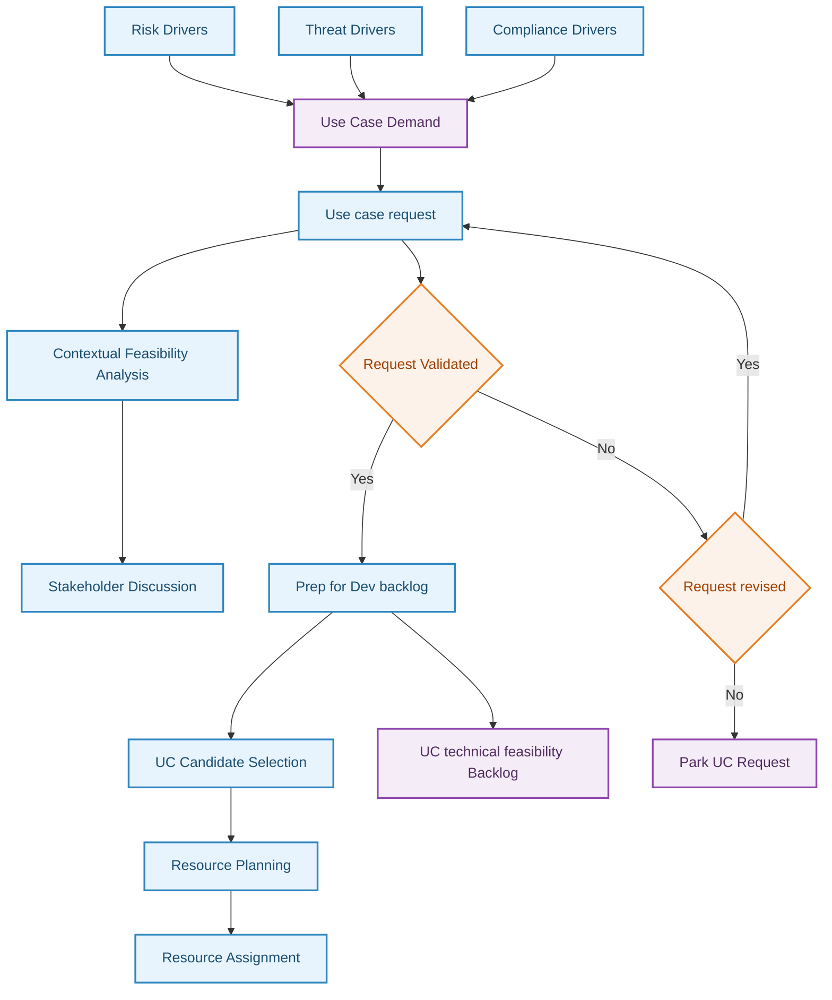

## Planning Phase

This phase defines the why, when, who & what needs to be in place to
commence the development of the use case.

The planning phase in SIEM (Security Information and Event Management)
detection engineering is a crucial step that sets the foundation for the
development and implementation of effective use cases. This phase
involves defining the why, when, who, and what aspects necessary to
commence the development process. By taking a top-down approach,
organizations can gain a comprehensive understanding of the big picture
and all its components, leading to more informed decision-making and
improved outcomes.

One of the key benefits of planning with a top-down approach is a
decreased risk in decision-making during the development phase. By
starting with a holistic view of the organization's security
requirements and objectives, potential risks and challenges can be
identified early on. This allows for more informed choices regarding the
selection of use cases, technologies, and resources required for
implementation.

The planning phase also sets organization-wide goals for the development
of use cases. By involving stakeholders from different departments and
levels of the organization, a shared understanding of security
priorities and objectives can be established. This alignment ensures
that the development efforts are focused on addressing the most critical
security needs and supporting the overall business strategy. In addition
to goal-setting, the planning phase leads to a faster and better way to
manage technical and procedural changes. By considering the impact of
new use cases on existing systems, processes, and workflows,
organizations can proactively identify potential conflicts or
dependencies. This enables them to develop strategies to minimize
disruption and optimize the integration of new detection capabilities
into the existing security infrastructure.

Another advantage of thorough planning is the minimization of time costs
associated with developing use cases. By investing time upfront to
define requirements, gather input from stakeholders, and create a clear
roadmap, organizations can streamline the development process. This
reduces the likelihood of delays, rework, or unnecessary iterations
during the implementation phase. Furthermore, the planning phase helps
to minimize errors during the development phase. By taking a systematic
and structured approach, organizations can identify potential pitfalls,
dependencies, and challenges early on. This allows for better risk
mitigation strategies and the implementation of robust quality assurance
measures to ensure the accuracy and effectiveness of the developed use
cases.

To successfully develop and onboard new use cases, specific elements of
the use case need to be made concrete. This includes clearly defining
the scope, objectives, and expected outcomes of the use case.
Stakeholders who provide input into the use case development process
should be actively involved to ensure proper alignment with their needs
and requirements. Their expertise and insights can help shape the
development process and enhance the effectiveness of the resulting use
case.

Once all relevant information has been identified, the use case request
should be documented. Documentation serves as a crucial reference point
throughout the development and implementation process. It captures the
key details, such as use case objectives, requirements, dependencies,
and expected outcomes. This documentation provides a shared
understanding among the development team, the security monitoring team,
and other stakeholders involved.

Moreover, developing a plan is essential to guide the use case
development process. The plan outlines the steps, milestones, and
resources needed to bring the use case to fruition. It helps ensure that
the development efforts are executed in a structured and organized
manner. The plan also facilitates effective coordination and
collaboration among different teams involved in the development process.

High-level use case needs are determined through the planning phase.
This involves formulating questions that channel the need for
information into discrete requirements for developing the logic or
detection capabilities. These requirements will guide the development
team in designing and implementing the necessary rules, queries, or
algorithms to detect and respond to security incidents effectively.

Additionally, a contextual feasibility analysis is conducted during the
planning phase. This analysis ensures that the use case aligns with the
business objectives and requirements. It examines factors such as the
relevance of the use case to the organization's threat landscape, the
availability and quality of data sources, the feasibility of
implementation within existing infrastructure, and the expected impact
on operational

### Contextual Feasibility Analysis

Without the planning phase the development of the use cases could be
delayed, inaccurate and could cause extended amount of confusion during
the development phase. It is important to understand the organisation’s
drivers or context behind the need for the use case as much as when the
use cases are needed by and what resources would it need to build the
use case. Such feasibility exercise is usually gathered in the form of
an internal form which is then kept on record for historical record
keeping and traceability purposes.

The following components are usually part of the planning phase captured
in a form and discussed among stakeholders and validated by the
developers; that are the driving force for the development of the use
case and its expected outputs:

The components of contextual feasibility analysis are further explained:

- **Objective**: Clearly defining the technical and organizational
  objectives of the use case is necessary to provide a clear direction
  and purpose for the development efforts. Without well-defined
  objectives, the use case may lack focus and fail to address the
  organization's specific security needs. It is akin to embarking on a
  journey without a destination in mind. Without clear objectives, the
  development team may wander aimlessly, resulting in wasted time and
  resources, and potentially missing critical security threats.

- **Drivers**: Identifying the reasons and motivations behind developing
  the use case helps provide context and ensure alignment with the
  organization's goals and priorities. Without a clear understanding of
  the drivers, the use case may not effectively address the
  organization's security challenges. An analogy could be driving a car
  without knowing the destination or purpose. The development team may
  end up creating a use case that fails to address the real security
  risks or doesn't provide the necessary value, leading to ineffective
  security monitoring.

- **Scope**: Defining the assets (systems, data, applications, people,
  etc.) that need to be protected by the use case is crucial for
  focusing development efforts and ensuring comprehensive coverage.
  Without a well-defined scope, the use case may either overlook
  critical assets or try to protect too many irrelevant elements.
  Imagine building a fence around a property without defining its
  boundaries. The result may be leaving some areas vulnerable or wasting
  resources on unnecessary protection, both of which diminish the
  effectiveness of the use case.

- **Purpose**: Describing the scope and value of the use case helps
  establish its importance and justification. It provides a clear
  understanding of why the use case is needed and what benefits it
  brings to the organization. Without a clear purpose, the development
  team may struggle to prioritize the use case or communicate its value
  to stakeholders. An analogy could be trying to convince someone to
  invest in a project without explaining its purpose or expected
  returns. The lack of purpose may lead to skepticism, lack of support,
  or misallocation of resources.

- **Value**: Assessing the potential impacts of losing the identified
  assets or interrupting critical processes helps prioritize use cases
  based on their potential impact. Understanding the value of protecting
  these assets is crucial for making informed decisions about resource
  allocation and risk management. Without assessing value, the
  development team may invest resources in less critical use cases while
  neglecting higher-priority ones. This is similar to insuring less
  valuable assets while leaving more valuable ones vulnerable, which
  exposes the organization to significant risks.

- **Priority**: Determining the urgency and timeframe within which the
  use case needs to be developed ensures that critical security needs
  are addressed promptly. It helps prevent delays and ensures that the
  most pressing risks are mitigated in a timely manner. Without
  prioritization, the development team may focus on low-impact use cases
  while neglecting those with higher urgency. It is comparable to a
  firefighter responding to a small fire while a larger blaze goes
  unattended, leading to severe consequences.

- **Stakeholders**: Identifying the departments and stakeholders who
  have an interest in the use case is vital for gathering input,
  ensuring alignment, and fostering collaboration. Involving relevant
  stakeholders promotes a sense of ownership and helps capture diverse
  perspectives. Without stakeholder involvement, the use case may lack
  input from critical areas, resulting in a solution that fails to meet
  their needs or gain their support. It is like designing a product
  without considering the input and requirements of end-users, leading
  to dissatisfaction and limited adoption.

- **Alignment**: Ensuring alignment with every relevant part of the
  organization that may be affected by the use case helps minimize
  conflicts, streamline integration, and optimize effectiveness. It
  allows for the smooth coordination of security operations with other
  business processes and ensures that the use case does not
  inadvertently disrupt existing workflows or systems. Without
  alignment, the use case may introduce conflicts, resistance, or
  unintended consequences. It is similar to trying to fit a square peg
  into a round hole. The lack of alignment may result in friction,
  inefficiency, and ultimately undermine the effectiveness of the use
  case.

- **Outputs**: Defining the required outputs to measure and monitor the
  effectiveness of the use case is essential for evaluating its
  performance and making informed decisions. It helps establish metrics,
  alerts, reports, or other deliverables that provide insights into the
  use case's efficacy. Without clear outputs, it becomes challenging to
  assess the impact and value of the use case. It is like driving a car
  without a dashboard or any indicators to monitor speed, fuel level, or
  engine temperature. The lack of outputs makes it difficult to gauge
  the effectiveness of the use case and make necessary adjustments.

- **Resourcing**: Identifying the internal and extended resources
  required for the development phase ensures that the necessary
  personnel, tools, and technologies are available to successfully
  implement the use case. It helps allocate resources effectively,
  preventing resource shortages or inadequate support. Without proper
  resourcing, the development team may lack the necessary expertise,
  tools, or infrastructure to develop and deploy the use case. It is
  akin to embarking on a construction project without the required
  construction materials or skilled workers, leading to delays, subpar
  results, or even project failure.

- **Backlog**: Maintaining a list of prioritized use cases that need to
  be developed allows for strategic planning and effective backlog
  management. It ensures that development efforts align with the
  organization's priorities and helps avoid ad-hoc decision-making or
  resource allocation. Without a backlog, the development team may
  struggle to prioritize and manage the development of multiple use
  cases. It is comparable to a chef trying to prepare multiple dishes
  without a recipe or a plan. The lack of a backlog may result in
  disorganized development, inefficiency, and missed opportunities to
  address critical security needs.

### Preparing for Development

The planning phase of SIEM detection engineering involves several
crucial considerations to ensure a successful development process. One
key aspect is determining the priority of use case development. Not all
use cases have the same level of urgency or importance. Some use cases
may have impending deadlines, while others are critical to the
organization's security posture or address imminent threats. Balancing
urgency and importance is essential.

To effectively prioritize use case development, it is recommended to
maintain a use case development backlog. This backlog should be
regularly reviewed, and each use case should be assigned scores for
urgency and importance on a scale of 0 to 10. By summing up these
scores, you can rank the use case requests and identify the ones with
the highest priority. It is advisable to begin development with the
highest-scoring use cases and progressively move down the list. In cases
where there are multiple urgent and important requests, it may be
beneficial to order them based on the level of effort required. This
approach ensures that the most challenging and critical use cases are
tackled first, streamlining the development process.

Another crucial consideration when preparing for the development phase
is identifying the resources required to develop and deliver the use
cases. While the SOC team or a dedicated content development team may be
primary resources, it is important to consider additional personnel from
various domains such as IT, Infrastructure, Systems, Security
Engineering, or Networks. These individuals play a crucial role in tasks
related to generating telemetry, ensuring its proper transport to the
destination for parsing and analysis, and overall infrastructure
support. Furthermore, organizations should also evaluate the
availability and accessibility of external resources like Managed
Security Service Providers (MSSPs), contractors, and online use case
marketplaces. These external resources can supplement internal
capabilities and expertise, providing additional support for use case
development.

However, resource availability alone is not sufficient. It is equally
important to ensure that the identified resources are willing and
formally aligned to participate in the development of the use cases.
This alignment can be achieved through Operational Level Agreements
(OLAs) or Service Level Agreements (SLAs) that define the expectations,
responsibilities, and commitments of all parties involved. OLAs or SLAs
formalize the collaboration between teams and stakeholders, establishing
clear communication channels, timelines, and deliverables. Ensuring the
availability and alignment of resources not only facilitates smoother
development but also enhances coordination and accountability among
different teams and stakeholders.

By considering the priority of use case development, identifying
necessary resources, and ensuring their availability and alignment,
organizations can effectively prepare for the development phase of SIEM
detection engineering.

### Key Roles and Stakeholders

In view of the fact that use case development involves various
stakeholders within an organization including risk team, information
security and SOC team, business owners, and senior executives. It is
imperative to have a clear understanding of roles, responsibilities and
expectation among them. Effective communication and explanation of
demand and expected outcome is also one of the key success factors which
contribute to an effective implementation of the Use Case Framework.
Some key roles and corresponding responsibilities are suggested here as
a reference. As organisational structures and team charters may vary
across different organisations, it is advised that one should map
corresponding role to their corresponding functions whichever
appropriate.

<table>
<caption>
Table 1:
Example of Key roles for Planning Phase
</caption>
<colgroup>
<col style="width: 37%" />
<col style="width: 62%" />
</colgroup>
<thead>
<tr>
<th><strong>Role</strong></th>
<th><strong>Responsibilities</strong></th>
</tr>
</thead>
<tbody>
<tr>
<td><strong>Information Security Committee</strong></td>
<td><ul>
<li>
Review and approve use case request
</li>
<li>
Review and approve resource and budget plan
</li>
</ul></td>
</tr>
<tr>
<td><strong>Business/ Asset Owner</strong></td>
<td><ul>
<li>
Provide input and take part in Contextual Feasibility
Analysis
</li>
</ul></td>
</tr>
<tr>
<td><strong>Information Security Team</strong></td>
<td><ul>
<li>
Lead and own the Contextual Feasibility Analysis
</li>
<li>
Consolidate inputs and requirements from various
stakeholders
</li>
<li>
Prepare use case request
</li>
</ul></td>
</tr>
<tr>
<td><strong>SOC Lead</strong></td>
<td><ul>
<li>
Evaluate and fulfil resource requirements
</li>
<li>
Assist in prioritisation of requests
</li>
</ul></td>
</tr>
</tbody>
</table>

**<u>Example Process steps for Planning Phase</u>**

