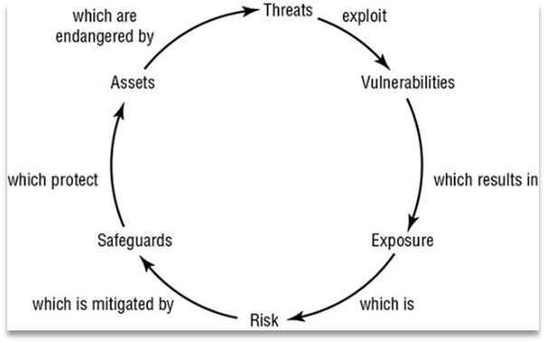

Use Case & Detection Engineering Framework

November 23, 2024

Version 2.0

# Contents

[Contents [2](#contents)](#contents)

[List of Figures and Tables
[4](#list-of-figures-and-tables)](#list-of-figures-and-tables)

[About This Use Case & Detection Engineering Framework
[5](#about-this-use-case-detection-engineering-framework)](#about-this-use-case-detection-engineering-framework)

[History [5](#history)](#history)

[Review [5](#review)](#review)

[Document Conventions [5](#document-conventions)](#document-conventions)

[1 Introduction [6](#introduction)](#introduction)

[1.1 Preface [6](#preface)](#preface)

[1.2 Audience [7](#audience)](#audience)

[1.3 Scope [7](#scope)](#scope)

[2 Use Case & Detection Engineering Framework
[8](#use-case-detection-engineering-framework)](#use-case-detection-engineering-framework)

[2.1 Overview [8](#overview)](#overview)

[2.2 Why adopt a Use Case & Detection Engineering Framework?
[8](#why-adopt-a-use-case-detection-engineering-framework)](#why-adopt-a-use-case-detection-engineering-framework)

[2.3 Principles of the Use Case & Detection Engineering Framework
[9](#principles-of-the-use-case-detection-engineering-framework)](#principles-of-the-use-case-detection-engineering-framework)

[2.4 What does the Use Case Framework consist of?
[9](#what-does-the-use-case-framework-consist-of)](#what-does-the-use-case-framework-consist-of)

[2.5 Challenges of Creating & Managing Use Cases
[9](#challenges-of-creating-managing-use-cases)](#challenges-of-creating-managing-use-cases)

[3 Drivers for Use Cases
[10](#drivers-for-use-cases)](#drivers-for-use-cases)

[3.1 Risk, Threats and Compliance
[11](#risk-threats-and-compliance)](#risk-threats-and-compliance)

[3.2 Aligning to Business Context
[12](#aligning-to-business-context)](#aligning-to-business-context)

[3.2.1 Risk Drivers [15](#_Toc136940837)](#_Toc136940837)

[3.2.2 Threat Drivers [16](#threat-drivers)](#threat-drivers)

[3.2.3 Compliance Drivers [19](#_Toc136940839)](#_Toc136940839)

[4 Use Case & Detection Engineering Lifecycle
[20](#use-case-detection-engineering-lifecycle)](#use-case-detection-engineering-lifecycle)

[4.1 Planning Phase [22](#planning-phase)](#planning-phase)

[4.1.1 Contextual Feasibility Analysis
[24](#_Toc136940842)](#_Toc136940842)

[4.1.2 Preparing for Development
[26](#preparing-for-development)](#preparing-for-development)

[4.1.3 Key Roles and Stakeholders
[27](#key-roles-and-stakeholders)](#key-roles-and-stakeholders)

[4.2 Development Phase [29](#development-phase)](#development-phase)

[4.2.1 Technical Feasibility Analysis
[30](#technical-feasibility-analysis)](#technical-feasibility-analysis)

[4.2.2 Key Roles and Stakeholders
[35](#key-roles-and-stakeholders-1)](#key-roles-and-stakeholders-1)

[4.2.3 Development code engineering and testing
[37](#development-code-engineering-and-testing)](#development-code-engineering-and-testing)

[4.2.4 Response Development [48](#_Toc136940849)](#_Toc136940849)

[4.2.5 Key Roles and Stakeholders
[54](#key-roles-and-stakeholders-2)](#key-roles-and-stakeholders-2)

[4.3 Delivery Phase [56](#delivery-phase)](#delivery-phase)

[4.3.1 SOC Handover [56](#soc-handover)](#soc-handover)

[4.3.2 Rule Activation [56](#rule-activation)](#rule-activation)

[4.3.3 Use Case Cataloguing
[59](#use-case-cataloguing)](#use-case-cataloguing)

[4.3.4 Response Automation
[67](#response-automation)](#response-automation)

[4.3.5 Key Roles and Stakeholders
[69](#key-roles-and-stakeholders-3)](#key-roles-and-stakeholders-3)

[4.4 Improvement Phase [71](#improvement-phase)](#improvement-phase)

[4.4.1 Decommissioning [72](#decommissioning)](#decommissioning)

[4.4.2 Key Roles and Stakeholders
[73](#key-roles-and-stakeholders-4)](#key-roles-and-stakeholders-4)

[5 Best Practices [75](#best-practices)](#best-practices)

[6 Appendix A – Use case catalogue template
[77](#appendix-a-use-case-catalogue-template)](#appendix-a-use-case-catalogue-template)

[7 Appendix B – Request for use case form template
[78](#appendix-b-request-for-use-case-form-template)](#appendix-b-request-for-use-case-form-template)

[8 Appendix C - Sources & References used
[79](#appendix-c---sources-references-used)](#appendix-c---sources-references-used)

[9 Appendix F: Acronym Listing or Full Glossary
[80](#appendix-d-acronym-listing-or-full-glossary)](#appendix-d-acronym-listing-or-full-glossary)

[Trademarks and Disclaimers
[81](#trademarks-and-disclaimers)](#trademarks-and-disclaimers)

# List of Figures and Tables

**<u>Figures:</u>**

[Figure 1: Relationship of Cyber Elements
[12](#_Toc136940877)](#_Toc136940877)

[Figure 2: Four phases of Use Case Lifecycle Management
[20](#_Toc136940878)](https://cisco-my.sharepoint.com/personal/kue_cisco_com/Documents/0121%20-%20SOCless/STC%20CDC%20Use%20case%20Framework%202.0.docx#_Toc136940878)

[Figure 3: Example Process steps for Planning Phase
[28](#_Toc136940879)](#_Toc136940879)

[Figure 4: Example of a System diagram
[32](#_Toc136940880)](#_Toc136940880)

[Figure 5: Example Process steps for Development Phase (Technical
Feasibility) [36](#_Toc136940881)](#_Toc136940881)

[Figure 6: Example Process steps for Development Phase
[55](#_Toc136940882)](#_Toc136940882)

[Figure 7: Example Process steps for Delivery Phase
[70](#_Toc136940883)](#_Toc136940883)

[Figure 8: Example Process steps for Improvement Phase
[74](#_Toc136940884)](#_Toc136940884)

**Tables:**

[Table 1: Example of Key roles for Planning Phase
[27](#_Toc136940866)](#_Toc136940866)

[Table 2: Blocks of a rule [33](#_Toc136940867)](#_Toc136940867)

[Table 3: Example of Key roles for Development Phase (Technical
Analysis) [35](#_Toc136940868)](#_Toc136940868)

[Table 4: Example of CR Blocks [38](#_Toc136940869)](#_Toc136940869)

[Table 5: Example of VAL development
[39](#_Toc136940870)](#_Toc136940870)

[Table 6: Example of Key roles for Development Phase
[54](#_Toc136940871)](#_Toc136940871)

[Table 7: Example of data fields in Use case Catalouge
[60](#_Toc136940872)](#_Toc136940872)

[Table 8: Example of Rule Quality Rating
[62](#_Toc136940873)](#_Toc136940873)

[Table 9: Example of Release Benchmarking
[63](#_Toc136940874)](#_Toc136940874)

[Table 10: Example of Key roles for Delivery Phase
[69](#_Toc136940875)](#_Toc136940875)

[Table 11: Example of Key roles for Improvement Phase
[73](#_Toc136940876)](#_Toc136940876)

**Equations:**

[Equation 1: Formula for measuring False-positive Ratio
[57](#_Toc80701724)](#_Toc80701724)

# About this Use Case & Detection Engineering Framework

| Author           | Kunal Hatode, Frank Hassenrueck, Matrix Chau |
|------------------|----------------------------------------------|
| Change Authority | Customer Experience, Cisco                   |

## History

| Version No. | Issue Date | Status   | Reason for Change   |
|-------------|------------|----------|---------------------|
| 0.1         | 13/04/2021 | Draft    | First Draft         |
| 1.0         | 14/04/2021 | Release  | First Release       |
| 1.1         | 25/04/2021 | Revision | Minor amendments    |
| 1.2         | 15/06/2021 | Revision | Minor amendments    |
| 1.3         | 24/08/2021 | Draft    | Overhaul amendments |
| 1.4         | 07/09/2021 | Released | Minor amendments    |
| 1.5         | 14/04/2022 | Released | Minor amendments    |
| 2.0         | 06/06/2023 | Revision | Major amendments    |

## Review

| Reviewer’s Details | Version No. | Date       |
|--------------------|-------------|------------|
| Kunal Hatode       | 1.0         | 13/04/2021 |
| Kunal Hatode       | 1.5         | 13/04/2022 |
| Kunal Hatode       | 2.0         | 06/06/2023 |

## Document Conventions

|  | Caution—Alerts readers to be careful. In this situation, you might do something that could result in equipment damage or loss of data. |
|----|----|
|  | Note—Alerts readers to take note. Notes contain helpful suggestions or references to material not covered in the document. |
|  | Timesaver—Alerts the reader that they can save time by performing the action described in the paragraph affixed to this icon. |
|  | Tip—Alerts the reader that the information affixed to this icon will help them solve a problem. The information might not be troubleshooting or even an action, but it could be useful information similar to a Timesaver. |
|  | Warning—Alerts readers of a situation that could cause bodily injury. They need to be aware of the hazards involved with electrical circuitry and familiarize themselves with standard practices for preventing accidents. |

# Introduction

## Preface

In today's ever-evolving digital landscape, organizations face a
multitude of sophisticated and persistent cyber threats that can
compromise their sensitive data, disrupt operations, and damage their
reputation. To effectively combat these threats, a robust Use Case and
Detection Engineering Framework is essential. This comprehensive guide
aims to provide security professionals, incident responders, and IT
teams with a holistic understanding of the key principles, strategies,
and best practices involved in building and maintaining an effective
security monitoring and incident response program.

The journey begins by establishing a strong foundation in the Planning
Phase, where organizations define their security objectives, assess
risks, and identify the scope of their security monitoring program. This
phase emphasizes the importance of collaboration between stakeholders,
ensuring alignment with business objectives, and selecting appropriate
tools and technologies to support the monitoring efforts.

The guide then delves into the Development Phase, where security use
cases and detection rules are developed, tested, and fine-tuned. It
highlights the significance of conducting thorough technical analysis,
considering business cases, and involving stakeholders throughout the
development process. The authors stress the need for well-defined and
well-designed playbooks, as well as the prerequisites for successful
automation implementation, including suitable tools, data integration,
process readiness, and organizational preparedness.

The Delivery Phase focuses on the handover of use cases to the security
monitoring team, rule activation, and the crucial aspect of monitoring
rule behavior and metrics. It stresses the need for vigilant monitoring
of false positives and false negatives, ensuring the use cases are
delivering the desired outcomes and providing insights to drive business
decisions. Cataloging the use cases and rules is explored in-depth in
the guide's chapters, as a crucial aspect of maintaining an organized
and efficient security monitoring program. The authors emphasize the
importance of clear and comprehensive catalogs, offering guidance on
creating effective use case quality ratings and release benchmarks. The
inclusion of mapping the use cases to the MITRE ATT&CK framework adds an
additional layer of insight and enables organizations to identify and
prioritize security gaps.

The Improvement Phase focuses on the continuous enhancement of the use
cases and rules in response to technical bugs, deficiencies in output,
and the need for periodic review. The guide emphasizes the importance of
conducting regular reviews, proactive attack simulations, and acceptance
testing to ensure the effectiveness and relevance of the security
monitoring program. It also outlines the process of decommissioning use
cases that are no longer required, highlighting the need for proper
offloading and communication with stakeholders.

Throughout the guide, key roles and stakeholders are identified,
providing a clear understanding of the responsibilities and
contributions of various teams involved in security monitoring and
incident response. This holistic approach ensures effective
collaboration and efficient handling of security incidents.

It is important to note that this guide is a comprehensive framework,
encompassing a wide range of concepts, methodologies, and best
practices. It serves as a valuable resource for organizations seeking to
establish or enhance their security monitoring and incident response
capabilities. By following the principles and recommendations outlined
in this guide, organizations can build a resilient and proactive
security posture, mitigating risks and responding effectively to
emerging threats.

## Audience

This document is intended for security managers, SOC managers, SOC
analysts, and professionals within the SOC, that are responsible for
focusing on the design, capability and maturity of use case development
and security monitoring. We hope that this guide will serve as a
valuable reference and practical companion for security professionals,
incident responders, and IT teams as they navigate the challenging
landscape of security monitoring and incident response.

## Scope

This deliverable is a Use Case Framework to address the detection of
cyber threats & attack tactics techniques and procedures appropriate to
the SOC. The objective of building a Use Case Framework is to better
protect the organization’s valuable assets by designing and developing
detection use cases using a holistic approach that connects Risk, Threat
& compliance requirements.

Following the guidelines and recommendations in this document does not
guarantee a secure environment, or that all security incidents will be
prevented. Absolute security is impossible to achieve on any open
network. However, security risks can be reduced by establishing a good
security policy together with sound administration practices; monitoring
and responding to security incidents; testing and evaluating security;
and improving, securing and managing security weaknesses on an on-going
basis. Cisco does not recommend deploying security technologies without
associated security policies.

# Use Case & Detection Engineering Framework

## Overview 

In the context of cybersecurity, a use case describes a potential
security threat or incident and defines the steps, actions, or behaviors
that indicate the presence of that threat. It helps in identifying,
monitoring, and detecting security incidents or suspicious activities
within an organization's network or systems.

Detection engineering, on the other hand, refers to the process of
designing and developing effective methods and techniques to identify
and respond to security threats and incidents. It involves creating and
implementing detection rules, logic, search strings, or detection
signatures that enable security monitoring systems to identify and
generate alerts for suspicious activities or potential security
breaches. Detection engineering also encompasses the development of
response playbooks, which provide predefined steps and actions to be
taken in response to specific security events or incidents.

The use case and detection engineering framework combines these two
concepts to create a structured approach for developing, managing, and
improving security monitoring capabilities. This framework emphasizes
the importance of proactive identification, monitoring, and response to
security threats. It involves several phases, including planning,
development, delivery, and improvement. A Use Case & Detection
Engineering Framework is a fundamental base of what operating strategies
guide the SOC to be able to develop use cases that are in line with the
business, the organizational structure, the strategic planning and
operational systems. Where possible the framework has been built in an
agnostic manner, but at the same time have allowances within the
framework to ensure that any development of the use cases takes in
account the organisation’s operating environment and operating
requirements.

The framework per se does not dictate the step by step process of
developing use cases but provides guidance on how to develop use cases
in a holistic and consistent manner to drive a sustainable approach to
use case & detection lifecycle management. The objective of building a
Use Case & Detection Engineering Framework is to better protect the
organization’s valuable assets by designing and developing detection use
cases that connects Risk, Threat & compliance requirements to the
reaction and response made by the organisation during a cyber attack or
incident.

## Why adopt a Use Case & Detection Engineering Framework?

Essentially, use cases describe manifestations of threats from a high
level (the modus operandi of the cyber criminals) to the lowest level
(concrete security events in the infrastructure such as exploits, failed
logins, etc.). Use cases also describe follow-up actions (incident
response) and are tied with business drivers to show how security
monitoring reduces risk in the organization. Within the complexity of
the security architecture, framework can provide structure and overview.

Such frameworks enable control over the development of the use cases and
provide insight into identify how well an organization can defend
against cyber threats. The use case framework should allow the SOC:

- To ensure stakeholder objectives are met uniformly

- To capture gaps and challenges early on during the creation of use
  cases

- To have a holistic “frame of reference” where detection use cases can
  be categorized into.

- To engineer detection capabilities in a consistent & methodological
  manner

- To quickly see where use cases are lacking and need more attention.

- To facilitate a phased approach of expanding new use cases based on a
  large variety of inputs and priorities in the form of Use Case
  Roadmap.

## Principles of the Use Case & Detection Engineering Framework 

- The creation of use cases should be driven by the organisation's
  business requirements

- The use cases must align with the business's risk appetite over any
  form of asset

- The use case framework should provide structured control over the
  compliance requirements of the organisation

- The creation of use cases must follow a systematic process to
  eliminate or reduce errors

- The use case framework should create a foundation for the ability to
  assess the state of visibility and detection capability

- The use case framework must reduce the ad hoc detection of threats for
  the organisation

- The use case framework should eliminate redundant & duplicate methods
  of managing use cases

- The management of the use cases must articulate the state of the use
  cases at any given point of time

## What does the Use Case Framework consist of?

- The fundamentals of how business risk, threats and compliance
  requirements drive the Use Case & Detection Engineering Framework.

- A practical Use Case & Detection Engineering lifecycle management
  process

- A practical guide to develop correlation and detection rules in SIEM
  from the use cases

- A suggested guide to maintain use cases and SIEM Rules in catalogue
  format

- A series of templates, processes and conventions that support the
  framework.

## Challenges of Creating & Managing Use Cases 

- Out-of-the-box use cases are split-up while covering same scope. Most
  out-of-the-box use cases are split up from each other based on their
  rule content package which can be put (after some analysis of the
  detection logic) under the same "use case" as they have the same
  detection scope.

- No naming conventions or pre-determined directory structure Most SIEM
  out-of-the-box (and later custom added rules) do not have an
  overarching naming convention over all rules.

- Most use case approaches have an Attack-centric or quantitative
  detection bias.

- Most SIEM Vendors have attempted to organize use cases in a Use Case
  Framework that primarily focuses on a single limited threat model
  (kill chain or ATT&CK Framework) this misses critical categories like
  Self-monitoring, localized anomaly detection (that is not attack
  centric) and distinctions between quantitative threat modelling and
  qualitative threat modelling. This as a result will create a
  attack-centric and quantitative threat detection bias.

- Use Cases are hard to align with a SOAR playbooks platform without a
  framework. Most vendors fail to accommodate the emergence of SOAR
  technologies that are trying to connect automated or semi-automated
  playbooks to SIEM use cases. Without a proper organized rule set
  according to some form of framework mapping use cases to playbooks
  becomes increasingly challenging.

- SIEM Vendor Taxonomy overly complex or not generalizable. Many SIEM
  vendors have attempted to standardize detection through taxonomy of
  detection categories, but these categories are generally limited only
  to the SIEM vendor itself and hard to generalize to other detection
  technologies of other vendors like IDS, IPS, UBA and others.

# **Drivers for Use Cases**

Before going any further, it is important to provide a definition of use
cases. This is necessary, because of the fact that the term is used to
describe a variety of elements in different publications.

In this document, the following definition for uses cases is used: “a
use case is a security monitoring scenario that is aimed at the
detection of manifestations of a cyber threat”. A use case has a
strategical, tactical and operational component. This definition
emphasizes the fact that the focus of the framework is on the ‘detect’
phase of the NIST cybersecurity framework. Naturally, the events and
incidents that flow from the security monitoring architecture can be
used to improve protection mechanisms or further refine the threat
identification. While threats are a core driver for security monitoring,
they are not the only driver. Other aspects of the organizational
environment must be considered as well such as risk and compliance
obligations.

Developing the right use cases or detection rules, and having an
effective development and implementation process, is more than half the
battle in reducing response time to a potential attack and minimizing
its impact.

Use cases must be customized for each organization. Thus, the choice of
which use case to develop first should reflect the following factors:

- The organization’s current unique requirements and risk, threat and
  compliance profile

- The current threat landscape, based on the organization’s industry
  vertical

- The types of assets owned

- The organization’s operating regions, applications and services used,
  and more

## Risk, Threats and Compliance

**Risks**

Cybersecurity risk is the probability of exposure or loss resulting from
a cyber-attack or data breach on your organization. A better, more
encompassing definition is the potential loss or harm related to
technical infrastructure, use of technology or reputation of an
organization. Organizations are becoming more vulnerable to cyber
threats due to the increasing reliance on computers, networks, programs,
social media and data globally. Data breaches, a common cyber-attack,
have massive negative business impact and often arise from
insufficiently protected data.

Global connectivity and increasing use of cloud services with poor
default security parameters means the risk of cyber-attacks from outside
your organization is increasing. What could historically be addressed by
IT risk management and access control now needs to complimented by
sophisticated detection and monitoring capabilities. Cybersecurity risk
management is generally set by leadership, often including an
organization's board of directors in the planning processes.
Best-in-class organizations will also have a Chief Information Security
Officer (CISO) who is directly responsible for establishing and
maintaining the enterprise vision, strategy and program to ensure
information assets and customer data is adequately protected.

**Threats**

Any potential occurrence that may cause an undesirable or unwanted
outcome for an organization or for a specific asset is a threat. Threats
are any action or inaction that could cause damage, destruction,
alteration, loss, or disclosure of assets or that could block access to
or prevent maintenance of assets.

Cyber threats refer to the possibility of a successful cyber-attack that
aims to gain unauthorized access, damage, disrupt, or steal an
information technology asset, computer network, intellectual property or
any other form of sensitive data. Cyber threats are known to come from
Hostile nations, Terrorist groups, Corporate spies, Hacktivists,
Disgruntled insiders or Accidental actions of authorized users.

**Compliance**

As the number and severity of cyber-attacks increases, industry
standards organizations and governments seek to enforce cybersecurity by
establishing more stringent compliance requirements. In cybersecurity,
compliance means creating a program that establishes risk-based controls
to protect the integrity, confidentiality, and accessibility of
information stored, processed, or transferred.

Organizations subject to industry or regional cybersecurity regulations
are required by law to meet compliance and take the prescribed actions
following the discovery of a data breach. Strict adherence to
cybersecurity compliance requirements reduces the risk of a data breach
and the associated response and recovery costs, as well as the
less-quantifiable costs of a breach such as reputation damage, business
interruption, and loss of business. Having robust cybersecurity
compliance measures in place, on the other hand, enables you to protect
your company’s reputation, maintain consumer trust, and build customer
loyalty by ensuring that your customer’s sensitive information is safe
and secure.

## Aligning to Business Context

Each line of business has their own risks and threats. For example, the
threats of banking firm is not the same as a healthcare or Government
entity. So, understanding the line of business would help well in
plotting the threat actors and attack motivation. It’s important to
understand what the organisation business objectives are specifically
for a given period of time. As these business objectives influence and
shape the technology decisions. The technology decisions in turn become
the assets in the shape of IT equipment, People and Data that must be
safeguarded every single day because they are bound to have
vulnerabilities that possess the risk of being exploited by Threat
agents.

The elements asset, threat, vulnerability, exposure, risk, and safeguard
are related, Threats exploit vulnerabilities, which results in exposure.
Exposure is risk, and risk is mitigated by safeguards. Safeguards
protect assets that are endangered by threats.

<figure>

<figcaption><p><span id="_Toc136940877" class="anchor"></span>Figure 1:
Relationship of Cyber Elements</p></figcaption>
</figure>

Businesses also evolve continuously. Thus, it is possible that changes
to the business layer of the use case may be required. These changes may
also need to be reflected in operational implementation. For example,
changes in demands regarding use case output may lead to new assets
being monitored or new monitoring rules being implemented. Additionally,
risk assessments conducted by the business may lead to new insights
regarding risk. Such insights can also lead to changes within the use
case framework.

In today's interconnected digital landscape, cybersecurity is of utmost
importance for individuals and organizations alike. As we navigate the
ever-evolving realm of technology, two critical concepts that form the
foundation of cybersecurity are threats and risks. Although often used
interchangeably, understanding the distinction between threats and risks
is crucial for effectively protecting our digital assets. In this blog
post, we will delve into the world of cybersecurity and explore the
comparative nature of threats and risks, providing you with valuable
insights to enhance your cybersecurity knowledge.

Defining Threats and Risks:

To grasp the essence of threats and risks, let's start by defining each
concept individually. In the realm of cybersecurity, a threat refers to
a specific type of malicious actor, an entity, or an event that has the
potential to exploit vulnerabilities and compromise the security of
computer systems, networks, or data. These threats may come in the form
of hackers, malware, viruses, phishing attacks, or social engineering
tactics. On the other hand, a risk is the potential for loss, harm, or
negative consequences resulting from the exploitation of vulnerabilities
by threats. Risks encompass assessing the likelihood and potential
impact of threats on an organization's information assets, including
data confidentiality, integrity, and availability.

**Threats: The 'What' of Cybersecurity:**

Imagine a medieval castle fortified with high walls, towers, and guards.
In the context of cybersecurity, threats can be likened to the external
forces attempting to breach the castle's defenses. These forces could be
hostile invaders, spies, or even traitors within the castle walls.
Similarly, cybersecurity threats are the specific instances of potential
harm, often associated with intentional malicious activities or
accidental occurrences. They are like arrows being shot at the castle
walls, representing concrete and identifiable risks that have the
potential to compromise security.

To effectively manage cybersecurity threats, it is essential to
understand the methods, tactics, and techniques employed by threat
actors. Just as castle defenders analyze potential vulnerabilities in
their fortifications, cybersecurity professionals must identify and
analyze potential vulnerabilities, attack vectors, and malicious
activities to develop appropriate security measures and defenses. This
could involve deploying firewalls, using intrusion detection systems,
training employees to recognize and report potential threats, and
constantly staying updated on emerging threats in the cyber landscape.

**Risks: The 'How' and 'Why' of Cybersecurity:**

While threats focus on the external forces attempting to breach our
digital defenses, risks provide a broader perspective by considering the
overall uncertainty and potential impact to our information assets. In
our castle analogy, risks can be compared to the assessment of the
castle's vulnerability, the potential impact of an invasion, and the
consequences for the kingdom. Risks in cybersecurity encompass the range
of potential threats, vulnerabilities, and their associated
consequences.

Managing cybersecurity risks requires a systematic approach to evaluate
the probability and impact of various threats on an organization's
information assets. Just as castle defenders assess the potential
consequences of successful attacks and evaluate the effectiveness of
their fortifications, cybersecurity professionals analyze the potential
impacts of threats, the effectiveness of existing security controls, and
make informed decisions about risk mitigation strategies. This involves
identifying and prioritizing risks, implementing risk mitigation
strategies, and continuously monitoring the effectiveness of controls to
ensure the ongoing protection of digital assets.

**The Interplay Between Threats and Risks:**

While threats and risks are distinct concepts, they are intertwined and
mutually influence each other in the realm of cybersecurity. Threats are
specific manifestations of potential harm, often originating from
intentional malicious activities or accidental occurrences. They
represent concrete examples of actions or events that exploit
vulnerabilities and compromise security. Threats serve as the building
blocks of risks, contributing to the overall risk landscape that
organizations face. Risks, on the other hand, encompass a broader range
of potential threats, vulnerabilities, and their associated
consequences.

Understanding the relationship between threats and risks is vital for
effective cybersecurity management. Threats are considered within the
broader context of risks, providing a comprehensive understanding of the
overall risk landscape and guiding risk management strategies. By
evaluating and managing risks, organizations can develop proactive
measures to prevent, detect, and respond to potential threats.

In the ever-evolving world of cybersecurity, it is crucial to stay
proactive and adaptive. The landscape of threats is constantly evolving,
with new attack vectors and techniques emerging regularly.
Cybercriminals are continuously finding innovative ways to exploit
vulnerabilities and breach security measures. This dynamic nature of
threats necessitates a comprehensive risk management approach that
accounts for the evolving threat landscape.

To effectively address cybersecurity threats and risks, organizations
should adopt a multi-layered security strategy. This strategy involves a
combination of technical measures, employee awareness and training,
incident response planning, and ongoing monitoring and assessment. By
implementing robust security controls, organizations can mitigate the
likelihood and impact of threats while minimizing their overall risk
exposure. Additionally, collaboration and information sharing within the
cybersecurity community are crucial for staying one step ahead of
threats. By participating in forums, sharing best practices, and staying
informed about the latest threat intelligence, organizations can enhance
their ability to detect and respond to emerging threats effectively.

Threats and risks are two fundamental concepts in the realm of
cybersecurity. While threats represent specific instances of potential
harm, risks encompass a broader evaluation of potential vulnerabilities
and their associated consequences. Threats focus on understanding the
methods and techniques employed by malicious actors, while risks provide
a comprehensive understanding of the overall risk landscape.

<span id="_Toc136940837" class="anchor"></span>

### Risk Drivers

All IT systems have risk. There is no way to eliminate 100 percent of
all risks. Instead, upper management and key stakeholders must decide
which risks are acceptable and which are not. Determining which risks
are acceptable requires detailed and complex asset and risk assessments.

There are two risk assessment methodologies: quantitative and
qualitative. Quantitative risk analysis assigns real monetary figures to
the loss of an asset. Qualitative risk analysis assigns subjective and
intangible values to the loss of an asset. Both methods are necessary
for a complete risk analysis. Most environments employ a hybrid of both
risk assessment methodologies in order to gain a balanced view of their
security concerns.

The premise of risks driving the development of use cases is very much
practical for e.g. where there are instances of recognized high value or
critical assets, that have been known to have vulnerabilities may need
to be kept under continuous monitoring and observation all the time.
This very need to observe the activities or events taking place on
critical assets is classed as Risk derived use cases.

The actual processes of performing risk analysis are often delegated to
security professionals or an evaluation team. However, all risk
assessments, results, decisions, and outcomes must be understood and
approved by upper management as an element in providing prudent due
care.

**Quantitative & Qualitative Pertinence**

The quantitative method results in concrete probability percentages.
That means the end result is a report that has monetary figures for
levels of risk, potential loss, cost of countermeasures, and value of
safeguards. This report is usually fairly easy to understand, especially
for anyone with knowledge of spreadsheets and budget reports. Think of
quantitative analysis as the act of assigning a quantity to risk—in
other words, placing a monetary figure on each asset and threat.
However, a purely quantitative analysis is not sufficient; not all
elements and aspects of the analysis can be quantified because some are
qualitative, subjective, or intangible.

Qualitative risk analysis is more scenario based than it is calculator
based. Rather than assigning exact monetary figures to possible losses,
you rank threats on a scale to evaluate their risks, costs, and effects.
Since a purely quantitative risk assessment is not possible, balancing
the results of a quantitative analysis is essential. The method of
combining quantitative and qualitative analysis into a final assessment
of organizational risk is known as hybrid assessment or hybrid analysis.
The process of performing qualitative risk analysis involves judgment,
intuition, and experience.

Once these risks are quantified quantitatively and/or qualitatively, the
stakeholders may ask the Security operations team to keep those IT
systems with high risk factor to be kept under observation for anomalous
activities.

**Business Impact Analysis**

Business impact analysis (BIA) is a systematic process to determine and
evaluate the potential effects of an interruption to critical business
operations as a result of a disaster, accident or emergency. A BIA is an
essential component of an organization's business continuance plan. It
includes an exploratory component to reveal any vulnerabilities and a
planning component to develop strategies for minimizing risk. The result
is a business impact analysis report, which describes the potential
risks specific to the organization.

One of the basic assumptions behind BIA is that every component of the
organization is reliant upon the continued functioning of every other
component, but that some are more crucial than others and require a
greater allocation of time, effort and funds in the wake of a disaster.
For example, a business may be able to continue more or less normally if
the cafeteria has to close but would come to a complete halt if the
information system crashes. It is easy to confuse BIA and risk analysis,
but they represent different steps in a business continuity plan. BIA
analysis may also invoke stakeholders to ask the Security operations
team to keep those IT systems with high Impact factor to be kept under
observation for outage or anomalous activities.

### Threat Drivers

Threat drivers are the factors or conditions that contribute to the
emergence, growth, or impact of threats in the cybersecurity landscape.
They provide insight into the motivations, capabilities, and techniques
of threat actors, helping organizations understand the potential risks
they face. Threat drivers can vary in nature and can be categorized into
different types based on their characteristics. Here are some common
threat drivers:

External Actors: External threat actors include individuals, groups, or
organizations that are not part of the target organization. They can be
motivated by financial gain, political or ideological reasons,
espionage, or disruption. Examples include hackers, cybercriminal
organizations, nation-states, or hacktivists.

Internal Actors: Internal threat actors are individuals within an
organization who pose a security risk. These can be employees,
contractors, or partners who have access to sensitive systems, data, or
infrastructure. Insider threats can be intentional, such as disgruntled
employees seeking revenge or personal gain, or unintentional, such as
employees falling victim to social engineering attacks.

Vulnerabilities: Vulnerabilities are weaknesses or flaws in software,
hardware, or system configurations that can be exploited by threat
actors to gain unauthorized access or cause damage. Common
vulnerabilities include unpatched software, misconfigured systems, weak
passwords, or insecure network protocols.

Exploits: Exploits are tools, techniques, or pieces of malicious code
that take advantage of vulnerabilities in systems or software. Threat
actors use exploits to compromise systems, gain unauthorized access, or
execute malicious activities. Exploits can be developed by skilled
individuals or acquired from underground markets.

Social Engineering: Social engineering refers to psychological
manipulation techniques used to deceive individuals or manipulate them
into divulging sensitive information or performing actions that may
compromise security. This can include techniques like phishing,
pretexting, baiting, or impersonation.

Malware: Malware, short for malicious software, is a significant threat
driver. It encompasses a wide range of malicious programs designed to
gain unauthorized access, disrupt systems, or steal information.
Examples include viruses, worms, Trojans, ransomware, or spyware.

Advanced Persistent Threats (APTs): APTs are sophisticated, targeted
attacks conducted by well-resourced and persistent threat actors. APTs
typically involve a combination of various threat drivers, including
advanced malware, zero-day exploits, social engineering, and lateral
movement within a network. APTs are often associated with nation-state
actors or highly organized cybercriminal groups

**Threat Intelligence**

Cyber threat intelligence is what cyber threat information becomes once
it has been collected, evaluated in the context of its source and
reliability, and analysed through rigorous and structured tradecraft
techniques by those with substantive expertise and access to all-source
information. Like all intelligence, cyber threat intelligence provides a
value-add to cyber threat information, which reduces uncertainty for the
organisation, while aiding the organisation in identifying threats and
opportunities. It requires that analysts identify similarities and
differences in vast quantities of information and detect deceptions to
produce accurate, timely, and relevant intelligence. Threat intelligence
or information about any applicable threat to the business assets are
known to be a major contributor to the development of the use cases.

**Threat Modelling**

Threat modelling is a crucial component of any robust use case framework
as it provides a systematic approach to identify, assess, and mitigate
potential threats and risks. By incorporating threat modelling into the
use case development process, organizations can enhance the security of
their systems, applications, and infrastructure.

One of the primary reasons why threat modelling is important for a use
case framework is its proactive nature. It allows organizations to
anticipate and address security risks early in the development
lifecycle. By systematically identifying potential threats and
vulnerabilities, organizations can implement appropriate controls and
safeguards to mitigate these risks before they are exploited by threat
actors. This proactive approach helps reduce the likelihood and impact
of security breaches, saving organizations from significant financial
losses, reputational damage, and operational disruptions.

Another key aspect of threat modelling in the use case framework is its
ability to provide a structured methodology for evaluating and
prioritizing risks. By systematically analyzing potential threats and
their impact on system components, data, and processes, organizations
can prioritize their efforts and allocate resources effectively. This
ensures that the most critical threats are addressed first, optimizing
the use of resources and improving the overall security posture of the
organization.

Threat modelling also promotes a holistic view of security. It
encourages organizations to consider the entire system architecture,
including dependencies, interfaces, and interactions between different
components. This comprehensive perspective enables organizations to
identify potential attack vectors and vulnerabilities that may not be
apparent when examining individual components in isolation. By
considering the system as a whole, organizations can develop robust use
cases that account for potential risks across the entire ecosystem.
Furthermore, threat modelling enhances collaboration and communication
among stakeholders involved in the use case framework. It encourages
discussions and knowledge sharing between security teams, developers,
architects, and business stakeholders. By involving multiple
perspectives and expertise, organizations can gain a deeper
understanding of the system's security requirements and identify
potential trade-offs between security and usability. This collaborative
approach helps align security objectives with business goals and ensures
that security considerations are integrated into the use case
development process.

Threat modelling also supports continuous improvement and adaptation in
the face of evolving threats and technologies. As the threat landscape
changes, organizations need to update their use cases to address new
risks and vulnerabilities. Threat modelling enables organizations to
iterate and refine their use case framework to keep pace with emerging
threats and technologies. By regularly reviewing and updating use cases
based on the latest threat intelligence and security best practices,
organizations can maintain an effective security posture and stay one
step ahead of potential attackers. Conducting a comprehensive Physical
and Logical Security Architecture review could often lead to uncover
dormant or unknown risks in the IT environment. The first step of
architecture review is to get a high-level design diagram of the
organization. The diagram should cover all the physical, logical assets,
networks, and intellectual properties of the organization. Missing to
consider any of the components of the physical or logical architecture
would make the whole process fruitless.

By incorporating threat modelling into the use case development process,
organizations can enhance their security posture, prioritize risks,
foster collaboration among stakeholders, and adapt to evolving threats.
This helps ensure that use cases are designed with security in mind,
protecting systems, data, and assets from potential threats and
vulnerabilities.

**Threat Hunting**

Threat hunting is the proactive cybersecurity practice of searching for
hidden threats already in an organization’s environment. Threat hunting
is necessary because many adversaries engineer their attacks to bypass
an organization’s perimeter and defences in order to sneak in
undetected. Threat hunting predominantly deals with discovering unknown
unknowns or what if scenarios that were not captured by day-to-day Risk
and Threat modelling activities. Threat hunting is an iterative process,
meaning that it must be continuously carried out in a loop, beginning
with a hypothesis, which derived from data analytics, situational
awareness and threat intelligence.

Security monitoring, in general, is reactive in nature: events are
generated in the infrastructure, monitoring rules or anomaly detection
tools fire alerts and an incident response is mounted by the SOC or
incident response team. Threat hunting is part of a more proactive
approach to security monitoring. Instead of waiting for events to
trigger, the hunting teams proactively search for signs of threats or
potential threats in the infrastructure. For example, hunting teams may
use event information available in the SIEM or analytics systems to
search for aberrant patterns. Alternatively, hunting teams may use
information regarding new 0-day attacks to determine which potential
threats are facing the organization.

Hunting activities should always start out with a hypothesis. In the
example of a 0-day, the hypothesis could be: “the recently uncovered
0-day exploit can be used by cybercriminals to compromise client systems
and gain foothold in our organization’s infrastructure”. Testing that
hypothesis could be done by attempting to reproduce parts of the
kill-chain: what delivery methods are available for this exploit? Will
this exploit work out-of-the-box on our client security architecture or
are modifications required? Is it possible to create a persistent
foothold?

Hunting activities need not be as sophisticated. Lab research regarding
new malware to observe behaviour and derive indicators can also be part
of hunting. Using indicators from threat intelligence feeds and
determining whether or not these indicators are present in the
infrastructure is another example of hunting activities. Note that more
elaborate hunting will focus on higher levels in the pyramid of pain \[
\], in particular on tactics, techniques and procedures (TTP). Hunting
for Indicators of Compromise (IoCs) should be avoided as much as
possible, as this can be automated using threat feeds directly into
security monitoring systems.

In any case, hunting activities may lead to new insights about threats
and security monitoring and are therefore input in the lifecycle
management for use cases. Similar to red team testing and security
incident response, hunting activities can be input for changing existing
use cases or creation of new use cases.

**Lessons Learned From Incident Response**

Incident response activities originating from security alerts are also
input into the use case management process. This loopback mechanism
ensures that monitoring is effective and efficient. After all, breaches
must be detected and false-positives should be avoided as much as
possible. As with red team testing, incident response outcome can be
used for enhancing existing use cases or creating new use cases. The
latter is true when the initial trigger for incident response did not
originate from the security monitoring process.

<span id="_Toc136940839" class="anchor"></span>

### Compliance Drivers

There are dozens of acronyms, hundreds of controls, and many business
owners find themselves completely overwhelmed with compliance
obligations. Compliance requirements vary and can be imposed by law,
regulatory bodies, and even private industry groups such as the Payment
Card Industry. Cybersecurity Compliance involves meeting various
controls (usually enacted by a regulatory authority, law, or industry
group) to protect the confidentiality, integrity, and availability of
data. Compliance requirements vary by industry and sector, but typically
involve using an array of specific organizational processes and
technologies to safeguard data. Controls come from a variety of sources
including CIS, the NIST Cybersecurity Framework, and ISO 27001. Many of
these standards impose rules that mandate monitoring key IT systems and
security controls.

New or updated rules and regulations, mostly through introduced audit &
compliance departments, may require changes to SOC use cases. For
example, new output may be required and thus, new monitoring rules must
be implemented to deliver such output.

**International Cybersecurity Regulations**

Certain compliance standards are adopted by the organisation’s due to
regulations that are not limited by the boundaries of a nation. Examples
of such are ISO 27001, GDPR, Common Criteria.

**National Cybersecurity Regulations**

Compliance standards that are imposed or suggested by the government of
the country. Examples of such are Qatar CSF, Cyber Essentials, BSI
IT-Grundschutz,

**Operating Sector Regulations**

Industry specific standards must be followed by the organisation to
comply with obligations bestowed on them to be able to operate their
business. Examples of such are PCI DSS or IEC 62443.

**Internal Information Management Policies**

Organizational specific policies or set of rules mandated by the
organisation’s internal information security department.

 

# Use Case & Detection Engineering Lifecycle

A Use Case Framework tackles the problem of “deciding where to focus on
and on what time in a complex cyber security environment”. Most
organizations tend to deal on an ad-hoc basis of building use cases
without any reference framework or train of thought. This introduces
risks to the organization since their SOC is not properly being guided
in an effective way. This Use Case framework allows for strategic and
effective decision making in a phased manner when dealing in developing
and implementing new use cases for the Security Operations Centre (SOC).

Each of these phases is separately addressed hereafter. Note that in the
use case framework itself, two-way traceability is important. Thus, it
must be possible to connect elements at the operational layer to
elements at the tactical and ultimately strategical layers and vice
versa. This allows the SOC to show how business drivers are implemented
in operational monitoring (top-down) and which monitoring rules relate
to which specific threats and business drivers (bottom-up).

<span id="_Toc136940878" class="anchor"></span>Figure 2: Four phases of
Use Case Lifecycle Management

**Planning:**

In this phase, the foundation for the use case and detection formation
is laid down. It involves defining the scope and objectives of your
detection program, identifying the assets and data sources to be
monitored, and understanding the specific threats and risks you need to
address. This phase also includes establishing the necessary governance
structure, defining key performance indicators (KPIs) for measuring
success, and identifying the required resources, such as tools,
technologies, and personnel.

**Development:**

Once the planning phase is complete, you move on to the development
phase. Here, you focus on creating the necessary detection rules,
queries, and use cases that will enable your SIEM system to identify and
alert on potential security incidents. This phase involves a deep
understanding of the organization's infrastructure, applications, and
threat landscape. You may also need to collaborate with other teams,
such as network administrators and system owners, to gather relevant
information and ensure effective detection capabilities.

**Delivery:**

The delivery phase involves implementing the detection rules and use
cases developed in the previous phase into the SIEM system. It includes
configuring the SIEM solution to ingest and analyze relevant log data
from various sources, such as firewalls, intrusion detection systems,
and endpoint agents. This phase also involves testing and fine-tuning
the detection mechanisms to reduce false positives and improve the
overall effectiveness of the SIEM system. Additionally, it may require
integrating with other security tools and systems for better contextual
information and response capabilities.

**Improvement:**

The improvement phase is an ongoing process that occurs after the
initial delivery. It involves continuously monitoring the performance of
the detection mechanisms and refining them based on real-world feedback
and incident response experiences. This phase includes analyzing the
effectiveness of the rules and use cases, identifying gaps or
weaknesses, and updating them to address emerging threats and changes in
the organization's environment. It also involves staying informed about
the latest threat intelligence and incorporating relevant updates into
the detection process.

## Planning Phase

This phase defines the why, when, who & what needs to be in place to
commence the development of the use case.

The planning phase in SIEM (Security Information and Event Management)
detection engineering is a crucial step that sets the foundation for the
development and implementation of effective use cases. This phase
involves defining the why, when, who, and what aspects necessary to
commence the development process. By taking a top-down approach,
organizations can gain a comprehensive understanding of the big picture
and all its components, leading to more informed decision-making and
improved outcomes.

One of the key benefits of planning with a top-down approach is a
decreased risk in decision-making during the development phase. By
starting with a holistic view of the organization's security
requirements and objectives, potential risks and challenges can be
identified early on. This allows for more informed choices regarding the
selection of use cases, technologies, and resources required for
implementation.

The planning phase also sets organization-wide goals for the development
of use cases. By involving stakeholders from different departments and
levels of the organization, a shared understanding of security
priorities and objectives can be established. This alignment ensures
that the development efforts are focused on addressing the most critical
security needs and supporting the overall business strategy. In addition
to goal-setting, the planning phase leads to a faster and better way to
manage technical and procedural changes. By considering the impact of
new use cases on existing systems, processes, and workflows,
organizations can proactively identify potential conflicts or
dependencies. This enables them to develop strategies to minimize
disruption and optimize the integration of new detection capabilities
into the existing security infrastructure.

Another advantage of thorough planning is the minimization of time costs
associated with developing use cases. By investing time upfront to
define requirements, gather input from stakeholders, and create a clear
roadmap, organizations can streamline the development process. This
reduces the likelihood of delays, rework, or unnecessary iterations
during the implementation phase. Furthermore, the planning phase helps
to minimize errors during the development phase. By taking a systematic
and structured approach, organizations can identify potential pitfalls,
dependencies, and challenges early on. This allows for better risk
mitigation strategies and the implementation of robust quality assurance
measures to ensure the accuracy and effectiveness of the developed use
cases.

To successfully develop and onboard new use cases, specific elements of
the use case need to be made concrete. This includes clearly defining
the scope, objectives, and expected outcomes of the use case.
Stakeholders who provide input into the use case development process
should be actively involved to ensure proper alignment with their needs
and requirements. Their expertise and insights can help shape the
development process and enhance the effectiveness of the resulting use
case.

Once all relevant information has been identified, the use case request
should be documented. Documentation serves as a crucial reference point
throughout the development and implementation process. It captures the
key details, such as use case objectives, requirements, dependencies,
and expected outcomes. This documentation provides a shared
understanding among the development team, the security monitoring team,
and other stakeholders involved.

Moreover, developing a plan is essential to guide the use case
development process. The plan outlines the steps, milestones, and
resources needed to bring the use case to fruition. It helps ensure that
the development efforts are executed in a structured and organized
manner. The plan also facilitates effective coordination and
collaboration among different teams involved in the development process.

High-level use case needs are determined through the planning phase.
This involves formulating questions that channel the need for
information into discrete requirements for developing the logic or
detection capabilities. These requirements will guide the development
team in designing and implementing the necessary rules, queries, or
algorithms to detect and respond to security incidents effectively.

Additionally, a contextual feasibility analysis is conducted during the
planning phase. This analysis ensures that the use case aligns with the
business objectives and requirements. It examines factors such as the
relevance of the use case to the organization's threat landscape, the
availability and quality of data sources, the feasibility of
implementation within existing infrastructure, and the expected impact
on operational

<span id="_Toc136940842" class="anchor"></span>

### Contextual Feasibility Analysis

Without the planning phase the development of the use cases could be
delayed, inaccurate and could cause extended amount of confusion during
the development phase. It is important to understand the organisation’s
drivers or context behind the need for the use case as much as when the
use cases are needed by and what resources would it need to build the
use case. Such feasibility exercise is usually gathered in the form of
an internal form which is then kept on record for historical record
keeping and traceability purposes.

The following components are usually part of the planning phase captured
in a form and discussed among stakeholders and validated by the
developers; that are the driving force for the development of the use
case and its expected outputs:

The components of contextual feasibility analysis are further explained:

- **Objective**: Clearly defining the technical and organizational
  objectives of the use case is necessary to provide a clear direction
  and purpose for the development efforts. Without well-defined
  objectives, the use case may lack focus and fail to address the
  organization's specific security needs. It is akin to embarking on a
  journey without a destination in mind. Without clear objectives, the
  development team may wander aimlessly, resulting in wasted time and
  resources, and potentially missing critical security threats.

- **Drivers**: Identifying the reasons and motivations behind developing
  the use case helps provide context and ensure alignment with the
  organization's goals and priorities. Without a clear understanding of
  the drivers, the use case may not effectively address the
  organization's security challenges. An analogy could be driving a car
  without knowing the destination or purpose. The development team may
  end up creating a use case that fails to address the real security
  risks or doesn't provide the necessary value, leading to ineffective
  security monitoring.

- **Scope**: Defining the assets (systems, data, applications, people,
  etc.) that need to be protected by the use case is crucial for
  focusing development efforts and ensuring comprehensive coverage.
  Without a well-defined scope, the use case may either overlook
  critical assets or try to protect too many irrelevant elements.
  Imagine building a fence around a property without defining its
  boundaries. The result may be leaving some areas vulnerable or wasting
  resources on unnecessary protection, both of which diminish the
  effectiveness of the use case.

- **Purpose**: Describing the scope and value of the use case helps
  establish its importance and justification. It provides a clear
  understanding of why the use case is needed and what benefits it
  brings to the organization. Without a clear purpose, the development
  team may struggle to prioritize the use case or communicate its value
  to stakeholders. An analogy could be trying to convince someone to
  invest in a project without explaining its purpose or expected
  returns. The lack of purpose may lead to skepticism, lack of support,
  or misallocation of resources.

- **Value**: Assessing the potential impacts of losing the identified
  assets or interrupting critical processes helps prioritize use cases
  based on their potential impact. Understanding the value of protecting
  these assets is crucial for making informed decisions about resource
  allocation and risk management. Without assessing value, the
  development team may invest resources in less critical use cases while
  neglecting higher-priority ones. This is similar to insuring less
  valuable assets while leaving more valuable ones vulnerable, which
  exposes the organization to significant risks.

- **Priority**: Determining the urgency and timeframe within which the
  use case needs to be developed ensures that critical security needs
  are addressed promptly. It helps prevent delays and ensures that the
  most pressing risks are mitigated in a timely manner. Without
  prioritization, the development team may focus on low-impact use cases
  while neglecting those with higher urgency. It is comparable to a
  firefighter responding to a small fire while a larger blaze goes
  unattended, leading to severe consequences.

- **Stakeholders**: Identifying the departments and stakeholders who
  have an interest in the use case is vital for gathering input,
  ensuring alignment, and fostering collaboration. Involving relevant
  stakeholders promotes a sense of ownership and helps capture diverse
  perspectives. Without stakeholder involvement, the use case may lack
  input from critical areas, resulting in a solution that fails to meet
  their needs or gain their support. It is like designing a product
  without considering the input and requirements of end-users, leading
  to dissatisfaction and limited adoption.

- **Alignment**: Ensuring alignment with every relevant part of the
  organization that may be affected by the use case helps minimize
  conflicts, streamline integration, and optimize effectiveness. It
  allows for the smooth coordination of security operations with other
  business processes and ensures that the use case does not
  inadvertently disrupt existing workflows or systems. Without
  alignment, the use case may introduce conflicts, resistance, or
  unintended consequences. It is similar to trying to fit a square peg
  into a round hole. The lack of alignment may result in friction,
  inefficiency, and ultimately undermine the effectiveness of the use
  case.

- **Outputs**: Defining the required outputs to measure and monitor the
  effectiveness of the use case is essential for evaluating its
  performance and making informed decisions. It helps establish metrics,
  alerts, reports, or other deliverables that provide insights into the
  use case's efficacy. Without clear outputs, it becomes challenging to
  assess the impact and value of the use case. It is like driving a car
  without a dashboard or any indicators to monitor speed, fuel level, or
  engine temperature. The lack of outputs makes it difficult to gauge
  the effectiveness of the use case and make necessary adjustments.

- **Resourcing**: Identifying the internal and extended resources
  required for the development phase ensures that the necessary
  personnel, tools, and technologies are available to successfully
  implement the use case. It helps allocate resources effectively,
  preventing resource shortages or inadequate support. Without proper
  resourcing, the development team may lack the necessary expertise,
  tools, or infrastructure to develop and deploy the use case. It is
  akin to embarking on a construction project without the required
  construction materials or skilled workers, leading to delays, subpar
  results, or even project failure.

- **Backlog**: Maintaining a list of prioritized use cases that need to
  be developed allows for strategic planning and effective backlog
  management. It ensures that development efforts align with the
  organization's priorities and helps avoid ad-hoc decision-making or
  resource allocation. Without a backlog, the development team may
  struggle to prioritize and manage the development of multiple use
  cases. It is comparable to a chef trying to prepare multiple dishes
  without a recipe or a plan. The lack of a backlog may result in
  disorganized development, inefficiency, and missed opportunities to
  address critical security needs.

### Preparing for Development

The planning phase of SIEM detection engineering involves several
crucial considerations to ensure a successful development process. One
key aspect is determining the priority of use case development. Not all
use cases have the same level of urgency or importance. Some use cases
may have impending deadlines, while others are critical to the
organization's security posture or address imminent threats. Balancing
urgency and importance is essential.

To effectively prioritize use case development, it is recommended to
maintain a use case development backlog. This backlog should be
regularly reviewed, and each use case should be assigned scores for
urgency and importance on a scale of 0 to 10. By summing up these
scores, you can rank the use case requests and identify the ones with
the highest priority. It is advisable to begin development with the
highest-scoring use cases and progressively move down the list. In cases
where there are multiple urgent and important requests, it may be
beneficial to order them based on the level of effort required. This
approach ensures that the most challenging and critical use cases are
tackled first, streamlining the development process.

Another crucial consideration when preparing for the development phase
is identifying the resources required to develop and deliver the use
cases. While the SOC team or a dedicated content development team may be
primary resources, it is important to consider additional personnel from
various domains such as IT, Infrastructure, Systems, Security
Engineering, or Networks. These individuals play a crucial role in tasks
related to generating telemetry, ensuring its proper transport to the
destination for parsing and analysis, and overall infrastructure
support. Furthermore, organizations should also evaluate the
availability and accessibility of external resources like Managed
Security Service Providers (MSSPs), contractors, and online use case
marketplaces. These external resources can supplement internal
capabilities and expertise, providing additional support for use case
development.

However, resource availability alone is not sufficient. It is equally
important to ensure that the identified resources are willing and
formally aligned to participate in the development of the use cases.
This alignment can be achieved through Operational Level Agreements
(OLAs) or Service Level Agreements (SLAs) that define the expectations,
responsibilities, and commitments of all parties involved. OLAs or SLAs
formalize the collaboration between teams and stakeholders, establishing
clear communication channels, timelines, and deliverables. Ensuring the
availability and alignment of resources not only facilitates smoother
development but also enhances coordination and accountability among
different teams and stakeholders.

By considering the priority of use case development, identifying
necessary resources, and ensuring their availability and alignment,
organizations can effectively prepare for the development phase of SIEM
detection engineering.

### Key Roles and Stakeholders

In view of the fact that use case development involves various
stakeholders within an organization including risk team, information
security and SOC team, business owners, and senior executives. It is
imperative to have a clear understanding of roles, responsibilities and
expectation among them. Effective communication and explanation of
demand and expected outcome is also one of the key success factors which
contribute to an effective implementation of the Use Case Framework.
Some key roles and corresponding responsibilities are suggested here as
a reference. As organisational structures and team charters may vary
across different organisations, it is advised that one should map
corresponding role to their corresponding functions whichever
appropriate.

<table>
<caption><p><span id="_Toc136940866" class="anchor"></span>Table 1:
Example of Key roles for Planning Phase</p></caption>
<colgroup>
<col style="width: 37%" />
<col style="width: 62%" />
</colgroup>
<thead>
<tr>
<th><strong>Role</strong></th>
<th><strong>Responsibilities</strong></th>
</tr>
</thead>
<tbody>
<tr>
<td><strong>Information Security Committee</strong></td>
<td><ul>
<li><p>Review and approve use case request</p></li>
<li><p>Review and approve resource and budget plan</p></li>
</ul></td>
</tr>
<tr>
<td><strong>Business/ Asset Owner</strong></td>
<td><ul>
<li><p>Provide input and take part in Contextual Feasibility
Analysis</p></li>
</ul></td>
</tr>
<tr>
<td><strong>Information Security Team</strong></td>
<td><ul>
<li><p>Lead and own the Contextual Feasibility Analysis</p></li>
<li><p>Consolidate inputs and requirements from various
stakeholders</p></li>
<li><p>Prepare use case request</p></li>
</ul></td>
</tr>
<tr>
<td><strong>SOC Lead</strong></td>
<td><ul>
<li><p>Evaluate and fulfil resource requirements</p></li>
<li><p>Assist in prioritisation of requests</p></li>
</ul></td>
</tr>
</tbody>
</table>

**<u>Example Process steps for Planning Phase</u>**

<figure>

<figcaption><p><span id="_Toc136940879" class="anchor"></span>Figure 3:
Example Process steps for Planning Phase</p></figcaption>
</figure>

## Development Phase 

This phase builds the technical detection capabilities with
parsing/testing criteria to detect the malicious behaviour based on the
data collected and associated response. Widely known as building the
code, detection rule, detection analytics, detection engineering, search
criteria in SIEM tools or signature-based behaviour detection in any
other concerned security controls. The intent of the development phase
is to develop the logic that is required to identify & detect the
adversarial behaviours and to trigger an accurate communication &
response with the help of communication systems, automation platform
and/or emergency notification system; in the form of an alert with the
help of Dashboard alerts that has high confidence in its integrity and
accuracy to minimize the false positive rate. The development phase of
SIEM detection engineering is a critical stage where the technical
detection capabilities are built to identify and respond to malicious
behaviors. This phase involves creating the necessary code, detection
rules, analytics, and search criteria within SIEM tools or other
security controls to enable effective detection of adversarial
activities. The primary objective of the development phase is to
establish the logic required for accurate identification and detection,
as well as to initiate appropriate communication and response
mechanisms, such as alerts through dashboards, automation platforms, or
emergency notification systems.

The development phase has two main stages:

- Technical feasibility analysis

- Development and testing of rules & responses

The technical feasibility analysis stage involves assessing the
viability and effectiveness of the proposed detection mechanisms. This
analysis ensures that the selected technical approaches align with the
organization's security objectives and can adequately address the
identified adversarial behaviors. During this stage, the development
team evaluates various factors, including the availability of required
data sources, the compatibility of chosen detection techniques with
existing infrastructure, and the feasibility of integrating detection
capabilities into the SIEM system. The goal is to ensure that the chosen
approach is technically feasible and will yield accurate and reliable
results.

Once the technical feasibility analysis is completed, the development
and testing of rules and responses commence. This stage focuses on
translating the identified detection requirements into actionable rules
and response mechanisms. Detection rules are crafted to specify the
criteria for identifying malicious behaviors based on collected data.
These rules can include patterns, signatures, thresholds, or statistical
models that indicate the presence of potential threats. Simultaneously,
response mechanisms are developed to trigger appropriate actions when a
malicious behavior is detected. These actions can range from generating
an alert or notification to initiating automated remediation processes.
During the development and testing stage, close collaboration between
the development team, security monitoring team, and stakeholders is
crucial. Developers work closely with security analysts to fine-tune the
rules and responses, ensuring their effectiveness in differentiating
genuine security incidents from false positives. Rigorous testing
procedures are employed to validate the detection capabilities and
verify that they perform accurately and efficiently. This includes
evaluating the detection accuracy, sensitivity, specificity, and overall
performance of the developed rules and response mechanisms. Through
iterative testing and refinement, the detection capabilities are
optimized to minimize false positives and false negatives while
maximizing the detection of real threats.

The development phase emphasizes the importance of creating alerts with
high confidence in their integrity and accuracy. False positives, which
are alerts triggered by legitimate activities, can generate unnecessary
noise and hinder the efficiency of security operations. By fine-tuning
the detection rules and implementing robust testing processes, the
development team aims to minimize false positives and ensure that the
generated alerts have a high level of confidence. This enables security
analysts to focus their attention on genuine threats, leading to more
effective incident response and mitigation.

### Technical Feasibility Analysis

Where the contextual feasibility analysis ensured the strategic elements
were scoped and provided the development governance; the technical
feasibility analysis ensures that the developers are aware of the
technical details that are needed to develop the use cases. These
technical details are often in the form of the asset base, its technical
attributes (IP Address, location, hardware type, operating system,
applications, layers of security controls etc.), the telemetry it does
or doesn’t generate, the location of the stored telemetry and whether
this telemetry is available in the detection platform for further
analysis.

**Technical analysis**

Technical analysis plays a crucial role in the creation of effective use
cases and helps define the technical threat landscape that organizations
need to defend against. Whether it is external or internal threats, a
threat modeling-based approach provides a continuous assessment of risk
exposure to the critical assets of the organization. The key objective
of technical analysis is to understand the taxonomy of the threat,
assess the likelihood of attacks, identify threat agents, analyze the
attack surface, and determine the potential threat vectors.

During the technical analysis phase, in-depth examination of assets,
threats, vulnerabilities, attack trees, attack vectors, indicators of
compromise (IoCs), indicators of attack (IoAs), and the anatomy of
attacks is conducted. This analysis is typically performed by internal
or external red teams or penetration testing teams who simulate
real-world attackers. By assuming the role of an attacker, these teams
identify potential vulnerabilities and weaknesses within the
organization's systems, networks, and applications. They aim to uncover
possible attack paths, understand the techniques and tactics employed by
adversaries, and assess the efficacy of existing security controls.

The output and information collected during the technical analysis serve
as the foundation for building effective detection scenarios. The
analysis helps identify the potential attack vectors and the systems
that are likely to be targeted. It also determines whether the necessary
telemetry data is available in the organization's detection platform to
support effective detection and response.

Based on the findings of the technical analysis, the detection
engineering team creates scenarios that reflect real-world attack
patterns and techniques. These scenarios are designed to fit the
organization's specific environment and capture both technical and
non-technical aspects of potential attacks. They provide a structured
representation of how an attack might unfold, including the initial
compromise, lateral movement, data exfiltration, and any other relevant
stages. By creating these scenarios, the team gains insights into how
various systems are expected to respond to the simulated attacks and can
ensure that the necessary telemetry data is being captured and monitored
within the detection platform.

Furthermore, technical analysis helps organizations gain a deeper
understanding of the threat landscape and anticipate potential risks. By
examining the taxonomy of threats, including their capabilities, intent,
and opportunities, organizations can proactively identify the most
likely adversaries and their motivations. This information assists in
prioritizing the development of use cases and allocating resources
effectively to address the most critical threats. Additionally,
technical analysis helps organizations assess the likelihood of specific
attacks occurring based on historical data, threat intelligence, and
current trends in the cybersecurity landscape.

By conducting technical analysis, organizations gain a comprehensive
view of their security posture and are better equipped to develop
effective use cases that align with the identified threats and attack
vectors. This analysis enhances the organization's ability to detect and
respond to potential security incidents promptly. It also helps
organizations continuously evaluate and improve their security measures
by identifying vulnerabilities, closing security gaps, and refining
their overall defense strategy.

The key aspect here is to understand:

- The taxonomy of the threat (Capability, Intent, Opportunity)

- The likelihood of the attack to take place

- Threat Agents

- Attack surface

- Threat vectors

**Attack simulation**

Despite all the security controls deployed in networks, advanced attacks
continue to cause a lot of damage. Attackers, encouraged by incentives
and even notoriety, are becoming increasingly more sophisticated and
their network penetration rate is gaining pace. Working under the radar,
they often wait patiently for months to exploit a security hole left
undetected by conventional security systems.

The scale and complexity of modern networks, within an increasingly
dynamic and distributed environment makes it almost impossible to really
know if the organization’s critical assets are secure.

Due to the complex nature of networks, it is human to expect to find
loopholes, created almost daily. We know from known breach reports
cyber-mature organizations with multiple protection measures were still
subject to blind spots and gaps along the attack vectors to their
digital crown jewels.

Organizations are coming to see that a proactive security strategy is
one of the best defences. Organizations need to see where the threats
are coming from, how they can move within the network, where the
vulnerabilities in the defences are, find them and close them before
cyber attackers take advantage of them. Networks are dynamic, security
systems are extremely complex, and IT demands are changing constantly,
adding new systems, software, hardware, new levels of security, of
permissions etc. All this takes time and money, and to protect
investments, automated security testing is a very efficient solution.

If organizations are continuously and automatically testing the security
posture, not only will they know that the defences are prepared and in
place but can also improve the security posture by identifying the areas
that are vulnerable to attack.

To become proactive on the security front, it’s vital that you identify
in advance the vectors of attack that will be utilized and remediate
security issues as they are created and before they are exploited. For
that, organizations need a continuously running campaign of tests
running against the current defences with simulations in their real
environment: that’s where attack simulation comes in.

Attack Simulation is usually an activity where security experts such as
the Red team or penetration testing team work with blue team or SOC
monitoring analysts to identify how an adversary operates. The ultimate
goal is to identify what actual telemetry is generated within the
security controls and assets of the organisation during the simulation,
which can help build contextual detection rules.

The Attack simulation exercise allows the use case development team to
identify what actual assets, data sources, telemetry and telemetry
fields would be generated during an attack, which would then allow for
system like SIEM to detect and alert on its occurrence. Without an
attack simulation exercise the development team at its best would be
either guessing or be overly confident in its development process. It is
also essential to continually evaluate the state of the infrastructure
for new or absent telemetry, since no environment is always static, and
by carrying out attack simulations it ensures that any change in the
organisation’s digital environment is kept in check and align the
detection capability for a continual changing environment.

A more modern way of conducting such attack simulations is to equip
Breach and Attack Simulation (BAS) platforms. A Breach and Attack
platform simulates, assesses, and validates the most current attack
techniques used by advanced persistent threats (APTs) and other
malicious entities. It does this along the entire attack path to an
organization’s critical assets, then provides a prioritized list of
remediation steps if any weaknesses are discovered. These simulations
can be run on a 24/7, 365 basis, which ensures that organizations
maintain much deeper visibility into the true state of their defence
readiness and the use cases are developed with most accurate efficacy.

<u>As an example of an attack scenario:</u>

*This scenario describes the use case for the asset C-Level user with a
company managed client and the attack vector phishing from a website. In
the scenario the C-Level manager receives a phishing mail with a
malicious file. After clicking on the file, a Trojan is installed and a
connection to a Command and Control (C2) server is established. The
attacker uses the compromised client to steal data from the folder “My
Documents”.*

It is necessary to observe associated log sources and messages while the
attacker conducted the attacks. For a clear identification of the
different attack activities, they are conducted step by step and after
every action the monitoring team will identify which systems generated
what kind of messages or telemetry. This outcome will be used in a later
part of the development phase to build the actual rule for the SIEM. It
is intended to identify an attack more precisely with all associated
actions and background information to start investigation, escalation,
mitigate and remediation cyber security incidents.

**Identifying the data Sources**

During the identification of the data source, communication between the
attacker and the monitoring team is key. For a better understanding of
the attack progress a common architecture diagram is necessary to
identify related assets. Figure 4 is an example for such a diagram.

<figure>

<figcaption><p><span id="_Toc136940880" class="anchor"></span>Figure 4:
Example of a System diagram</p></figcaption>
</figure>

For the identification of attack related log messages, the monitoring
team searches for evidence like source and target IP, certain strings
which are obviously related to the attack and within the timeframe.

The list of all detected logs which are generated during one attack step
are the basis for developing the rule for this attack scenario. For
better identification, each observed event gets a unique Message ID
which is used later in the development of the rule. The observed events,
from various event sources, during one attack step are part of the
“**Block”** which is used later in the creation of the correlation rule.

<span id="_Toc136940867" class="anchor"></span>Table 2: Blocks of a rule

<table>
<colgroup>
<col style="width: 7%" />
<col style="width: 92%" />
</colgroup>
<thead>
<tr>
<th colspan="2" style="text-align: center;">Blocks</th>
</tr>
</thead>
<tbody>
<tr>
<td colspan="2" style="text-align: left;"><p>All Blocks are relating to
an attack step conducted by an attacker. The Block always consist
of:</p>
<p><strong><u>Description:</u></strong> A short description what
happened in this step of the attack scenario.</p>
<p><strong><u>Correlation terms:</u></strong> This are the unique marked
items in the messages like Hostname/ IP etc. This information is
important to establish a relation between the messages to ensure they
are pointing to the same attack scenario.</p>
<p><strong><u>Strings in Events:</u></strong> This is a collection of
stings that can be used in the Vendor Agnostic Logic (VAL) to find the
attack step in the correlating log message.</p>
<p><strong><u>Observed message ID:</u></strong> This is the number of
the Log message observed in the chapter Data Requirement.</p>
<p><strong><u>Possible Sources:</u></strong> This is a collection of
possible Log sources that could deliver messages relating to this attack
step.</p></td>
</tr>
<tr>
<td style="text-align: center;"><strong>Block 1</strong></td>
<td style="text-align: left;"><p>IF client (Username “siemtest2”) event
transfer Files to external Server OR any malware activity on the
client</p>
<p><strong><u>Correlation terms:</u></strong></p>
<p>User Mail address, Destination Mail Address</p>
<p><strong><u>Strings in Events:</u></strong></p>
<p>MAIL FROM:&lt;siemtest2@xyz.com</p>
<p>Quarantined duser=superuser@65535.com </p>
<p><strong><u>Observed message ID:</u></strong></p>
<p>SC1-017 – SC1-019</p>
<p><strong><u>Possible Sources:</u></strong></p>
<p>WEL, AV, HIPS, Host Fw, Server HIPS. Server Log</p></td>
</tr>
<tr>
<td style="text-align: center;"><strong>Block 2</strong></td>
<td style="text-align: left;"><p>IF client (Username eg. “siemtest2”)
tries to execute, connect external suspicious site or download
malware</p>
<p><strong><u>Correlation terms:</u></strong></p>
<p>Host IP, Hostname, Command Server IP</p>
<p><strong><u>Strings in Events:</u></strong></p>
<p>Suspicious PowerShell, System infected, Trojan</p>
<p>PERMITTED_BY_POLICY_EXCEPTION</p>
<p><strong><u>Observed messages:</u></strong></p>
<p>SC1-010 - SC1-016</p>
<p><strong><u>Possible Sources:</u></strong></p>
<p>NetFlow, Proxy, IPS, DNS Fw, HIPS, ATP, APT</p></td>
</tr>
<tr>
<td style="text-align: center;"><strong>Block 3</strong></td>
<td style="text-align: left;"><p>Check if any suspicious download from
an external Website OR E-Mail link</p>
<p><strong><u>Correlation terms:</u></strong></p>
<p>Host IP, Hostname, external server IP</p>
<p><strong><u>Strings in Events:</u></strong></p>
<p>INDICATOR-COMPROMISE potential Squiblydoo application whitelisting
bypass attempt</p>
<p>SECURITY_OVERRIDE_BLOCKED_REAL_TIME - Potentially Unwanted
Software</p>
<p>SymantecServer: Virus found</p>
<p>Web Attack: Malicious File Download attack blocked.</p>
<p>Malicious Executable</p>
<p><strong><u>Observed messages:</u></strong></p>
<p>SC1-004 - SC1-008</p>
<p><strong><u>Possible Sources:</u></strong></p>
<p>NetFlow, Proxy, IPS, AM/AV HIPS, ATP, APT</p></td>
</tr>
<tr>
<td style="text-align: center;"><strong>Block 4</strong></td>
<td style="text-align: left;"><p>Check if E-Mail with suspicious content
was detected (Username/Mail)</p>
<p><strong><u>Correlation terms:</u></strong></p>
<p>Host IP, Hostname, external server IP</p>
<p><strong><u>Strings in Events:</u></strong></p>
<p>External Spam/Phising Mailserver</p>
<p><strong><u>Observed messages:</u></strong></p>
<p>SC1-001 - SC1-003</p>
<p><strong><u>Possible Sources:</u></strong></p>
<p>Access Fw, Exchange Server, DNS Fw</p></td>
</tr>
</tbody>
</table>

**Identify if attack indicators are fully available**

There are certain reasons, why necessary log information may not
available. In the best case the missing logs are just not collected and
forwarded to the detection platform. It becomes more difficult, if due
to system architectural reasons information are not available at a point
where security systems do the inspection. Organizations need to evaluate
the availability of essential attack indicators. This includes reviewing
the collected log information and ensuring that all relevant data is
being forwarded to the detection platform. It is crucial to identify any
gaps or missing indicators that may hinder the accuracy and
effectiveness of the attack simulation. By understanding the
availability of attack indicators, organizations can take appropriate
steps to address any deficiencies.

**Change Architecture or onboard needed information**

If there are limitations in the architecture or infrastructure that
prevent the availability of necessary attack indicators or telemetry,
organizations may need to consider making changes. This can involve
modifying the system architecture to capture the required data or
onboarding additional information sources. It is important to assess the
feasibility of these changes, considering both technical and operational
factors. In cases where architectural changes are not feasible,
organizations must acknowledge the associated risks and assign
responsibility for managing them.

**Check if all needed data is available**

In the case mentioned above, that there is missing log data in the
detection platform, which is needed for detecting a certain step of the
attack, or decrease the possibility of a false positive, these logs must
be onboarded to the detection platform as well.

**Configuring the data sources**

Once the required data sources have been identified, configuring them
properly is essential for seamless data collection and forwarding. This
step includes setting up the appropriate protocols, ensuring secure
authentication mechanisms, and establishing reliable connectivity
between the data sources and the designated log collectors and
forwarders. Proper configuration ensures the smooth flow of data from
the sources to the detection platform.

**Shipping data to collectors and forwarders  **
After configuring the data sources, organizations must implement
mechanisms to transport the collected data to the centralized log
collectors and forwarders. This involves deploying secure log shipping
protocols, implementing data encryption and integrity measures, and
establishing robust network connectivity. By effectively shipping the
data, organizations can ensure its timely and secure delivery to the
designated collection points, facilitating further analysis and
processing.

**Onboarding and Data validation  **
Once the data reaches the collectors and forwarders, the next step is to
onboard it into the detection platform. This includes validating the
ingested data to ensure its accuracy, completeness, and adherence to the
expected format. Data validation is essential for identifying any
anomalies or discrepancies that may impact the reliability and
effectiveness. By thoroughly validating the data, organizations can
ensure high-quality information for accurate analysis during the
development phase.

**Data parsing**

Each log has a repeating data format which includes data fields and
values. However, the format varies between systems, even between
different logs on the same system.

A log parser is a software component that can take a specific log format
and convert it to structured data. If manual data parsing is necessary,
then data parsing should be conducted. Data parsing plays a crucial role
in extracting relevant information from the collected data and
transforming it into a structured format suitable for analysis. As
different systems and applications generate logs with varying formats,
data parsing involves applying parsing rules, regular expressions, or
scripts to extract specific fields and standardize the data. This
standardized data enables efficient correlation, analysis, and detection
during the attack simulation, ensuring accurate identification and
response to simulated attacks.

**Final consideration if development prerequisites are fulfilled**

After all necessary prerequisites are fulfilled, the Use Case is ready
to go into the development stage 2 which is the code engineering and
testing.

### Key Roles and Stakeholders

<table>
<caption><p><span id="_Toc136940868" class="anchor"></span>Table 3:
Example of Key roles for Development Phase (Technical
Analysis)</p></caption>
<colgroup>
<col style="width: 36%" />
<col style="width: 63%" />
</colgroup>
<thead>
<tr>
<th><strong>Role</strong></th>
<th><strong>Responsibilities</strong></th>
</tr>
</thead>
<tbody>
<tr>
<td><strong>Red team/ Pen test team</strong></td>
<td><ul>
<li><p>Lead and perform attack simulation</p></li>
</ul></td>
</tr>
<tr>
<td><strong>Content Development Team</strong></td>
<td><ul>
<li><p>Lead and own the technical analysis</p></li>
</ul></td>
</tr>
</tbody>
</table>

**<u>Example Process steps for Development Phase (Technical
Feasibility)</u>**

<figure>

<figcaption><p><span id="_Toc136940881" class="anchor"></span>Figure 5:
Example Process steps for Development Phase (Technical
Feasibility)</p></figcaption>
</figure>

### 

### Development code engineering and testing

Monitoring rules are the vital part of the operational layer as these
feed the incident response process. Monitoring rules should relate
directly to ‘incident response’ in the operational layer, ‘threats’ from
the threat layer and, if required, ‘output’ from the business layer.

**Code Development**

In the code development phase, first a Vendor Agnostic Logic (VAL) rule
is created.

Vendor Agnostic Logic refers to an approach or design principle that is
independent of any specific vendor or technology. It implies the use of
generic or standardized logic and methodologies that are not tied to a
particular vendor's products or solutions.

In the context of information technology, Vendor Agnostic Logic is often
applied in areas such as software development, system integration, and
decision-making processes. It focuses on using vendor-neutral standards,
protocols, and interfaces to ensure interoperability, flexibility, and
independence from proprietary solutions.

The concept of Vendor Agnostic Logic is particularly relevant in
environments where multiple vendors' products or technologies are used,
and there is a need for seamless integration and collaboration among
different systems and components. By adopting a vendor-agnostic
approach, organizations can avoid vendor lock-in, reduce dependency on
specific vendors, and have the freedom to choose the best solutions that
meet their requirements.

In practice, Vendor Agnostic Logic involves designing systems and
processes that are compatible with various vendors' products or
technologies. It requires the use of open standards, protocols, and APIs
(Application Programming Interfaces) that are widely accepted and
supported by multiple vendors. This approach ensures that different
components can communicate effectively, share data, and work together
regardless of the specific vendors involved.

Vendor Agnostic Logic also promotes flexibility and scalability by
allowing organizations to easily replace or upgrade specific vendor
solutions without disrupting the overall system. It enables
organizations to leverage the strengths of different vendors and select
the most suitable products or services for their specific needs.

Furthermore, Vendor Agnostic Logic encourages a focus on functional
requirements, performance criteria, and compatibility rather than being
driven solely by the offerings of a particular vendor. This approach
fosters competition among vendors, promotes innovation, and allows
organizations to make informed decisions based on objective evaluations
and comparisons.

This rule uses the **Blocks** which contains the observed log events.

<table>
<caption><p><span id="_Toc136940869" class="anchor"></span>Table 4:
Example of CR Blocks</p></caption>
<colgroup>
<col style="width: 8%" />
<col style="width: 91%" />
</colgroup>
<thead>
<tr>
<th colspan="2" style="text-align: left;"></th>
</tr>
</thead>
<tbody>
<tr>
<td style="text-align: center;"><strong>Block 1</strong></td>
<td><p>IF client (Username “siemtest2”) event transfer Files to external
Server OR any malware activity on the client</p>
<p><u>Correlation terms:</u></p>
<p>User Mail address, Destination Mail Address</p>
<p><u>Strings in Events:</u></p>
<p>MAIL FROM:&lt;siemtest2@xyz.com</p>
<p>Quarantined duser=superuser@65535.com </p>
<p><u>Observed message ID:</u></p>
<p>SC1-017 – SC1-019</p>
<p><u>Possible Sources:</u></p>
<p>WEL, AV, HIPS, Host Fw, Server HIPS. Server Log</p></td>
</tr>
<tr>
<td style="text-align: center;"><strong>Block 2</strong></td>
<td><p>IF client (Username eg. “siemtest2”) try to execute, connect
external suspicious site or download malware</p>
<p><u>Correlation terms:</u></p>
<p>Host IP, Hostname, Command Server IP</p>
<p><u>Strings in Events:</u></p>
<p>Suspicious powershell, System infected, Trojan</p>
<p>PERMITTED_BY_POLICY_EXCEPTION</p>
<p><u>Observed messages:</u></p>
<p>SC1-010 - SC1-016</p>
<p><u>Possible Sources:</u></p>
<p>NetFlow, Proxy, IPS, DNS Fw, HIPS, ATP, APT</p></td>
</tr>
<tr>
<td style="text-align: center;"><strong>Block 3</strong></td>
<td><p>Check if any suspicious download from an external Website OR
E-Mail link</p>
<p><u>Correlation terms:</u></p>
<p>Host IP, Hostname, external server IP</p>
<p><u>Strings in Events:</u></p>
<p>INDICATOR-COMPROMISE potential Squiblydoo application whitelisting
bypass attempt</p>
<p>SECURITY_OVERRIDE_BLOCKED_REAL_TIME - Potentially Unwanted
Software</p>
<p>SymantecServer: Virus found</p>
<p>Web Attack: Malicious File Download attack blocked.</p>
<p>Malicious Executable</p>
<p><u>Observed messages:</u></p>
<p>SC1-004 - SC1-008</p>
<p><u>Possible Sources:</u></p>
<p>NetFlow, Proxy, IPS, AM/AV HIPS, ATP, APT</p></td>
</tr>
<tr>
<td style="text-align: center;"><strong>Block 4</strong></td>
<td><p>Check if E-Mail with suspicious content was detected
(Username/Mail)</p>
<p><u>Correlation terms:</u></p>
<p>Host IP, Hostname, external server IP</p>
<p><u>Strings in Events:</u></p>
<p>External Spam/Phishing Mailserver</p>
<p><u>Observed messages:</u></p>
<p>SC1-001 - SC1-003</p>
<p><u>Possible Sources:</u></p>
<p>Access Fw, Exchange Server, DNS Fw</p></td>
</tr>
</tbody>
</table>

In the next step some VAL are developed from these Blocks.

<table>
<caption><p><span id="_Toc136940870" class="anchor"></span>Table 5:
Example of VAL development</p></caption>
<colgroup>
<col style="width: 50%" />
<col style="width: 50%" />
</colgroup>
<thead>
<tr>
<th colspan="2" style="text-align: center;">VAL</th>
</tr>
</thead>
<tbody>
<tr>
<td colspan="2">VAL 1 is a higher confident Trigger because all related
attack blocks are detected. In this case the described action of the
Phishing /Spear Fishing and related Playbooks can be followed
immediately.</td>
</tr>
<tr>
<td><strong>VAL</strong> 1</td>
<td><p>Check IF (<strong>Block 1</strong>)</p>
<blockquote>
<p>{THEN Check</p>
<p>(<strong>Block 2</strong>)</p>
<p>AND</p>
<p>(<strong>Block 3)</strong></p>
<p>AND</p>
<p>(<strong>Block 4)</strong></p>
<p>Return “Alert Phishing Attack Steal Data in File Share”</p>
<p><strong>}</strong></p>
</blockquote></td>
</tr>
<tr>
<td colspan="2">VAL 2 is a lower confident Trigger because related
attack blocks are detected but not the typical file encryption.
Nevertheless, there is malicious action ongoing. In this case some
further investigation as described in the Phishing /Spear Fishing and
related Playbooks must be done.</td>
</tr>
<tr>
<td><strong>VAL</strong> 2</td>
<td><p>Check (<strong>Block 2</strong>)</p>
<blockquote>
<p>{THEN check IF</p>
<p>(<strong>Block 3)</strong></p>
<p>AND</p>
<p>(<strong>Block 4)</strong></p>
<p>Return “Alert Phishing Attack Steal Data in File Share”</p>
<p><strong>}</strong></p>
</blockquote></td>
</tr>
<tr>
<td colspan="2"><strong>VAL</strong> 3 is a lower confident Trigger
because related attack blocks are detected but not all of them.
Nevertheless, there is malicious action ongoing. In this case some
further investigation as described in the Phishing /Spear Fishing and
related Playbooks must be done.</td>
</tr>
<tr>
<td><strong>VAL</strong> 3</td>
<td><p>Check IF (<strong>Block 1</strong>)</p>
<blockquote>
<p>{THEN Check IF</p>
<p>(<strong>Block 2</strong>)</p>
<p>or</p>
<p>(<strong>Block 3)</strong></p>
<p>or</p>
<p>(<strong>Block 4)</strong></p>
<p>Return “possible Alert Phishing Attack Steal Data in File Share”</p>
<p><strong>}</strong></p>
</blockquote></td>
</tr>
<tr>
<td colspan="2"><strong>VAL</strong> 4 is a lower confident Trigger
because related attack blocks are detected but not all of them.
Nevertheless, there is malicious action ongoing. In this case some
further investigation as described in the Phishing /Spear Fishing and
related Playbooks must be done.</td>
</tr>
<tr>
<td><strong>VAL</strong> 4</td>
<td><p>Check IF (<strong>Block 1</strong>)</p>
<blockquote>
<p>{THEN Check IF</p>
<p>(<strong>Block 2</strong>)</p>
<p>NOT</p>
<p>(<strong>Block 3)</strong></p>
<p>or</p>
<p>(<strong>Block 4)</strong></p>
<p>Return “possible Alert Phishing Attack Steal Data in File”</p>
<p><strong>}</strong></p>
</blockquote></td>
</tr>
</tbody>
</table>

The VAL is the base for developing the correlation rule for the actual
detection platform in use.

**Rule Prototyping**

Once a Vendor Agnostic Logic (VAL) is theorized, the process of
converting it into a SIEM rule involves several steps, including
prototyping the rule. Here is an overview of the process:

- Understand the VAL: Ensure a clear understanding of the Vendor
  Agnostic Logic (VAL) and its intended purpose. Identify the specific
  detection scenario or use case that the rule aims to address.

- Identify SIEM Rule Syntax: Familiarize yourself with the syntax and
  rule language of the SIEM platform you are working with. Different
  SIEM solutions may have their own specific rule syntax.

- Map VAL to SIEM Rule Language: Translate the concepts and logic from
  the VAL into the specific syntax and structure of the SIEM rule
  language. This involves understanding how the conditions, operators,
  and actions in the VAL map to the corresponding components in the SIEM
  rule.

- Define Conditions: Identify the conditions or criteria that need to be
  met for the rule to trigger. This may involve specifying event fields,
  log sources, patterns, or specific values to match against.

- Specify Operators: Determine the appropriate operators to be used in
  the rule to evaluate the conditions. This includes logical operators
  (e.g., AND, OR) and comparison operators (e.g., equals, greater than)

- Define Actions: Specify the actions to be taken when the rule is
  triggered. This could involve generating an alert, sending a
  notification, executing a script, or performing other predefined
  actions supported by the SIEM platform.

- Prototype the Rule: Implement the translated VAL into the SIEM rule
  language as a prototype rule. This involves writing the rule using the
  defined syntax, conditions, operators, and actions.

**Exception’s Handling**

If exceptions occur, they must be handled with expressive statements.

Handling exceptions in SIEM rules is an important aspect of refining and
optimizing the detection capabilities of a security system. It allows
organizations to improve the accuracy and effectiveness of their
security monitoring by reducing false positives and focusing on genuine
threats. There are several scenarios where handling exceptions becomes
necessary.

One common scenario is dealing with false positives. False positives
occur when SIEM rules generate alerts for events that are not actually
indicative of malicious activity. These false alarms can be triggered by
legitimate system activities or non-threatening anomalies. By handling
exceptions, organizations can identify and exclude these false
positives, reducing the noise and ensuring that security teams focus
their efforts on genuine security incidents.

Another scenario involves handling authorized or benign activities.
Within an organization's network, there are certain activities or events
that are expected and authorized. These can include routine system
maintenance, authorized scans, or specific user actions. If these
activities are not accounted for, they may trigger alerts. By defining
exceptions for these authorized or benign activities, SIEM rules can be
refined to avoid unnecessary alerts, preventing operational disruptions
and alert fatigue.

Exceptions also play a role in dealing with known good or whitelisted
entities. Organizations often maintain lists of trusted IP addresses,
domains, or applications. These entities should not trigger alerts as
they are considered safe. By handling exceptions based on these
whitelisted entities, organizations can reduce false positives and
ensure that alerts are focused on potential security threats.

Handling exceptions is also necessary when dealing with legacy systems
or deprecated technologies. These systems may generate abnormal events
that are not relevant to the current security landscape. By creating
exceptions for these systems, organizations can filter out events
associated with outdated technologies, reducing noise and allowing for
better prioritization of security resources.

Lastly, regulatory compliance requirements may necessitate handling
exceptions. Certain regulations or industry standards may require
specific exceptions to be implemented. For example, data encryption
processes or authorized vulnerability scanning may trigger alerts, but
exceptions can be defined to avoid unnecessary notifications while still
maintaining compliance.

By carefully considering and excluding known benign activities,
authorized entities, legacy systems, and compliance-related scenarios,
organizations can improve the efficiency and effectiveness of their SIEM
rules. Handling exceptions allows security teams to focus their efforts
on genuine threats, reduce false positives, and enhance the overall
security posture of the organization.

After prototyping a SIEM rule, handling exceptions becomes an important
aspect of rule refinement and optimization. Exceptions allow for more
nuanced and accurate detection by excluding certain scenarios or events
that may trigger false positives or are not relevant to the specific use
case. Here's an overview of the process involved in handling exceptions:

**Data Enrichment**

Data enrichment is a process that involves enhancing raw security event
data with additional contextual information. It aims to provide a deeper
understanding of security events, improve analysis capabilities, and
facilitate effective incident response. The process of data enrichment
involves gathering relevant information from various sources and
integrating it with the original event data to create a more
comprehensive and insightful picture of the security landscape.

The first step in data enrichment is identifying the additional data
sources that can contribute valuable context to security events. These
sources can include threat intelligence feeds, vulnerability databases,
asset inventory systems, user directories, and other internal or
external repositories of information. By integrating data from these
diverse sources, security teams can gain a broader perspective on events
and identify patterns or correlations that might otherwise go unnoticed.

Once the data sources are identified, the next step is to extract the
relevant information and map it to the original event data. This can
involve parsing log files, querying databases, making API calls, or
using specialized enrichment tools. The extracted data can include
details such as IP geolocation, user identity, asset ownership, threat
reputation, vulnerability information, or historical behavior patterns.
By enriching the event data with these additional attributes, security
analysts can gain more context and make more informed decisions during
incident investigation and response.

Data enrichment also involves normalization and standardization of the
enriched data. This ensures that the additional information is
structured and formatted in a consistent manner, making it easier to
analyze and correlate with other security events. Normalization may
involve converting data into a common format, applying naming
conventions, or standardizing data fields to facilitate effective
querying and analysis.

Data enrichment is an ongoing process that requires continuous updates
and maintenance. Threat intelligence feeds, for example, need to be
regularly updated to include the latest indicators of compromise or
emerging threat patterns. Vulnerability databases should be regularly
synced to incorporate new vulnerability disclosures. By staying current
with the enriched data, security teams can effectively detect and
respond to evolving threats.

**Challenges of VAL-Based SIEM Rules in AI/ML**

When it comes to creating SIEM rules, using a Vendor Agnostic Logic
(VAL) based approach can be limited in its effectiveness when dealing
with Artificial Intelligence (AI) and Machine Learning (ML)
technologies. Here's why:

AI and ML algorithms are designed to analyze vast amounts of data,
identify patterns, and make intelligent decisions based on those
patterns. These algorithms can learn and adapt over time, making them
highly effective in detecting complex and evolving threats. However, the
underlying logic and decision-making processes of AI and ML models are
often complex and difficult to represent using traditional rule-based
approaches like VAL.

Lack of Explicit Rules: AI and ML models work by identifying hidden
patterns and correlations in data, which may not be easily expressed as
explicit rules. The power of AI and ML lies in their ability to discover
new insights and detect anomalies that were not explicitly defined
beforehand. This makes it challenging to create specific rules based on
VAL that can effectively capture the sophisticated behavior of AI and ML
models.

Adaptability to Changing Threat Landscape: The threat landscape is
constantly evolving, with new attack techniques and vulnerabilities
emerging regularly. AI and ML models excel at adapting to these changes
by continuously learning from new data. However, VAL-based rules are
often static and require manual updates to incorporate new threats. This
manual process can be time-consuming and may lead to delays in detecting
and responding to emerging threats.

False Positives and False Negatives: VAL-based rules rely on predefined
conditions and logic, which may result in either an excessive number of
false positives or false negatives. False positives occur when valid
activities are incorrectly flagged as malicious, leading to unnecessary
alerts and increased workload for security analysts. False negatives
occur when actual threats go undetected, leaving the organization
vulnerable to attacks. AI and ML models, on the other hand, can
dynamically adjust their detection thresholds and minimize false
positives and false negatives by learning from real-world data.

Scalability and Efficiency: SIEM systems often deal with large volumes
of security logs and events, requiring efficient processing and
analysis. VAL-based rules can become cumbersome and resource-intensive
to manage as the number of rules increases. In contrast, AI and ML
models can process and analyze vast amounts of data more efficiently,
allowing for scalable and real-time threat detection without
overwhelming the SIEM infrastructure.

**Rule Deployment**

This stage defines the testing loop for the construct of the Logic that
needs to be executed. It helps identify test cases that cover the entire
use case, on a transaction-by-transaction basis from start to the
finishing point.

**  **

**Functional Testing**

Functional testing is a critical phase in the deployment of a rule
within a SIEM (Security Information and Event Management) system. It
involves verifying the functionality and effectiveness of the rule to
ensure that it performs as intended and produces the desired outcomes.
Functional testing aims to validate the rule's behavior, identify any
potential issues or gaps, and ensure that it aligns with the defined
requirements and objectives. Overall, functional testing is crucial to
validate the rule's functionality, accuracy, and performance within the
SIEM environment. It helps identify any issues, gaps, or areas for
improvement, allowing security teams to fine-tune the rule and ensure
its effectiveness in detecting and responding to security incidents. By
conducting comprehensive functional testing, organizations can enhance
their SIEM capabilities and strengthen their overall security posture.

During functional testing, several key aspects can be evaluated to
assess the rule's performance and functionality:

- Rule Execution: The testing involves verifying that the rule triggers
  appropriately based on the defined conditions and thresholds. This
  ensures that the rule detects the intended security events and
  generates the expected alerts or responses.

- Event Correlation: Functional testing also focuses on evaluating the
  rule's ability to correlate and analyze multiple related events to
  identify complex security patterns or sequences. This helps in
  detecting sophisticated attacks or security incidents that span across
  multiple events.

- Alert Generation: The testing verifies that the rule generates
  accurate and informative alerts or notifications. This includes
  checking the content of the alerts, their formatting, severity levels,
  and any additional contextual information provided. It ensures that
  the generated alerts effectively convey the relevant details for
  incident investigation and response.

- False Positive and False Negative Analysis: Functional testing helps
  in assessing the rule's accuracy by analyzing false positive and false
  negative rates. False positives occur when the rule triggers alerts
  for events that are not actual security incidents, while false
  negatives happen when the rule fails to detect genuine security
  events. Analyzing these rates helps in fine-tuning the rule to
  minimize false positives and improve detection accuracy.

- Rule Performance: Testing the performance of the rule is essential to
  ensure that it operates efficiently without causing significant delays
  or resource constraints within the SIEM system. This involves
  evaluating factors such as rule execution time, resource utilization,
  and the impact on overall system performance.

- Rule Updates and Maintenance: Functional testing should also consider
  the rule's ability to handle updates or modifications. Testing the
  process of updating the rule, such as adjusting thresholds, adding new
  conditions, or incorporating additional data sources, ensures that the
  rule can adapt to changing security requirements and remain effective
  over time.

**  **

**Attack Emulation**

Once the SIEM rule has successfully passed functional and non-functional
testing and has been accepted for deployment, it is important to
validate its effectiveness in real-world scenarios.

Testing the rule with another attack emulation allows for a more
comprehensive evaluation of its performance and detection capabilities.
By emulation realistic attack scenarios, the rule's behavior can be
tested against a variety of known and unknown threats, enabling the
identification of any potential gaps or weaknesses.

This additional testing stage helps assess the rule's ability to
accurately detect and respond to various types of attacks, including
those that may not have been covered during the initial testing phases.
It provides an opportunity to validate the rule's effectiveness in
detecting new attack vectors, emerging threats, or sophisticated attack
techniques that may not have been anticipated during the rule
development and previous testing stages. By incorporating another attack
emulation, organizations can gain more confidence in the rule's
capabilities and its resilience against evolving cyber threats. It
allows for a more realistic assessment of the rule's performance in a
dynamic and ever-changing threat landscape.

During this testing phase, the rule is subjected to various attack
scenarios, and its behavior is closely monitored and evaluated. The
emulation may involve generating test events or activities that mimic
real-world attacks, and the SIEM system's response to these events is
observed. The rule's detection accuracy, false positive and false
negative rates, response actions, and overall effectiveness in
identifying and mitigating security incidents are analyzed and assessed.

The insights gained from testing the rule with another attack emulation
can be used to further refine and optimize the rule's logic, adjust
detection thresholds, or fine-tune response actions. It helps ensure
that the rule remains effective over time and can adapt to evolving
attack techniques and patterns. some examples of how real-time attack
simulation, can be carried out:

- Traffic Generation Tools: Specialized tools such as DDoS simulators or
  traffic generators can be used to simulate various types of network
  traffic, including benign, malicious, and anomalous patterns. These
  tools can emulate different attack vectors, such as distributed denial
  of service (DDoS) attacks, port scans, brute-force login attempts, or
  data exfiltration attempts. By generating this traffic in real-time,
  organizations can assess the SIEM rule's ability to detect and respond
  to these simulated attacks.

- Honeypots and Canary Tokens: Honeypots are intentionally vulnerable
  systems or decoys designed to attract attackers. By deploying
  honeypots and incorporating canary tokens (e.g., files or credentials
  that trigger an alert when accessed), organizations can monitor and
  analyze the activities of potential attackers. This enables the
  evaluation of the SIEM rule's effectiveness in detecting and alerting
  on unauthorized access or suspicious behavior related to these decoy
  systems and tokens.

- Malware Sandbox Execution: Malware sandboxing involves executing
  suspicious files or programs in a controlled environment to observe
  their behavior and assess their potential threat. Organizations can
  utilize specialized malware sandboxing solutions to simulate the
  execution of malware samples and analyze their activities. By
  monitoring the outputs of the sandbox, including network
  communications, system interactions, and file modifications, the SIEM
  rule's ability to detect and respond to these simulated malware
  behaviors can be evaluated.

- Phishing Campaigns: Phishing simulations involve sending mock phishing
  emails to employees and monitoring their responses. By using tools or
  services that facilitate phishing campaigns, organizations can assess
  their employees' susceptibility to phishing attacks and evaluate the
  SIEM rule's effectiveness in detecting and alerting on
  phishing-related activities. This can include analyzing email headers,
  URLs, attachments, and user interactions with the simulated phishing
  attempts.

- Endpoint Behavior Simulation: Endpoint behavior simulation tools
  emulate the activities of malicious actors on endpoint devices within
  a controlled environment. These tools can simulate various actions
  such as suspicious file execution, lateral movement, privilege
  escalation, or data exfiltration. By observing and analyzing these
  simulated endpoint behaviors, organizations can assess the SIEM rule's
  ability to detect and respond to these malicious activities in
  real-time.

- Attack Traffic Replay: This involves capturing and replaying real
  attack traffic or network packet captures within a controlled
  environment. By reproducing actual attack scenarios, organizations can
  evaluate the SIEM rule's capability to detect and alert on the
  specific attack patterns observed in the replayed traffic. This method
  allows for the assessment of the rule's accuracy and effectiveness in
  identifying known attack signatures or anomalies associated with the
  captured attack data.

**  **

**Non-functional testing**

Non-functional testing is an essential aspect of validating the
performance and characteristics of a rule within a SIEM (Security
Information and Event Management) system. Unlike functional testing,
which focuses on the rule's behavior and functionality, non-functional
testing evaluates its attributes and qualities that contribute to
overall system performance and user experience. It aims to assess
various non-functional aspects and ensure that the rule meets the
required standards and performance expectations. Non-functional testing
helps validate the rule's performance, reliability, security, and
compliance aspects within the SIEM environment. By conducting
comprehensive non-functional testing, organizations can ensure that the
rule meets the required standards, performs optimally, and contributes
to a robust and efficient security monitoring and incident response
system.

Several types of non-functional testing can be carried out for SIEM
rules:

- **Performance Testing:** This type of testing assesses the rule's
  performance under normal and peak loads. It involves measuring
  response times, resource utilization, and scalability to determine if
  the rule operates efficiently and can handle high volumes of events
  without causing performance degradation.

- Scalability Testing: Scalability testing evaluates the rule's ability
  to handle an increasing amount of data or events without compromising
  its effectiveness. It involves testing the rule's performance with a
  gradually increasing workload to determine its scalability limits and
  identify any bottlenecks or limitations.

- Reliability and Availability Testing: This testing ensures that the
  rule is reliable and available for detection and response at all
  times. It involves assessing its resilience to failures, recovery
  mechanisms, and the ability to handle system interruptions or restarts
  without losing critical data or functionality.

- Security Testing: Security testing focuses on evaluating the rule's
  ability to detect and respond to various security threats. It involves
  testing its effectiveness against known attack patterns, evaluating
  its resilience to evasion techniques, and assessing its ability to
  handle malicious or abnormal behaviors.

- Usability Testing: Usability testing assesses the rule's
  user-friendliness and ease of configuration. It involves evaluating
  the rule's interface, rule parameter settings, and overall user
  experience. Usability testing helps ensure that the rule can be easily
  understood, configured, and managed by security analysts and
  administrators.

- Compliance Testing: Compliance testing verifies that the rule complies
  with relevant regulatory requirements, industry standards, and
  organizational policies. It ensures that the rule captures and reports
  on the necessary security events and meets the compliance obligations
  of the organization.

- Disaster Recovery Testing: Disaster recovery testing evaluates the
  rule's ability to recover from system failures or disasters. It
  involves simulating disaster scenarios and testing the rule's recovery
  mechanisms, data integrity, and the ability to resume normal operation
  seamlessly.

**  **

**Acceptance testing**

Acceptance testing, also known as user acceptance testing (UAT), is a
crucial phase in the software development lifecycle. It aims to
determine whether a system or application meets the specified
requirements and is acceptable for delivery to end-users or
stakeholders. In the context of SIEM rules, acceptance testing focuses
on evaluating the rule's performance, functionality, and alignment with
desired outcomes.

During acceptance testing, stakeholders and end-users collaborate to
review the initial requirements and ensure they align with their needs.
A comprehensive test plan is created, outlining the testing approach,
acceptance criteria, test scenarios, and expected outcomes. Test cases
are designed to validate the rule's behavior and functionality, covering
various scenarios and conditions. These test cases are executed within
the SIEM environment, and the rule's behavior, effectiveness, and
performance are observed and assessed.

If any defects or deviations are identified during testing, they are
logged, tracked, and reported to the development team for resolution.
The participation of end-users or stakeholders is crucial as they
provide feedback and verify that the rule meets their expectations.
Their involvement helps validate the rule's effectiveness in detecting
and responding to security events. Based on the test results, feedback
from end-users, and alignment with the acceptance criteria, a decision
is made regarding the acceptance of the rule. If the rule meets the
specified requirements and performs as expected, it is approved for
deployment and production use.

Acceptance testing ensures that the SIEM rule meets the intended
objectives, satisfies user requirements, and operates effectively within
the target environment. It validates that the rule is ready for
deployment and builds confidence among stakeholders that it will deliver
the desired security monitoring and incident response capabilities.
Acceptance testing plays a crucial role in the successful implementation
of SIEM rules by ensuring their quality, functionality, and alignment
with user expectations. It helps identify and address any issues or
deviations, leading to improved rule effectiveness and end-user
satisfaction.

<span id="_Toc136940849" class="anchor"></span>

### Response Development

SOC teams are typically inundated with security alerts and incidents on
a regular basis, at volumes so large that available personnel are
overwhelmed. This results all too often in situations where many alerts
are ignored and many incidents aren't investigated, leaving the
organization vulnerable to attacks that go unnoticed. Many, if not most,
of these alerts and incidents conform to recurring patterns that can be
addressed by specific and defined sets of remediation actions.

Security is inherently complicated with many disparate data sources and
types of security logs and events. If your organisation is a big,
distributed enterprise, you have a huge amount of network complexity
like overlapping RFC 1918 addresses, offices in dozens of countries,
business units doing their own thing, and IPsec tunnels, among other
things. At the same time, surely, you’re collecting IDS events, AV logs,
NetFlow, client http requests, server syslog, authentication logs, and
many other valuable data sources.

Beyond just your data sources, you also have intelligence sources from
the broader security community as well as in-house developed security
knowledge and other indicators of hacking and compromise. With such a
broad landscape of security data sources and knowledge, the natural
tendency is towards complex monitoring systems. Of course, complexity is
the enemy of reliability and maintainability, so something must be done
to combat the inexorable drift.

In the case of an ongoing attack, data breach or compromise, things are
coming to a head. The monitoring and incident response team must do deep
and accurate investigation, analysis and minor decisions. Provide the
collected information and derived facts to the C-Level management, to
enable them doing the major decisions.

To enable the teams in doing their job under very high stress
situations, where everybody desires to have fast and accurate
information, Playbooks and Runbooks are needed to support the incident
response team with checklists of what steps need to be done in case of
an attack.

Playbooks and runbooks are both crucial components of incident response
and cybersecurity operations, but they serve slightly different purposes
and focus on different aspects of incident handling.

Playbooks are strategic guides or frameworks that outline the overall
approach and procedures to be followed during incident response. They
provide a structured methodology for responding to different types of
incidents and help ensure a consistent and effective response across the
organization. Playbooks typically follow established frameworks, such as
those provided by NIST, and define the stages and steps involved in
incident response.

On the other hand, runbooks are more operational in nature and focus on
specific technical procedures and processes. They provide detailed
instructions and step-by-step guidance for executing specific tasks or
actions during incident response. Runbooks are often created for common
or recurring incidents and provide a standardized approach for handling
those incidents. They are designed to be executed by the incident
response team or technical staff involved in the incident response
process.

While playbooks offer a high-level overview and guide the overall
incident response strategy, runbooks provide the tactical details needed
to carry out specific tasks or actions. Playbooks define the stages of
incident response, such as preparation, detection, investigation,
containment, and recovery, and provide a framework for decision-making
and coordination. They focus on the broader incident response process,
including communication, collaboration, and management of the incident
response team.

Runbooks, on the other hand, dive deeper into the technical aspects of
incident response. They include detailed procedures, commands, scripts,
and other technical instructions for performing specific tasks, such as
analyzing logs, isolating systems, collecting forensic evidence, or
applying patches. Runbooks are often tailored to the organization's
specific technologies, systems, and tools, ensuring that responders have
the necessary technical guidance to carry out their tasks effectively.

Playbooks and runbooks complement each other in the incident response
process. Playbooks provide the strategic guidance and overall structure
for incident response, while runbooks provide the operational details
and specific instructions for executing tasks. Together, they help
streamline the incident response process, improve coordination among
team members, and ensure that incidents are handled consistently and
effectively.

By having well-designed playbooks and runbooks in place, organizations
can enhance their incident response capabilities. Playbooks enable
organizations to establish a standardized and structured approach to
incident response, ensuring that incidents are handled efficiently and
effectively. Runbooks, on the other hand, provide the technical
instructions needed to execute specific tasks accurately, minimizing the
risk of errors and enabling faster response times.

**Playbook Design**

Playbooks are an essential component of incident response and
cybersecurity operations. They serve as strategic guides or frameworks
that outline the overall approach and procedures to be followed during
incident handling. Playbooks provide a structured and standardized
methodology for responding to various types of incidents, helping
organizations effectively manage and mitigate potential risks.

At a high level, playbooks define the stages and steps involved in
incident response, following established frameworks such as the US
National Institute of Standards and Technology (NIST) guidelines. They
are designed to provide a comprehensive framework that incident response
teams can follow to ensure a consistent and effective response across
different incidents.

The first section of a playbook typically covers the background
information, describing the scenario or incident type that the playbook
is designed to address. This helps provide context and a clear
understanding of the incident scenario for the incident response team.

The preparation stage of the playbook focuses on the measures that
should be in place before an incident occurs. It includes both technical
preparations, such as implementing appropriate security controls and
technologies, as well as non-technical preparations, such as defining
processes and procedures. This stage ensures that the organization is
adequately prepared to respond to incidents.

Triggers and detection are addressed in the playbook to define how
incidents are detected and what specific triggers may initiate further
investigation or the declaration of an incident. Triggers are
categorized into high-confidence and low-confidence triggers, helping
responders determine the severity and urgency of the incident.

The investigation and analysis stage outlines the activities that should
be undertaken to investigate and analyze available data when it is
unclear whether an incident has occurred. This stage involves gathering
and analyzing relevant information to confirm or rule out the occurrence
of an incident.

Once an incident is confirmed, the playbook guides the incident
declaration process. This stage involves raising an incident ticket
within the organization's incident management system and assigning it to
the appropriate personnel for evaluation and further action.

Containment and mitigation steps are defined in the playbook to address
the actions that should be taken to stop the incident from spreading or
limit its impact. This stage outlines the tools, techniques, and
procedures that can be used to contain and mitigate the incident
effectively.

The playbook also includes the remediation and recovery stage, which
outlines the steps to be taken to address the damage caused by the
incident and recover affected systems or data. This stage focuses on
restoring normal operations and minimizing the impact of the incident.

Finally, the post-incident activity stage covers the activities to be
performed once the incident has been closed. This may include
documenting the incident narrative, capturing lessons learned, and
identifying any necessary improvements to the organization's incident
response capabilities.

Overall, playbooks provide a structured approach to incident response,
ensuring that the organization follows a consistent and well-defined
process for handling incidents. They serve as a reference guide,
enabling incident response teams to navigate through each stage of the
incident response lifecycle effectively. By following the playbook,
organizations can enhance their incident response capabilities, improve
coordination among team members, and mitigate the impact of security
incidents.

**Runbook Design**

Runbooks are a documentation tool used in incident response and
cybersecurity operations. They serve as a detailed reference guide,
providing step-by-step instructions for executing specific tasks or
actions during incident response. Unlike playbooks, which provide a
high-level framework, runbooks delve into the tactical and operational
procedures required to handle specific incidents effectively.

The primary purpose of a runbook is to guide incident responders and
technical teams through the execution of tasks in real-time during an
incident. They offer detailed guidance on how to perform various
activities, such as using specific tools, executing commands, collecting
relevant data, analyzing logs, and carrying out other necessary actions.
By following the instructions outlined in the runbook, incident
responders can ensure consistency and accuracy in their response
efforts.

A runbook is typically tailored to address a specific incident scenario
or type. It focuses on the practical steps and technical processes
necessary to address that particular incident effectively. For example,
a runbook may provide detailed investigation procedures, specific
containment strategies, forensic analysis steps, system recovery
processes, and incident closure steps. These instructions are designed
to assist incident responders in carrying out their tasks systematically
and efficiently.

Runbooks often incorporate troubleshooting guides, checklists, scripts,
and other technical resources that aid in incident response activities.
They provide responders with a comprehensive set of instructions and
tools they can rely on during high-pressure situations. The detailed
nature of runbooks ensures that responders have the necessary
information at their fingertips, enabling them to act quickly and
effectively.

The contents of a runbook may vary depending on the organization's
specific needs and incident response processes. However, they typically
cover a wide range of technical and operational procedures relevant to
incident handling. By following the runbook, incident responders can
navigate through the necessary steps, ensuring that critical tasks are
completed in a structured and efficient manner.

Runbooks play a crucial role in maintaining consistency and reducing
errors during incident response. They provide a reliable reference point
for incident responders, ensuring that they have access to accurate and
up-to-date instructions when faced with an incident. By following the
procedures outlined in the runbook, responders can minimize the risk of
overlooking critical steps or making mistakes that could compromise the
effectiveness of their response efforts.

In summary, runbooks are detailed documentation resources that guide
incident responders through the execution of specific tasks during
incident response. They offer step-by-step instructions, troubleshooting
guides, and technical resources to aid in addressing specific incident
scenarios. Runbooks ensure consistency, accuracy, and efficiency in
incident response by providing responders with a comprehensive reference
guide they can rely on during high-pressure situations..

**Dashboard Design**

The Dashboard design is focused on the playbook and analysis conform
event and alert presentation. It also contains all necessary information
for further investigation and analysis.

Dashboard design is a critical aspect of visualizing and presenting
information in a concise and meaningful way. It involves creating user
interfaces that display key metrics, data, and insights in a visually
appealing and easily understandable format. The purpose of a dashboard
is to provide users with a snapshot of relevant information and enable
them to make informed decisions quickly and efficiently.

When designing a dashboard, several factors need to be considered to
ensure its effectiveness. Firstly, the target audience and their
specific needs should be understood. This includes identifying the roles
and responsibilities of the users who will be interacting with the
dashboard, as well as their goals and the tasks they need to accomplish.
By understanding the audience, designers can tailor the dashboard to
meet their specific requirements and ensure its relevance and
usefulness.

The selection of appropriate visualizations is another important aspect
of dashboard design. Visualizations such as charts, graphs, tables, and
maps help to convey complex data in a more digestible format. The choice
of visualization types should align with the nature of the data being
presented and the insights that need to be conveyed. The visualizations
should be clear, intuitive, and able to effectively communicate the
desired information.

In addition to visualizations, the layout and organization of the
dashboard elements play a crucial role. Designers need to consider the
hierarchy and grouping of information, ensuring that the most important
and relevant data is prominently displayed. It is essential to strike a
balance between providing enough information to convey insights without
overwhelming the user with excessive data or visual clutter. Effective
use of whitespace, color, and typography can help guide the user's
attention and make the dashboard visually appealing and easy to
navigate.

Furthermore, dashboard design should incorporate interactive elements to
enhance user experience and enable deeper exploration of the data.
Interactive filters, drill-down options, and contextual linking can
provide users with the flexibility to interact with the dashboard and
access more detailed information as needed. This interactivity allows
users to customize their view, focus on specific metrics, and gain
deeper insights into the data.

Usability and accessibility considerations are also essential in
dashboard design. The dashboard should be intuitive and user-friendly,
requiring minimal effort for users to understand and interact with the
information. It should be responsive and adaptable to different devices
and screen sizes to accommodate users accessing the dashboard from
various platforms. Proper labeling, clear navigation, and consistent
design patterns contribute to a positive user experience.

Lastly, dashboard design should be an iterative process that involves
gathering user feedback and continuously refining the design based on
user needs and expectations. User testing and feedback sessions can help
identify areas for improvement and ensure that the dashboard meets the
users' requirements effectively.

**Response Testing**

Playbook testing is an essential aspect of ensuring the effectiveness
and reliability of security incident response playbooks. It involves
evaluating the playbooks through simulated scenarios and test cases to
validate their functionality, accuracy, and response effectiveness. The
goal of playbook testing is to identify any gaps, weaknesses, or areas
of improvement in the playbooks and refine them to enhance their
performance during real-world incidents.

During playbook testing, various stages of the incident response process
outlined in the playbooks are executed and evaluated. This includes
simulating different types of security incidents and running through the
steps and actions specified in the playbooks to assess their
appropriateness and effectiveness. The testing process should mimic
real-world scenarios as closely as possible to provide a realistic
evaluation of the playbooks' performance.

One approach to playbook testing is conducting tabletop exercises or
simulations where a team of security professionals role-play different
incident scenarios using the playbooks as a guide. These exercises
involve scenario-based discussions, decision-making, and response
actions to assess the playbooks' practicality and effectiveness. Through
these simulations, the team can identify any gaps, ambiguities, or
inconsistencies in the playbooks and address them accordingly.

Another aspect of playbook testing is verifying the integration and
automation of the playbooks with security tools and technologies. This
involves testing the connectivity and compatibility of the playbooks
with the various security systems, such as SIEM (Security Information
and Event Management) platforms, ticketing systems, and communication
tools. The integration testing ensures that the playbooks can
effectively interact with these systems and orchestrate the required
actions and workflows.

Furthermore, playbook testing should involve collaboration with
different stakeholders, including incident response teams, IT
operations, management, and legal departments. By involving these
stakeholders in the testing process, the playbooks can be evaluated from
different perspectives and ensure that they align with organizational
policies, legal requirements, and operational constraints.

The output of playbook testing should include detailed reports and
documentation highlighting the findings, recommendations, and lessons
learned during the testing process. This information can be used to
refine and improve the playbooks, addressing any identified deficiencies
or gaps. It is crucial to maintain a feedback loop with the incident
response team and other stakeholders to incorporate their insights and
feedback into the playbook refinement process.

Overall, playbook testing is a crucial step in the development and
continuous improvement of security incident response playbooks. It helps
validate the functionality, accuracy, and effectiveness of the playbooks
in a controlled environment, allowing organizations to enhance their
incident response capabilities and ensure a more efficient and effective
response to security incidents..

**Playbook Functional Testing**

Functional testing of playbooks encompasses a range of activities aimed
at evaluating various aspects of their functionality. One of the key
approaches is scenario-based testing, which involves executing the
playbooks using different incident scenarios to validate their
effectiveness in handling various types of incidents. By simulating
real-world situations, the testing team can assess how the playbooks
respond, examine the accuracy of their instructions and actions, and
identify any potential issues or gaps in their coverage.

Another important aspect of functional testing is validation testing,
which focuses on verifying that the playbooks correctly interpret and
process the inputs and triggers that initiate incident response actions.
This involves providing inputs to the playbooks, such as simulated
events or alerts, and observing how they respond and execute the
appropriate response steps. The objective is to ensure that the
playbooks accurately interpret the inputs and trigger the expected
actions, leading to the desired outcomes.

Furthermore, functional testing may involve testing the integration of
playbooks with other systems and tools used in the incident response
process. This integration testing ensures that the playbooks can
effectively interact with external systems, such as ticketing systems,
notification mechanisms, or security monitoring tools. By validating the
seamless integration between the playbooks and these systems, the
testing team can ensure smooth coordination and collaboration during
incident response.

In addition to these approaches, functional testing can also include
validation of error handling and exception scenarios. This involves
deliberately introducing erroneous inputs or unexpected conditions to
observe how the playbooks detect and handle such situations. The testing
team assesses the playbooks' ability to identify errors, provide
appropriate error messages or notifications, and recover gracefully from
exceptional scenarios.

Overall, functional testing of playbooks aims to validate their
effectiveness, accuracy, and reliability in guiding the incident
response process. It helps ensure that the playbooks perform as
intended, respond appropriately to different incidents, and facilitate
effective and efficient incident resolution. By conducting comprehensive
functional testing, organizations can enhance the reliability and
efficiency of their incident response procedures, thereby improving
their overall cybersecurity posture..

**Playbook Non-functional Testing**

When it comes to playbooks, non-functional testing involves assessing
various aspects of their performance and characteristics beyond their
functional behavior. One key aspect is performance testing, which
evaluates the responsiveness and scalability of the playbooks under
different loads and stress levels. This testing can involve simulating a
high volume of incidents or concurrent users to assess how the playbooks
handle the increased workload. The objective is to identify any
performance bottlenecks, resource limitations, or issues that may impact
the playbook's responsiveness or scalability during critical incident
response scenarios.

Another important aspect of non-functional testing is security testing,
which focuses on identifying vulnerabilities and weaknesses in the
playbooks that could potentially be exploited by malicious actors. This
testing involves assessing the playbook's resistance to common security
threats, such as unauthorized access, injection attacks, or data
breaches. By evaluating the security measures and controls implemented
within the playbooks, organizations can ensure that their incident
response procedures are robust and can withstand potential security
breaches.

Usability testing is another facet of non-functional testing that
evaluates the playbooks from a user's perspective. This testing assesses
the playbook's user interface, navigation, and overall user experience.
It aims to ensure that the playbooks are intuitive, easy to understand,
and provide clear instructions for the incident response team. Usability
testing may involve conducting user surveys, observing user
interactions, and gathering feedback to identify any areas where the
playbooks can be improved to enhance user-friendliness and efficiency.

Reliability testing is also an essential aspect of non-functional
testing, which assesses the stability and consistency of the playbooks
in different scenarios. This testing involves subjecting the playbooks
to prolonged use, diverse incident scenarios, and various environmental
conditions to validate their reliability. By identifying potential
errors, crashes, or inconsistencies in the playbook's behavior,
organizations can take necessary measures to enhance their reliability
and ensure consistent performance during critical incident response
activities.

Non-functional testing can also include compatibility testing, which
evaluates the playbooks' compatibility with different systems,
platforms, and configurations. This testing ensures that the playbooks
can seamlessly integrate and function effectively within the existing
infrastructure and software ecosystem. Compatibility testing may involve
assessing interoperability with different operating systems, database
systems, security tools, or other relevant components.

By conducting comprehensive non-functional testing, organizations can
ensure that their playbooks meet the required quality attributes,
perform optimally, and provide a reliable and secure foundation for
incident response activities. It helps organizations mitigate risks,
identify areas for improvement, and enhance the overall effectiveness
and efficiency of their incident response procedures.

**Acceptance Testing**

Acceptance testing is a crucial phase in the software development
lifecycle that focuses on evaluating whether a system or software
application meets the specified requirements and is ready for
deployment. It involves testing the system's functionality, usability,
and adherence to business needs to ensure that it satisfies the
stakeholders' expectations. Acceptance testing is typically conducted in
a real-world environment, simulating real-life scenarios and user
interactions.

In the context of playbooks, acceptance testing verifies that the
incident response procedures outlined in the playbooks align with the
organization's requirements and effectively address the identified risks
and threats. It ensures that the playbooks are capable of guiding the
incident response team through various incident scenarios, enabling them
to effectively detect, investigate, contain, and remediate security
incidents. The primary goal of acceptance testing is to validate that
the playbooks fulfill their intended purpose and meet the organization's
incident response objectives.

Acceptance testing for playbooks can encompass different types of
testing, including functional, usability, and compatibility testing.
Functional acceptance testing verifies that the playbooks perform the
intended functions and actions as specified in the incident response
procedures. It ensures that the playbooks accurately capture the
necessary steps and actions required to address different types of
security incidents. This testing involves executing the playbooks in a
controlled environment and validating that the expected outcomes and
responses are achieved.

Usability acceptance testing focuses on evaluating the playbooks from
the perspective of the end-users, such as the incident response team
members. It assesses the playbooks' user interface, clarity of
instructions, ease of use, and overall user experience. Usability
acceptance testing aims to ensure that the playbooks are user-friendly,
intuitive, and enable efficient incident response without causing
confusion or errors.

Compatibility acceptance testing ensures that the playbooks are
compatible with the existing systems, tools, and technologies within the
organization's infrastructure. It involves testing the interoperability
of the playbooks with different operating systems, software versions,
security tools, and other relevant components. Compatibility acceptance
testing ensures that the playbooks can seamlessly integrate with the
existing ecosystem and function effectively without any compatibility
issues.

Additionally, acceptance testing may also involve security testing to
validate that the playbooks adhere to the organization's security
requirements and best practices. This testing ensures that the playbooks
incorporate necessary security controls, handle sensitive information
appropriately, and protect against potential vulnerabilities or risks.

During acceptance testing, it is crucial to involve the key
stakeholders, including representatives from the incident response team,
management, and relevant business units. Their participation and
feedback provide valuable insights into whether the playbooks meet their
expectations, address the organization's specific requirements, and
align with the overall incident response strategy.

### Key Roles and Stakeholders

<table>
<caption><p><span id="_Toc136940871" class="anchor"></span>Table 6:
Example of Key roles for Development Phase</p></caption>
<colgroup>
<col style="width: 37%" />
<col style="width: 62%" />
</colgroup>
<thead>
<tr>
<th><strong>Role</strong></th>
<th><strong>Responsibilities</strong></th>
</tr>
</thead>
<tbody>
<tr>
<td><strong>Content Development Team</strong></td>
<td><ul>
<li><p>Lead and own the use case development</p></li>
<li><p>Lead and own response development</p></li>
</ul></td>
</tr>
<tr>
<td><strong>IT/ System/ Network Team</strong></td>
<td><ul>
<li><p>Facilitate change and deployment in production
environment</p></li>
</ul></td>
</tr>
<tr>
<td><strong>Testing Team</strong></td>
<td><ul>
<li><p>Prepare various test cases and perform test based on test
plans</p></li>
<li><p>Arrange test resources and execution</p></li>
</ul></td>
</tr>
</tbody>
</table>

**<u>Example Process steps for Development Phase</u>**

<figure>

<figcaption><p><span id="_Toc136940882" class="anchor"></span>Figure 6:
Example Process steps for Development Phase</p></figcaption>
</figure>

## Delivery Phase

### SOC Handover

Use case handover is a process of transition, and should only be
initiated once the development phase is completed or approaching
completion.

Use case handover is better known as the point in the life-cycle where
deliverables are handed over to the stakeholders and users which in this
case are mainly the Security monitoring team. An effective handover will
enable the Security monitoring team to operate, maintain and support the
use case through its lifetime in an effective and responsible manner;
producing the desired or intended outcome.

The Development team must ensure completeness of deliverables at
handover and should focus on the following aspects:

- Documented information pack that contains all information captured at
  the Planning, Development, and/or improvement phase

- Level of technical analysis carried out before developing the use case

- Any exceptions that were taken into account during the development
  phase

- The VAL, actual rule or code logics that were developed during the
  development phase

- Validation of the all the code and Response playbook tests that were
  carried out

- Confirmation of all technical and non-technical Stakeholder approvals

- An Alert forecast before activating the alerts

- A joint walkthrough and tabletop simulation of the Response playbook

- A suggested use case quality rating

- Assistance in cataloguing the Use case and its associated rules

- Ample period of time for the security monitoring team to consider and
  provide feedback

- A jointly agreed date and time when the rule’s alert notification
  would be turned on.

### Rule Activation

The code, rule, logic, search string or detection signature if has been
tested in preproduction platform, now should be moved to the production
platform and activated for its desired type of notification in the form
of alerts or watchlists.

**Monitoring Rule Behaviour**

In most cases with an extensive testing procedure in the development
phase, the effort to monitor should be minimal. But in the lay of the
land for the organisation, organization’s assets, the assets
configuration, and the threat it faces from the ever-evolving threat
landscape never remain constant.  
  
Hence when new detection rules & it’s alerts are activated in
production; it is as a good practice best to ensure that the rule
behaviour is monitored for undesirable behaviours such as

- The rule causes extensive amount of unmanageable alerts

- The rule provides insufficient amount of initial information for
  further investigation

- The rule causes deprecating effect on the platform

- The rule’s data sources are not forwarding any telemetry

- The rule causes any other systemic anomaly

**  **

**Monitoring metrics**

**Number of Alerts**

For each use case, the number of alerts resulting from the security
monitoring systems should be reported on. These numbers are indicators
of which use cases are triggered often and which are triggered rarely.
Combined with the information on false-positives, this information is
input into the threat management process. The number of alerts should be
expressed as an absolute value per use case. Not every alert will also
lead to an incident response. Therefore, the number of incidents should
also be reported on. Just like with alerts, the number of incidents
should be expressed as an absolute value per use case.

**False-positive Ratio**

The false-positive provides an indication of the quality of the security
monitoring system. False-positives occur when a security alert is
triggered, while there’s no actual security incident. While
false-positives are fact-of-life in any SOC, high numbers of
false-positives should be avoided at any cost.

False positives can be expressed as the ratio between the total number
of alerts and the number of alerts relating to incidents.

Equation 1: Formula for measuring False-positive Ratio

``` math
{FP\ Rate\% = 100 - 100*\left( \frac{Number\ of\ alerts\ relating\ to\ incident}{Total\ number\ of\ alerts} \right)}
```

**Number of False-negatives**

False negatives refer to the instances where a monitoring system fails
to detect an actual event or incident. It occurs when a legitimate
security event or anomaly goes undetected and is not flagged as
suspicious or potentially harmful. False negatives are essentially
missed opportunities to identify and respond to security threats or
incidents.

Monitoring false negatives is of utmost importance because they pose a
significant risk to the organization's security posture. When an actual
security event goes undetected, it means that the organization remains
vulnerable to ongoing attacks or compromises. The potential consequences
of false negatives include prolonged unauthorized access, data breaches,
loss of sensitive information, or disruption of critical services.

By monitoring false negatives, organizations can identify gaps and
shortcomings in their monitoring systems, detection mechanisms, and
alerting processes. It helps them evaluate the effectiveness of their
security controls and incident response capabilities. Monitoring false
negatives enables organizations to refine and improve their monitoring
strategies, fine-tune detection rules, and enhance the overall accuracy
and efficiency of their security monitoring systems.

Here are a few key reasons why monitoring false negatives is important:

- Incident Response Improvement: Monitoring false negatives provides
  insights into potential blind spots in the monitoring system. It
  allows organizations to identify areas where their detection
  mechanisms may be inadequate or require fine-tuning. By addressing
  these gaps, organizations can enhance their incident response
  capabilities and reduce the risk of undetected security incidents.

- Threat Detection Enhancement: False negatives indicate that certain
  types of security events or attack techniques are not being
  effectively identified. By monitoring and analyzing false negatives,
  organizations can gain a better understanding of emerging threats, new
  attack vectors, or sophisticated evasion techniques employed by
  adversaries. This knowledge can inform the development of improved
  detection rules and strategies to stay ahead of evolving threats.

- Risk Mitigation: False negatives increase the organization's exposure
  to potential risks and threats. By monitoring them, organizations can
  take proactive measures to mitigate these risks. This may involve
  strengthening security controls, implementing additional monitoring
  measures, or adjusting response procedures to ensure that potential
  threats are not overlooked.

- Compliance and Regulatory Requirements: Monitoring false negatives is
  essential for meeting compliance and regulatory obligations. Many
  industry standards and regulations mandate robust monitoring and
  detection capabilities. By actively monitoring false negatives,
  organizations can demonstrate their commitment to maintaining a strong
  security posture and complying with relevant requirements.

- Continuous Improvement: False negatives provide valuable feedback for
  ongoing improvement of the monitoring system. By analyzing the reasons
  behind false negatives, organizations can identify patterns, trends,
  or recurring issues that need to be addressed. This iterative approach
  allows for continuous enhancement of the monitoring infrastructure,
  detection algorithms, and incident response processes.

Information on false-negative, similar to the false-positive ratio,
provides insight into the quality of the operational security monitoring
rules. False-negatives occur when an actual incident has taken place
that is within scope of one of the use cases, but was not detected by
any operational monitoring detection mechanisms. This could be due to
improper tuning of correlation rules, incorrect configuration of the
correlation rules or simply because no detection mechanisms exists as
the attack vector was either unforeseen or not implemented yet.

False negatives should be reported as a quantity of missed security
incidents. Note that false-negatives may occur continuously without
being noticed.

### Use Case Cataloguing

A poor or non-existent catalogue can create huge problems for the SOC
such as

- Unclear map of visibility and detection techniques

- Installing multiple copies of the same use cases or rules

- Incorrect interpretation of use cases

- Minimal number of details around why the use case exists

- No auditable history or information on the changes and revisions

Use Case cataloguing helps to understand what established use cases and
rules the organisation has, where it is located and what purpose it
serves. It also helps to prioritize use case improvements and resources
through understanding how important any given use case or rule is.

This framework takes a thread from descriptive cataloguing, which is the
process of representing resources by recording their identifying traits
and selecting specific names and titles to serve as access points. The
goal of descriptive cataloguing is not to create perfect representations
but to provide data to serve users.

The collection of use cases in a single catalogue are related by order.
The ordering of the use cases according to some characteristic is called
a unique identifier. Such characteristics may be intrinsic properties of
the objects (e.g., use case category, Rule ID etc.) or they may be
assigned from some agreed-upon set, such as object class or date of
creation. The values of the key are arranged in a sorting sequence that
is dependent on the type of key involved and may be sorted on the basis
of similarity in class, such as use case category based on the threat
coverage or asset type coverage.

This order is imposed on the catalogue to create their inventory and to
facilitate locating specific objects in the set. Unless the objects in a
catalogue are replicated, any ordering scheme is one-dimensional and
unable to meet all the functions of ordering with equal effectiveness.
The main approach for overcoming some of the limitations of
one-dimensional ordering of recorded use cases relies on extended
description of its content.

The importance of cataloguing is twofold:

- Explicitly show high relevance of the use cases and rules to a certain
  type of user

- Provide that type of user with a highly compatible way of navigating
  the content in use cases and rules

The following fields are some of the important identifying traits for
cataloguing the use case, rules and its associated attributes

| Field Name | Field Description |
|----|----|
| Use Case ID# | Typically, a serial number that uniquely identifies the use case |
| Use Case Name | High level descriptive name for the use case |
| Use Case Description | Low level brief description of the use case |
| Use Case Requestor Name | Name of the person that requested the Use Case |
| Use Case Date of Creation | The date of the Use Case when it was first recorded |
| Use Case Date of Revision | The date of the Use Case when it was last modified |
| Use Case Date of Decommission | The date of the Use Case when it was decommissioned |
| Rule ID# | Typically, a serial number that uniquely identifies the rule |
| Rule Onboarding Status | The stage of the Rule development process. |
| Rule Name | High level descriptive name for the rule *See section (4.3.3.1)* |
| Rule Description | Low level brief description of the use case |
| Rule Creator Name | Name of the technical person that created the rule |
| Rule Modifier Name | Name of the technical person that modified the rule |
| Rule Date of Creation | The date of the rule when it was first created |
| Rule Date of Revision | The date of the rule when it was last modified |
| Rule Date of Decommissioning | The date of the rule when it was first created |
| Rule Required Log Sources | Indicates the required telemetry for this rule to work. |
| Rule Actions | Describes the required actions by the rule. Some rules are intended to generate alerts, some are required as basic rules for a more complex detection logic, others are required to be processed through reports. |
| Rule Priority | Indicates an initial priority for alerts generated by this detection rule. |
| Rule VAL | Describes the actual detection logic including event matches and suggested thresholds. |
| Rule Exceptions | List of suggested exceptions that are known to trigger this rule but do not constitute a threat. |
| Rule Quality Rating | Maturity rating for the rule *See section (4.3.3.2)* |
| Rule Release benchmark | Release benchmarking for the rule *See section (4.3.3.3)* |
| Rule Alert Status | Alert status for the rule whether it is enabled or disabled |
| Rule associated playbooks | The associated playbook/s that should be triggered |
| Rule ATT&CK Tactic mapping | Referenced to related MITRE ATT&CK tactic |
| Rule ATT&CK Technique mapping | Referenced to related MITRE ATT&CK technique |
| Rule ATT&CK Sub-Technique mapping | Referenced to related MITRE ATT&CK sub-technique |
| SOC Manager Approval | Approved by the SOC manager |
| Stakeholder Requestor Approval | Approved by the Stakeholder |
| Notes and Comments | Includes details about any special considerations such as required audit configuration, note on high event volume, and recommended implementation approach where applicable. |

<span id="_Toc136940872" class="anchor"></span>Table 7: Example of data
fields in Use case Catalouge

**Category and Naming Convention**

When establishing a naming convention for use cases and SIEM rules, it's
important to create a standardized approach that promotes clarity,
consistency, and ease of management. Here's a suggested naming
convention:

<table>
<colgroup>
<col style="width: 9%" />
<col style="width: 23%" />
<col style="width: 28%" />
<col style="width: 38%" />
</colgroup>
<thead>
<tr>
<th style="text-align: center;"><strong>No.</strong></th>
<th style="text-align: center;"><strong>Use case category</strong></th>
<th style="text-align: center;"><strong>ATT&amp;CK Tactic</strong></th>
<th style="text-align: center;"><strong>Infrastructure</strong></th>
</tr>
</thead>
<tbody>
<tr>
<td><p>0001</p>
<p>0002</p>
<p>0003</p>
<p>0004</p>
<p><strong>…..</strong></p></td>
<td><p>Self-Monitoring</p>
<p>Access Control</p>
<p>Application</p>
<p>Host</p>
<p>Mobile</p>
<p>Wireless Network</p>
<p>Internal Network</p>
<p>Cloud</p>
<p>Perimeter</p>
<p>Physical</p>
<p>Policy</p></td>
<td><p>Reconnaissance</p>
<p>Resource Development</p>
<p>Initial Access</p>
<p>Execution</p>
<p>Persistence</p>
<p>Privilege Escalation</p>
<p>Defence Evasion</p>
<p>Credential Access</p>
<p>Discovery</p>
<p>Lateral Movement</p>
<p>Collection</p>
<p>Command and Control</p>
<p>Exfiltration</p>
<p>Impact</p></td>
<td><p>Windows</p>
<p>Linux</p>
<p>AWS</p>
<p>Azure</p>
<p>Firewall</p>
<p>IDP/IPS</p>
<p>SIEM</p>
<p>2FA System</p>
<p>Web application</p>
<p>MySQL Database</p>
<p>Proxy</p>
<p>Door Card Reader</p>
<p>Printer</p>
<p>Point of Sale</p>
<p>Elevator PLC</p>
<p>Water Meter</p>
<p>SMART HVAC</p>
<p>……</p></td>
</tr>
</tbody>
</table>

The use case naming convention could follow the following format

**Use case name:**

\<USE CASE NAME\>

**Rule name:**

\<####\>-\<USE CASE CATEGORY\>-\<ATT&CK TACTIC\>-\<USE CASE NAME\> On
\<INFRASTRUCTURE\>

***Example:***

**Use case name:**

Unauthorized Software Deployment

**Rule name:**

0021-Host-Execution-Unauthorized Software Deployment On Windows

**Rule Quality Rating**

The use of the following rating in the cataloguing tool allows the
Stakeholders, Content developers, SOC analysts to rapidly understand
what level of maturity the Detection rule is at.

| **Rating** | **Description** | **Quality** | **Risk** |
|:--:|----|----|----|
| **0** | Use Case/ Rule disabled | \- | \- |
| **1** | Active but untested rule with high number of False positives or no detection with unmapped business case, response playbook or automation | Lowest | Highest |
| **2** | As rating 1 with some exclusions and filtering exist to reduce false positive rate but code needs to be optimized further and still without business case, response playbook or automation | Low | High |
| **3** | As rating 2 with recorded business case, specific response playbook and/or operating Automation workflow | Medium | Medium |
| **4** | As rating 3 and metrics are continually measured | High | Low |
| **5** | As rating 4 and metrics are used to drive business decisions | Highest | Lowest |

<span id="_Toc136940873" class="anchor"></span>Table 8: Example of Rule
Quality Rating

**Release Benchmark**

A Use case release stage is the sum of the stages of development and
maturity for a use case delivery stage. The delivery stage ranges from
its initial concept derived from known drivers to its eventual release
in production environment.

The use of the following tags in the cataloguing tool allows the
Stakeholders, Content developers, SOC analysts to rapidly understand at
what stage of development the Use case is.

- Concept

- Pre-Alpha

- Alpha

- Beta

- Release Candidate (RC)

- Release to Production (RTP)

- Maintenance

- Offloaded

|  | **Plan** | **Code** | **Code tested** | **Response** | **Response tested** |
|----|----|----|----|----|----|
| **Concept** |  |  |  |  |  |
| **Pre-Alpha** |  |  |  |  |  |
| **Alpha** |  |  |  |  |  |
| **Beta** |  |  |  |  |  |
| **Release Candidate** |  |  |  |  |  |
| **Release to Production** |  |  |  |  |  |
| **Maintenance** |  |  |  |  |  |
| **Decommissioned** |  |  |  |  |  |

Table 9: Example of Release Benchmarking

**Concept**

At this stage the Use case is just an undocumented idea or concept that
has emerged from Risk, Threat or Compliance drivers. Usually, such use
cases may need not be catalogued but it is essential to understand this
stage to differentiate a casual stakeholder discussion from a formal
business use case requirement.

**Pre-Alpha**

At this stage the Use case requirement has formally been submitted,
validated and added to the technical feasibility backlog for the content
delivery team to commence its technical development. To claim that
use-case is in Pre-alpha stage the Objective, Drivers, Scope, purpose,
value, Priority, Stakeholders, Alignment, Outputs and resourcing has
been established.

**Alpha**

At this stage a prototype level of code, rule, logic, search string or
detection signature has been attained but has not undergone any formal
functional or non-functional testing. Such code, rule, logic, search
string or detection signatures may exist is production environment, but
the usefulness or efficacy may be extremely sub-optimal or
unsatisfactory due to high alerts volumes, no detection/alerts at all,
or causing performance issues on the detection platform. Such rules also
may or may not be utilizing an unapproved universal response playbook.
It is highly advised that such code, rule, logic, search string or
detection signatures are only tested in pre-production environment so
that neither the SOC platform nor SOC analysts are adversely impacted.

**Beta**

At this stage the code, rule, logic, search string or detection
signature has been tested and has undergone all formal functional or
non-functional testing that produces the exact detection and alerting
behavior. Such rules may exist is production environment, but the
usefulness may be sub-optimal or unsatisfactory due to still utilizing
an unapproved or approved universal response playbook.

**Release Candidate (RC)**

At this stage the use case with its code, rule, logic, search string or
detection signature and a response playbook has been formally positioned
to be release in to production. Such code, rule, logic, search string or
detection signature may exist in the production platform with a specific
approved response playbook but the playbook may not have been
extensively tested with the SOC analysts or the wider IT / non-IT
consortium. SOC analysts may generally be able to cope with such use
cases but must take extreme caution with the wider consortium since the
interaction based on this specific use case may come across as
completely alien initiative.

**Release to Production (RTP)**

At this stage the Plan, Code and its associated Response has been
developed and tested appropriately. All use cases, ultimately must aim
to reach this level of benchmark.

**Maintenance**

At this stage the code or response is formally going under changes due
to request for improvements caused by code defects or in appropriate
alert fidelity.

**Decommissioned**

The specific use case or code has been decommissioned due to no longer
being required. It is important to still keep a record of such use cases
to be able to have traceability for closed or previous security cases.

|  | **Plan** | **Code** | **Code tested** | **Response** | **Response tested** |
|----|----|----|----|----|----|
| **Concept** |  |  |  |  |  |
| **Pre-Alpha** |  |  |  |  |  |
| **Alpha** |  |  |  |  |  |
| **Beta** |  |  |  |  |  |
| **Release Candidate** |  |  |  |  |  |
| **Release to Production** |  |  |  |  |  |
| **Maintenance** |  |  |  |  |  |
| **Decommissioned** |  |  |  |  |  |

<span id="_Toc136940874" class="anchor"></span>Table 10: Example of
Release Benchmarking

**Mapping to Mitre ATT&CK**

Each use case when viewed from an attackers perspective referred to as
an attack scenario – represents the outcome of an attack, or the
attacker’s desired outcome state such as exposing a specific asset (or
set of assets). This outcome is mapped to the MITRE ATT&CK (Hubbard,
2020)

Each use case contains all of the information related to a specific
attack scenario, providing greater context and details related to the
attack. In addition to mapping an attack to the MITRE ATT&CK’s tactics
and techniques, the use case also includes the attack’s source, Kill
Chain correlation, log source types, risk level, high-level explanation
of the threat, and remediation & mitigation playbook.

Handling a use case effectively is an in-depth process that requires:

- Collecting the right security data to perform security analytics

- Orchestrating security monitoring and incident response technologies

- Developing incident response playbooks and incident management
  workflows

- Automating responses by enabling integration with network and security
  controls

Once the process of mapping the organization’s use cases to ATT&CK has
been completed, it becomes possible for an organization to visualize and
identify exactly where the gaps in the security perimeter exist – and to
prioritize the development of new use cases on that basis

The MITRE ATT&CK framework is a comprehensive matrix of tactics and
techniques used by threat hunters, red teamers, and defenders to better
classify attacks and assess an organization's risk. The aim of the
framework is to improve post-compromise detection of adversaries in
enterprises by illustrating the actions an attacker may have taken. The
MITRE ATT&CK provides organizations with a way to develop, organize, and
use a threat-informed defensive strategy that can be communicated in a
standardized way.

The goal of the MITRE ATT&CK is to be a living dataset that is
continuously evolving – updated with new threat information on a
continual basis. It is a framework that organizes known cyber threats,
and categorizes the activities of malicious actors in terms of their
tactics, techniques and procedures (TTPs).

A technique is a unique method identified by MITRE of achieving a
specific tactic, which is an intrusion goal.

For each technique listed in the MITRE ATT&CK, the following information
is provided:

- A unique four-digit identifier in the form of T####, such as T1037 for
  Logon Scripts

- A tactic or tactics with which the technique is associated. (A
  technique can be listed under more than one tactic.)

- Platforms the technique is applicable to, such as Windows or Linux

- System or permission requirements for attackers to use that technique

- Defence strategies bypassed, such as whitelisting

- Data sources that can identify the use of the technique

- Mitigations and detection methods for preventing or identifying the
  technique an

  attacker is using.

Note that MITRE recently changed how the framework is organized –
introducing sub-techniques. The addition of sub-techniques enables even
more granular tracking within vendor tools, use cases, and detection
analytics.

Each technique in the ATT&CK is listed together with information on how
to identify, detect, and mitigate that technique. And by
programmatically extracting data source information for techniques that
are of interest, you can highlight an organization’s visibility gaps.
ATT&CK allows you to focus  on what data is missing and gain a more
measurable understanding of the organization’s ability to defend itself.

The ATT&CK knowledge base is not just one matrix. It is comprised of
multiple matrices including ATT&CK Enterprise, ATT&CK Mobile, ATT&CK ICS
and PRE-ATT&CK. While ATT&CK Enterprise gets the most attention, you
should be aware of all versions of ATT&CK.

Depending on the organization, one or more of these matrices may be
relevant to its cyber defense strategy:

- **ATT&CK Enterprise:** ATT&CK Enterprise is the most commonly
  referenced matrix. It mostly contains techniques that attackers use
  for the post-exploitation stage portion of an intrusion. The
  information is broken into the following platforms:

  - Operating systems—Microsoft Windows, macOS and Linux

  - Cloud platforms—Amazon Web Services (AWS), Microsoft Azure and
    Google Cloud Platform (GCP)

  - Cloud services—Microsoft Office 365, Microsoft Azure Active
    Directory and generic SaaS platforms

- **ATT&CK Mobile:** The Mobile matrix covers techniques involving
  access and network based effects that adversaries can use without
  device access. It encompasses techniques for Android and iOS.

- **ATT&CK ICS:** ATT&CK for ICS is the knowledge base specific to the
  tactics and techniques that attackers may use while operating within
  an ICS network.

- **PRE-ATT&CK:** While the other ATT&CK matrices aim to enumerate
  tactics and techniques used as part of the post-exploitation attack
  stages (except for the Initial Access tactic), PRE-ATT&CK enumerates
  the pre-exploitation phase. These are tactics, such as Technical
  Weakness Identification, Target Selection and Technical Information
  Gathering, that adversaries may perform as they prepare for and hone
  their attack methods. Note that the 2020 roadmap indicates that MITRE
  is targeting an eventual merging of the matrices into a single ATT&CK
  model.

### Response Automation

> Technologies that enable organizations to collect inputs monitored by
> the security operations team; where incident analysis and triage can
> be performed by leveraging a combination of human and machine power to
> help define, prioritize and drive standardized incident response
> activities are known as Security Orchestration, Automation and
> Response (SOAR) platforms. SOAR allows organisation’s to collect
> alert/incident related data from a range of sources and
> automate the responses which already exists in the form of Playbooks
> or Runbooks. SOAR functionally come in many shapes and forms but for
> the purpose of this framework rather than discussing SOAR, we will
> look at the need, purpose and scope of Automating playbooks since such
> functionality can be equipped as an individual platform or may already
> be built-in the detection platform.
>
> One of the primary purposes of automating response playbooks is to
> automate any recurring and predictable enrichment, response, and
> remediation tasks that are the responsibility of the organisation’s
> Security Operations Center and personnel (SOC/SecOps), freeing up time
> and resources for more in-depth investigation of, and hunting for,
> advanced threats. Automation takes a few different forms, from
> automation rules that centrally manage the automation of incident
> handling and response, to playbooks that run predetermined sequences
> of actions to provide powerful and flexible advanced automation to
> your threat response tasks.
>
> In summary the automation functionality mainly assists security
> operations teams to

- Conduct faster incident detection and reaction

- Gain better threat context

- Simplify the management of alerts and incidents

- Increase their productivity levels

- Automate Repeated Response Workflow​

- Save Time for Higher Priority Triage Tasks​

- Standardize the Response steps that need to be followed

- Provide better and relevant reporting metrics

- Lower costs of operating a SOC environment

> Automating response playbooks is not a silver bullet approach nor it
> can be just dependant on standalone technology like SOAR platforms.
> The approach should be part of a security strategy especially as it
> requires inputs and actions from various security/IT departments and
> personnel. The drawbacks of response automation approach could be the
> following on an organisational level:

- Failure to remediate a broader security strategy

- Conflated expectations due to over reliance on automation

- Create unnecessary response development and management complexity

- Lack of limited metrics

> **Automation Prerequisites**
>
> When implementing or developing a full automation solution, ensure
> that defined playbooks workflows and processes are well defined, are
> capable of operating manually or undeveloped are part of the
> development process. It establishes a starting point for organization
> response protocols that can be used to build upon as use cases evolve.
>
> Automation of playbooks requires several prerequisites to ensure a
> successful implementation and execution. These prerequisites encompass
> technical considerations, process readiness, and organizational
> factors.
>
> One important prerequisite is the design of the playbooks themselves.
> Playbooks should be well-defined and thoroughly designed, outlining
> the specific steps, actions, and decisions to be taken during incident
> response. They should provide clear instructions, establish criteria
> for decision-making, and define roles and responsibilities. Designing
> comprehensive and effective playbooks is essential before proceeding
> with automation.
>
> Another prerequisite is the availability of suitable automation tools
> and technologies. Organizations need to evaluate and select the
> appropriate tools that align with their playbook requirements. These
> tools should have the capability to automate the defined actions,
> integrate with existing security systems, and support the desired
> level of customization and flexibility. Implementing the necessary
> automation infrastructure and ensuring its compatibility with the
> organization's existing technology landscape is crucial.
>
> Additionally, data integration plays a vital role in playbook
> automation. The automation process relies on the availability of
> relevant and accurate data from various sources such as security event
> logs, threat intelligence feeds, and other monitoring systems. Data
> integration mechanisms should be established to collect and
> consolidate data in a format that can be easily processed by the
> automation tools. This may involve setting up data connectors, APIs,
> or other data integration methods to ensure seamless data flow into
> the automation system.
>
> Process readiness is another key prerequisite. Organizations should
> have well-defined incident response processes in place before
> attempting to automate their playbooks. It is important to establish
> standardized procedures, workflows, and escalation paths for incident
> response. This ensures that the automation aligns with existing
> processes and that the automated playbooks fit seamlessly into the
> overall incident response framework.
>
> Furthermore, organizational readiness is essential. This involves
> having the necessary resources, skills, and expertise to implement and
> maintain the automated playbooks. Adequate training and knowledge
> transfer should be provided to the incident response team to ensure
> they understand the automated processes and can effectively utilize
> the automation tools. Additionally, proper governance and oversight
> should be in place to monitor and assess the performance of the
> automated playbooks and make necessary adjustments as needed.
>
> **Layers of Response Automation**
>
> **Orchestration**
>
> The automation platform/functionality integrates disparate internal
> and external tools via built-in or custom integrations and application
> programming interfaces (APIs). Connected systems may include
> vulnerability scanners, endpoint protection products, end-user
> behavior analytics, firewalls, intrusion detection and intrusion
> prevention systems (IDS/IPS), and security information and event
> management (SIEM) platforms, as well as external threat intelligence
> feeds.
>
> With all the data gathered comes a better chance at detecting threats,
> along with more thorough context and improved collaboration. Where
> orchestration consolidates data to initiate response functions,
> automation takes action.
>
> **Automation**
>
> Automation, fed by the data and alerts collected from orchestration,
> ingests and analyses data and creates repeated, automated actions to
> replace manual processes. Tasks previously performed by analysts, such
> as vulnerability scanning, log analysis, ticket checking and auditing
> capabilities, can be standardized and automatically executed by
> automation platforms. Using artificial intelligence (AI) and machine
> learning to decipher and adapt insights from analysts and automate
> future responses. Alternately, automation can elevate threats if human
> intervention is needed.
>
> Predefined playbooks are essential to the success of Response
> Automation. Prebuilt or customized playbooks are predefined automated
> actions. Multiple playbooks can be connected to complete complex
> actions. For example, if a malicious Uniform Resource Locator (URL) is
> found in an employee email and identified during a scan, a playbook
> can be adopted that blocks the email, alerts the employee of the
> potential phishing attempt and blocklists the Internet Protocol (IP)
> address of the sender. Automation functionality can tools can also
> trigger follow-up investigative actions by security teams if
> necessary. In terms of the phishing example, follow-up could include
> searching other employee inboxes for similar emails and blocking them
> and their IP addresses, if found.

### Key Roles and Stakeholders

<table>
<caption><p><span id="_Toc136940875" class="anchor"></span>Table 11:
Example of Key roles for Delivery Phase</p></caption>
<colgroup>
<col style="width: 37%" />
<col style="width: 62%" />
</colgroup>
<thead>
<tr>
<th><strong>Role</strong></th>
<th><strong>Responsibilities</strong></th>
</tr>
</thead>
<tbody>
<tr>
<td><strong>Security Monitoring Team</strong></td>
<td><ul>
<li><p>Monitoring of newly configured rules and alerts</p></li>
<li><p>Perform fine tuning or optimisation if needed</p></li>
<li><p>Perform use case cataloguing exercise and update the catalogue
entries</p></li>
</ul></td>
</tr>
<tr>
<td><strong>Content Development Team</strong></td>
<td><ul>
<li><p>Confirm readiness of hand over pack and deliverables</p></li>
<li><p>Evaluate and determine if SOAR automation is possible and
required</p></li>
<li><p>Own automation development</p></li>
</ul></td>
</tr>
<tr>
<td><strong>IT/ System/ Network Team</strong></td>
<td><ul>
<li><p>Support security monitoring team in fine tuning or
optimisation</p></li>
</ul></td>
</tr>
</tbody>
</table>

**<u>Example Process steps for Delivery Phase</u>**

<figure>

<figcaption><p><span id="_Toc136940883" class="anchor"></span>Figure 7:
Example Process steps for Delivery Phase</p></figcaption>
</figure>

## Improvement Phase

This phase defines the need and steps required to fine tune or improve
the code, rule, VAL, search string or detection signature and/or its
response playbook in production. The need to improve use cases mainly
arises due to the following three reactive reasons:

- Technical bugs or defects in the code, rule, VAL, search string or
  detection signature

- Deficiencies in output created by the detection system

- Part of continual improvement process or periodic review

The use case improvement phase is a crucial aspect of security
monitoring and detection. It involves assessing and enhancing the code,
rules, VAL (Vendor Agnostic Logic), search strings, and detection
signatures used in the production environment. This phase is driven by
reactive reasons such as technical bugs, deficiencies in output, and the
need for periodic review or continual improvement.

One of the key reasons for use case improvement is the identification of
technical bugs or defects in the code, rules, VAL, search strings, or
detection signatures. These bugs may lead to inaccurate or inconsistent
results, impacting the effectiveness of the detection system. By
addressing these bugs, organizations can ensure the reliability and
accuracy of their security monitoring processes.

Another driver for use case improvement is deficiencies in the output
created by the detection system. The output generated by the system
should provide meaningful and actionable information to the security
teams. However, if the output is ambiguous, incomplete, or lacks
context, it can hinder effective incident response. Therefore,
identifying and addressing these deficiencies is essential to enhance
the value and usability of the detection system.

Additionally, use case improvement is a part of the continual
improvement process. Regular reviews of the existing use cases help
identify opportunities for optimization and refinement. The threat
landscape is constantly evolving, and new attack vectors emerge
regularly. It is crucial to adapt and update the use cases to address
emerging threats and ensure the ongoing effectiveness of the security
monitoring program. In some cases, a simple upgrade of an application,
operating system, or changes in firewall rules can render the existing
detection rules ineffective. This highlights the need for constant
communication between the owners of assets and the security monitoring
team. By maintaining a bidirectional flow of information, organizations
can capture changes in the state of assets and promptly update the use
cases to reflect those changes.

A proactive approach to ensuring the relevance and efficacy of use cases
is through the conduction of continual attack simulations. These
simulations allow organizations to simulate real-world attack scenarios
and evaluate the effectiveness of their detection and response
capabilities. By continually monitoring the organization's digital
infrastructure and associated threat landscape, development teams can
identify gaps or weaknesses in the use cases and take appropriate
actions to enhance their effectiveness. When considering modifications
or decommissioning of a candidate code, rule, VAL, search string, or
detection signature, it is essential to evaluate the time, effort, and
resources required for the change. This evaluation helps determine the
feasibility and impact of the proposed modifications. Additionally,
conducting a thorough technical analysis before making any changes
ensures that the modifications align with the technical requirements and
objectives of the organization.

Acceptance testing plays a crucial role in the use case improvement
phase. It verifies the technical and non-technical credibility of the
modified or newly developed code, rules, VAL, search strings, or
detection signatures. This testing ensures that the changes function as
intended, produce accurate results, and align with the organization's
security goals. By conducting acceptance testing, organizations can
mitigate the risks associated with deploying untested or unreliable use
cases.

### Decommissioning

When use cases are no longer required, an offloading process should be
followed to remove the use case from the framework at each of the
layers. The same inputs that feed the change management of the use case
may trigger the decommissioning of the use case. The offloading process
should focus on:

- Removing operational elements from the detection system

- Decommissioning any specific procedures associated with the use case

- Informing the owner of the monitored systems that the use case
  regarding a particular threat is being removed

- Informing business stakeholders and recipients of reports generated
  specifically for that use case that the use case is being removed.

### Key Roles and Stakeholders

<span id="_Toc136940876" class="anchor"></span>Table 12: Example of Key
roles for Improvement Phase

<table>
<colgroup>
<col style="width: 37%" />
<col style="width: 62%" />
</colgroup>
<thead>
<tr>
<th><strong>Role</strong></th>
<th><strong>Responsibilities</strong></th>
</tr>
</thead>
<tbody>
<tr>
<td><strong>Information Security Team</strong></td>
<td><ul>
<li><p>Consolidate or review request for use case improvement from
various stakeholders such as security monitoring team, pen test team,
business/ asset owner, risk and compliance department, etc.</p></li>
<li><p>Determine if new Use Case, modification of existing Use Case or
decommission of Use Case is needed</p></li>
</ul></td>
</tr>
<tr>
<td><strong>Content Development Team</strong></td>
<td><ul>
<li><p>Lead and own the technical analysis for new Use Case or existing
Use Case change</p></li>
</ul></td>
</tr>
</tbody>
</table>

**<u>Example Process steps for Improvement Phase</u>**

<figure>

<figcaption><p><span id="_Toc136940884" class="anchor"></span>Figure 8:
Example Process steps for Improvement Phase</p></figcaption>
</figure>

# 

#  Best Practices

During the creation of the UCF, the focus group has identified some best
practices that can be applied to use case management. These best
practices are described hereafter.

**Challenge the customer**

Here, the customer is the SOC customer; the department head requesting
the onboarding of a new use case. Always challenge the customer so that
they are able to accurately define the risk the use case is meant to
mitigate. Also challenge the customer to think about remediation and
response. Thinking ahead will save precious time in case of actual
incidents.

**Make sure incident response is known beforehand**

Never start the onboarding procedure if follow-up for a specific use
case is unknown. If it is not possible for the security incident
response team to mount an effective response process, a use case will
have limited or no added value.

**Obtain required mandate for incident response**

In addition to the previous best practice, it is important that the
security incident response team has the required mandate beforehand to
ensure effective incident response. Obtaining mandate outside of
business hours during an incident may prove to be difficult and can slow
down the incident response process.

**Use playbooks for security incident response**

To support the SOC in analysis and incident response, a playbook can be
used. This allows for structuring of required information about
follow-up for use cases. More on playbooks can be found here:
http://blogs.cisco.com/security/using-a-playbook-model-to-organize-your-informationsecurity-monitoring-strategy

**Always evaluate incident response**

Incident response evaluation should always be carried out after security
incidents have been resolved. These evaluations should focus on actions
performed in incident response process, and the effectiveness and
efficiency of those actions. This information can be used to improve the
security monitoring process as well as the security incident management
process. Such evaluations can also be used to show added value of the
SOC or security incident response team (and the security monitoring
process indirectly) in limiting impact of security incidents.

**Provide sufficient context for security monitoring**

Security monitoring can be greatly improved by adding context regarding
users, assets, business processes and threat intelligence. Consider such
enrichments when designing and deploying use cases for optimal security
monitoring efficiency.

**Use a grace period**

Before the newly implemented use case is made fully operational, it
makes sense to apply a grace period. In this grace period, the security
alerts resulting from newly implemented security monitoring rules are
aggregated. Periodically (for example, daily or weekly), the aggregated
results are analyzed and the security monitoring rules are tuned
accordingly. After a predefined period of time, the security monitoring
rule is operationalized and the number of false-positives should be
limited.

**Be vigilant about false-positives**

False-positives can lead to security incidents, because analysts may not
be able to differentiate actual threats from events that can be ignored.
Overwhelming numbers of false-positives reduce analyst capability to
identify actual threats greatly.

**Go beyond detection and response where possible**

Showing added value of the SOC is imperative for retaining SOC budget.
Thus, ensure that activities from the SOC are seen by relevant
stakeholders. Go beyond detection and response and provide input for
protection against threats to business, IT and development teams. Inform
stakeholders of new threats possibly facing the organization. Help the
organization in implementing security measures where possible. Simply
put: be proactive about security and do not sit around waiting for
incidents to happen.

**Support risk management process**

The SOC can support the risk management process by providing information
on the threats facing the organization and the impact of such threats.
This way, the SOC plays a role in the strategical process of managing
operational risk. Threat reporting is also important to achieve SOC
visibility.

**Have the UCF audited or reviewed**

Regularly let another department (for example: audit or security
management) review the current state of the UCF. By having someone
outside of the SOC provide a ‘fresh’ perspective on the UCF, additional
points for improvement can be identified.

# Appendix A – Use case catalogue template 


# Appendix B – Request for use case form template 


# Appendix C - Sources & References used 

- <https://blogs.oracle.com/cloudsecurity/post/how-to-improve-security-monitoring-with-detection-engineering-program>

- <https://www.betaalvereniging.nl/en/safety/magma/>

- <http://correlatedsecurity.com/introducing-speed-use-case-framework-v1-0/>

- <https://foren6.files.wordpress.com/2017/10/uc11.png>

- <https://securityintelligence.com/posts/quick-guide-to-siem-use-cases/>

- <http://www.mitre.org/sites/default/files/publications/characterizing-effects-cyber-adversary-13-4173.pdf>

- <https://www.sans.org/white-papers/39685/>

# Appendix D: Acronym Listing or Full Glossary

<table>
<colgroup>
<col style="width: 23%" />
<col style="width: 76%" />
<col style="width: 0%" />
</colgroup>
<thead>
<tr>
<th>Term</th>
<th colspan="2">Definition</th>
</tr>
</thead>
<tbody>
<tr>
<td>ATT&amp;CK</td>
<td colspan="2">Attacker’s Tactics, Techniques, &amp; Common
Knowledge</td>
</tr>
<tr>
<td>AV</td>
<td colspan="2">Antivirus</td>
</tr>
<tr>
<td>CAPEC</td>
<td colspan="2">Common Attack Pattern Enumeration and
Classification</td>
</tr>
<tr>
<td>SOC</td>
<td colspan="2">Cyber Defense Center</td>
</tr>
<tr>
<td>SOC</td>
<td colspan="2">Security Operations Center</td>
</tr>
<tr>
<td>TTP</td>
<td colspan="2">Tactics, Techniques &amp; Procedures</td>
</tr>
<tr>
<td>MSSP</td>
<td>Managed Security Service Provider</td>
<td></td>
</tr>
<tr>
<td>OLA</td>
<td>Operating Level Agreement</td>
<td></td>
</tr>
<tr>
<td>SLA</td>
<td>Service Level Agreement</td>
<td></td>
</tr>
</tbody>
</table>

# Trademarks and Disclaimers

IF THIS DOCUMENT IS PROVIDED AS A DELIVERABLE IN ACCORDANCE WITH THE
CISCO TERMS AND CONDITIONS ASSOCIATED WITH A PURCHASED CISCO SERVICE
(“TERMS”) THEN THIS DOCUMENT IS PRESENTED SUBJECT TO THOSE TERMS. IN ALL
OTHER EVENTS, THIS DOCUMENT IS PROVIDED “AS-IS” WITHOUT WARRANTY OF ANY
KIND, EXPRESS OR IMPLIED, INCLUDING WITHOUT LIMITATION, THOSE OF
MERCHANTABILITY, FITNESS FOR A PARTICULAR PURPOSE AND NON-INFRINGEMENT
OR ARISING FROM A COURSE OF DEALING, USAGE, OR TRADE PRACTICE.

Cisco and the Cisco logo are trademarks or registered trademarks of
Cisco and/or its affiliates in the U.S. and other countries. To view a
list of Cisco trademarks, go to this URL:
[www.cisco.com/go/trademarks](http://www.cisco.com/go/trademarks).
Third-party trademarks mentioned are the property of their respective
owners. The use of the word partner does not imply a partnership
relationship between Cisco and any other company. (1110R)

© 2025 Cisco and/or its affiliates. All rights reserved.
